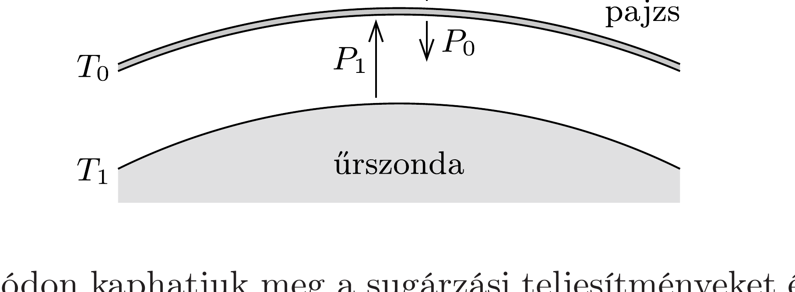

## Útmutatás

A burkolat mindkét oldala hőmérsékleti sugárzást bocsát ki, de el is nyeli a rá eső sugárzást. A kialakuló hőmérsékletet az elnyelt és a kibocsátott teljesítmények egyenlősége határozza meg.

\section*{Halmazállapot-változások}

## Megoldás

A távoli világűrben a szonda közelében nincsen olyan anyag, amelytől számottevő mértékben hőt tudna felvenni, vagy annak leadni, így az energia
leadása teljes egészében hőmérsékleti sugárzással történik. Feltehetjük, hogy a szonda a világűrből nem kap számottevő mértékben energiát (vagyis a világür „hideg”).
a) Védőpajzs nélkül a szonda annyira melegszik fel, hogy a belső energiaforrása által leadott $P_{0}$ teljesítményt hőmérsékleti sugárzás formájában ki tudja sugározni. Ez a hőmérséklet a megadott $T_{0}=250 \mathrm{~K}$.

Védőpajzs alkalmazása esetén a pajzs hőmérséklete $T_{0}$ kell hogy legyen, hiszen ezen a hőmérsékleten tudja leadni az egész rendszer belsejéből származó $P_{0}$ teljesítményt. (A pajzs felületének méretét közel azonosnak tekinthetjük a szonda felszínével.) A $T_{0}$ hőmérsékletú pajzs nemcsak kifelé, de befelé is sugároz, méghozzá éppen $P_{0}$ teljesítménnyel, hiszen a sugárzás erósségét a hómérséklet határozza meg. A szondának tehát összesen $P_{1}=2 P_{0}$ teljesítményt kell kisugároznia, ezt viszont csak az eredetinél magasabb $T_{1}$ hőmérsékleten tudja megtenni. Mivel a Stefan-Boltzmann-törvény szerint a sugárzási teljesítmény (felületegységenként) $T^{4}$-nel arányos, a kérdezett hőmérséklet $T_{1}=\sqrt[4]{2} \cdot T_{0}=297 \mathrm{~K}$ lesz.

b) Hasonló módon kaphatjuk meg a sugárzási teljesítményeket és a hőmérsékleteket több hővédő pajzs esetén is. A legkülső pajzs (kifelé és befelé egyaránt) $P_{0}$ teljesítménnyel sugároz, az eggyel beljebb lévó eszerint $2 P_{0}$-lal, a harmadik $3 P_{0}$ teljesítménnyel (hiszen kívülről kap $2 P_{0}$-t, amihez hozzáadódik a belülről jövő $P_{0}$ ) és így tovább. A legbelsố, $(n+1)$-edik réteg, vagyis maga a szonda $(n+1) P_{0}$ teljesítménnyel sugároz, a hőmérséklete tehát $T_{n+1}=\sqrt[4]{n+1} \cdot T_{0}$. Speciálisan $n=8$ esetén $T_{\text {szonda }}=\sqrt[4]{9} \cdot 250 \mathrm{~K} \approx 430 \mathrm{~K}$ lesz.

Megjegyzés. Az itt leírtakhoz hasonló elven múködik a termosz (Dewar-edény) is. A meleg folyadékot tartalmazó edényt légritkított térrel és (egy vagy több) tükröző felületü fallal veszik körül. A külső réteg hőmérséklete kisebb lesz, mint a belső edényé, emiatt a termosz tartalma lassabban húl ki, mint egy hagyományos edényben.

\section*{Halmazállapot-változások}
