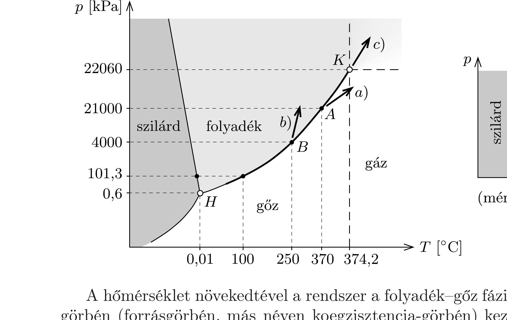
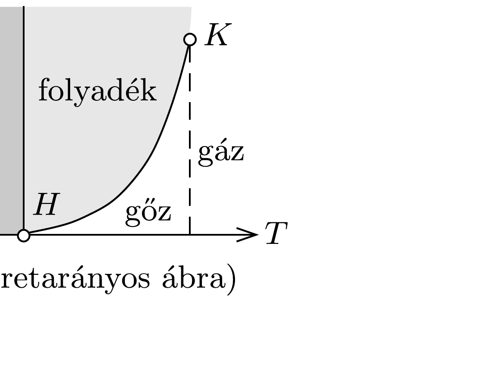

## Útmutatás

A tartály lassú melegítésekor a víz nem kezd el „zubogva” forrni, hanem lényegében csak párolog, a rendszer mindvégig egyensúlyi állapotokat vesz fel. (Az ilyen eseteket kváziegyensúlyi folyamatoknak nevezzük.) A függelékben található táblázati adatok felhasználásával vizsgáljuk meg, hogyan alakul a víz, illetve a telített gőz sűrúsége a hőmérséklet emelkedtével.

## Megoldás

A tartályban lévő anyag halmazállapotát (halmazállapotait) különböző hőmérsékleteken és nyomásokon az ábrán vázolt fázisdiagramon szemléltethetjük. (A nagy ábra nem méretarányos, a valódi arányokat egyenletes beosztású tengelyekkel a kis méretú diagram mutatja.) A 0,01 °C-os hármasponti $(H)$ hőmérsékletnél magasabb hőmérsékleten víz és vízgőz tart egyensúlyt. Mivel a feladat szövege szerint szobahőmérsékletről indulunk, szilárd halmazállapot sem kezdetben, sem a továbbiakban nem jelenik meg.

A hőmérséklet növekedtével a rendszer a folyadék-gőz fázishatárnak megfelelő görbén (forrásgörbén, más néven koegzisztencia-görbén) kezd el mozogni. Ha a tartály elég erős, akkor a hőmérséklet (és vele együtt a nyomás) jelentős növekedését is kibírja. Felmerülhet a kérdés, milyen hőmérsékletig találhatunk folyékony halmazállapotot a tartályban. A függelékben található, telített vízgőzre vonatkozó táblázat adataiból kiolvashatjuk, hogy a víz kritikus hőmérséklete $374,2^{\circ} \mathrm{C}$, kritikus súrúsége pedig $326,2 \mathrm{~kg} / \mathrm{m}^{3}$. Ez azt jelenti, hogy az $a$ ) és $b$ ) esetben nem juthat el a rendszer a $K$ kritikus pontig, hiszen az $a$ ) esetben kisebb, a $b$ ) esetben pedig nagyobb az átlagsűrúség a tartályban, mint a kritikus ponthoz tartozó súrűség.

A koegzisztencia-görbe mentén haladva a folyadék súrúsége fokozatosan csökken, a gőz súrúsége pedig növekszik. A kétféle fázis térfogatának arányát az aktuális sűrúségek és a rendszer átlagsúrúsége határozza meg. Ha a gőz súrúsége eléri az átlagsúrúséget, akkor a tartályban nem lehet folyékony halmazállapotú víz; ez az $a$ ) esetben 370 °C-on, 21 MPa nyomáson, a fázisdiagram $A$ pontjában következik be. A további melegítésnél a rendszer „leválik” a forrásgörbéről, és az „alatt”, a gőzfázis állandó súrúségú görbéje mentén fog mozogni.

Még furcsább dolog történik a $b$ ) esetben: 250 °C-os hőmérsékletnél (4 MPa nyomáson) a víz súrúsége $800 \mathrm{~kg} / \mathrm{m}^{3}$-re, vagyis az egész rendszer átlagsürúségére
csökken (az ábrán $B$-vel jelölt pontban). Ekkor a tartályban már nem lehet gőz, a teljes térfogatot folyékony halmazállapotú víz tölti ki. A további melegítés során a rendszer állapotát jellemző pont eltávolodik a koegzisztencia-görbétől („fölé” kerül), és az állandó sűrúségú folyadéknak megfelelő görbén mozog tovább.

A c) esetben a tartályban lévő anyag átlagsűrúsége éppen a $K$ kritikus pont súrúségének felel meg. Ebben az esetben a rendszer egészen a $K$ pontig jut el a forrásgörbén. Ott a folyadék és a gőz súrúsége egyenlővé válik, a víz és gőz közötti megkülönböztetés értelmét veszti: az anyag homogén, gázszerú halmazállapotba kerül.

Megjegyzés. Szigorúan véve egy légnemú anyagot akkor nevezünk gáznak, ha hőmérséklete a kritikus hőmérsékletnél magasabb, nyomása azonban a kritikus nyomásnál kisebb. Az ilyen halmazállapotban lévő anyag állandó hőmérsékleten nem cseppfolyósítható (tetszőlegesen nagy nyomáson sem). Gőzről akkor beszélünk, ha a légnemú anyag hőmérséklete és nyomása is kisebb a kritikus értéknél; a gőz tehát állandó hőmérsékleten cseppfolyósítható. Ha az anyagnak mind a hőmérséklete, mind pedig a nyomása a kritikus pont feletti, akkor ún. szuperkritikus állapotban van. Ebbe a fázisba jut el a c) esetben a víz.

Érdekesség, hogy gáz halmazállapotból a folyadékfázisba kétféleképpen juthatunk el. Az első módszer az, hogy a gázt lehútjük a kritikus hőmérséklet alá, és az így keletkezett gőzt cseppfolyósítjuk. A gőz lecsapódása során a folyadék- és a gőzfázis között közeghatár (meniszkusz) alakul ki, mígnem végül az egész gőzmennyiség folyadékká alakul. A másik módszer, hogy a gázt a nyomás növelésével szuperkritikussá tesszük, majd a hőmérséklet csökkentésével a $K$ kritikus pontot a fázisdiagramon „megkerülve” jutunk el a folyadékállapotba. Utóbbi esetben nem alakul ki folyadék-gőz határfelület, az átalakulás folytonos módon valósul meg.
