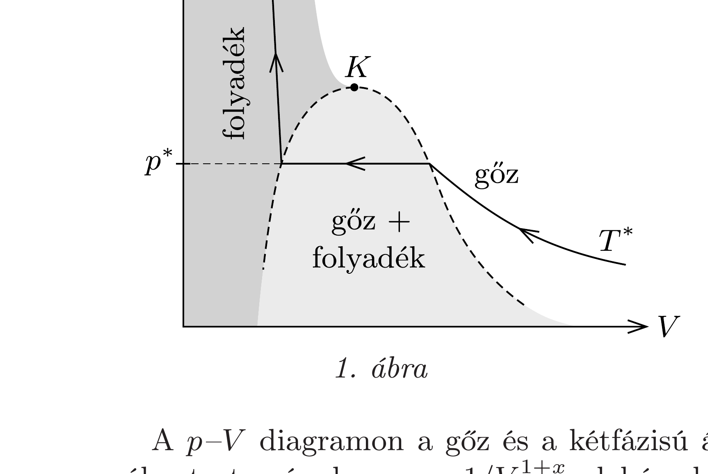
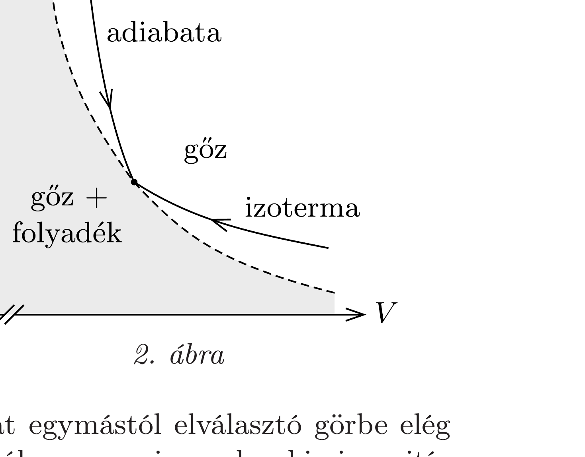

## Útmutatás

Meglepő módon mindkét térfogatváltozás során kicsapódhat víz a telített gőzből. Vajon hogyan?

## Megoldás

Vizsgáljuk meg, mi történik a vízgőzzel, ha a térfogatát csökkentjük, illetve ha növeljük. Megfontolásaink során csak a vízgőzzel kell törődnünk, egyéb gázok jelenléte - Dalton törvénye szerint - a telítési nyomásra nincs hatással.

A telített gőzre (hacsak nem vagyunk a kritikus pont közelében) jó közelítéssel érvényes az ideális gázok állapotegyenlete:
\[
p V=N k T .
\]
Ha a telített gőz térfogatát lassan csökkentjük, a hőmérséklet állandó marad, a nyomás sem tud megváltozni, mert az csak a hőmérséklettől függ, így a gáztörvény szerint az $N$ részecskeszámnak kell csökkennie. A lassan összenyomott gőz egy része tehát kicsapódik. A térfogat lassú növelésekor a fordított folyamat játszódik le: a víz egy része elpárolog, növekszik a gőztérben lévő vízmolekulák száma.

Ha a térfogatot olyan hirtelen növeljük meg, hogy nincs idő számottevő hőcserére a vízgőzt tartalmazó tartály és a környezete között, akkor a hőmérséklet lecsökken (adiabatikus tágulás). Az új, alacsonyabb hőmérséklethez tartozó telítési gőznyomás kisebb lesz, mint az eredeti, sőt, annak ellenére, hogy $V$ nő, a gőz egy része kicsapódik, mert $T$ erősen csökken.

A gőz kicsapódása tehát a térfogat csökkentésével és növelésével egyaránt előidézhető, a térfogatváltozás tényleges hatása a folyamat sebességétől függ.

Megjegyzések. 1. Ha a vízgőz állapotváltozását az ideális gáz közelítésnél pontosabban akarjuk nyomon követni, akkor pl. a van der Waals-féle állapotegyenletet használhatjuk, vagy vizsgálhatjuk a mérési eredmények alapján empírikusan megállapított összefüggéseket. Az 1. ábrán egy valódi izoterma (és a víz fázisai) láthatók a $p-V$ diagramon. (A $K$ kritikus ponton áthaladó izoterma fölött elhelyezkedő gáz és szuperkritikus gáz fázist az ábrán nem jelöltük.)

Ezen megfigyelhetjük, hogy az izotermikus összenyomás során a (telítetlen) gőz nyomása mindaddig nố, amíg el nem éri az adott $T^{*}$ hőmérséklethez tartozó $p^{*}$ (a telített gőz nyomásának megfelelő) értéket. Ezek után a nyomás nem nő tovább, hanem a góz elkezd lecsapódni. A térfogat csökkentése közben fokozatosan nő a lecsapódott folyadék mennyisége. A nyomás mindaddig állandó marad, amíg az egész gózmennyiség le nem csapódik. A gőzök tehát állandó hốmérsékleten úgy cseppfolyósíthatók, ha a térfogatukat csökkentjük.

Ha a gőzt a környezetétől adiabatikusan elzárva akarjuk cseppfolyósítani, akkor azt kell valamilyen módon elérnünk, hogy a hőmérséklet lecsökkenjen. Mivel most nincs hốátadás $(Q=0)$, az első főtétel szerint $\Delta E=-W_{\text {gôz }}$. Ha a gőz végez munkát (vagyis $W_{\text {göz }}>0$ ), a belsó energia (és vele együtt a gőz hőmérséklete) le fog csökkenni. A gőz pedig akkor végez munkát, ha a térfogata nố.

A vízgőz kicsapódásához tehát több út is vezethet: izotermikus folyamatban a térfogat csökkentése, adiabatikus folyamatban a térfogat növelése okozhat vízlecsapódást.

A $p-V$ diagramon a gőz és a kétfázisú állapotokat egymástól elválasztó görbe elég széles tartományban $p \sim 1 / V^{1+x}$ alakú, ahol $x$ általában egy viszonylag kicsi pozitív szám (2. ábra). Vízgőz esetén $x \mathrm{~kb} .1 / 16$. Ez azt jelenti, hogy a határgörbe meredekebb, mint az izoterma (amelyre ideális gáz esetén $x=0$ ), de kevésbé meredek, mint az adiabata (amelyre $f$ termodinamikai szabadsági fokú ideális gáz esetén $x=2 / f$ ).
2. A hirtelen kitágított (és emiatt túltelítetté váló) vízgőz kicsapódásához ún. kondenzációs magok szükségesek. Ilyen magok lehetnek pl. koromszemcsék vagy ionizált részecskék. Az előbbiek a repülőgép kondenzcsíkjának képződésekor, az utóbbiak az elemi részecskéket láthatóvá tevő Wilson-féle ködkamrában kapnak szerepet: a gyorsan mozgó, elektromosan töltött elemi részecskék ionokat keltenek, és az ezek által megindított folyadékcsepp-képződés ködfonalként jelöli ki a részecskék pályáját.
