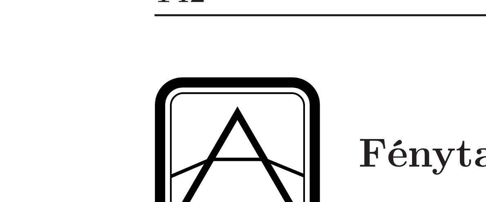
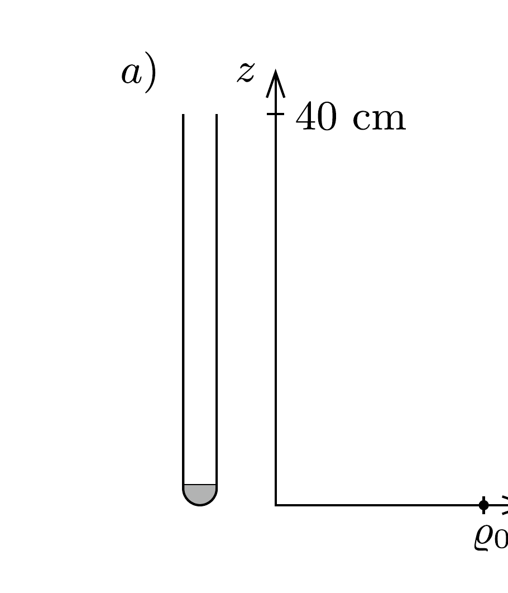
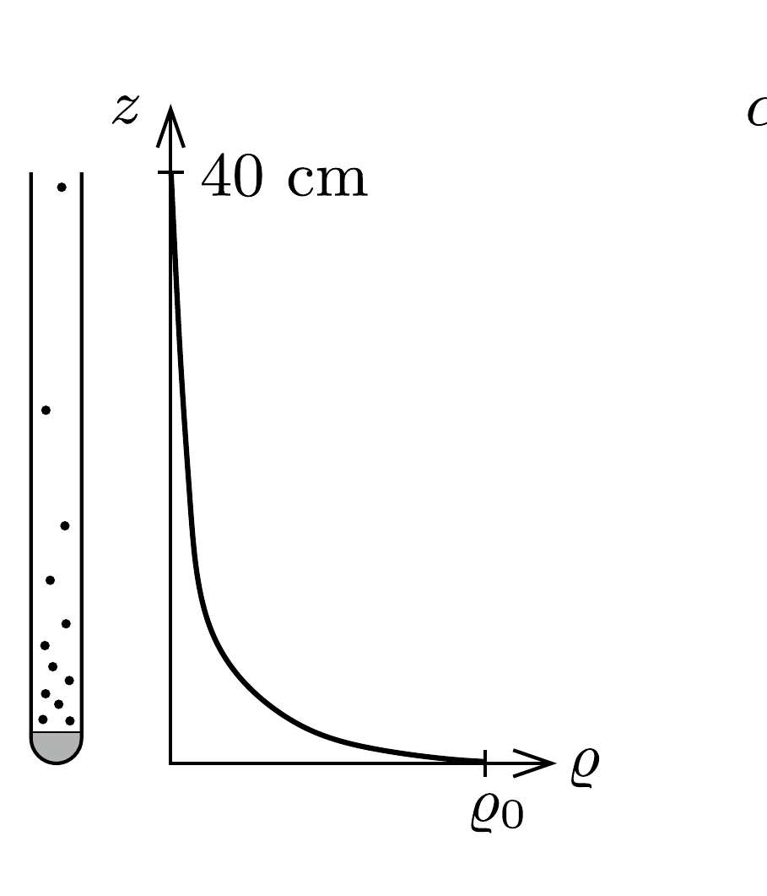
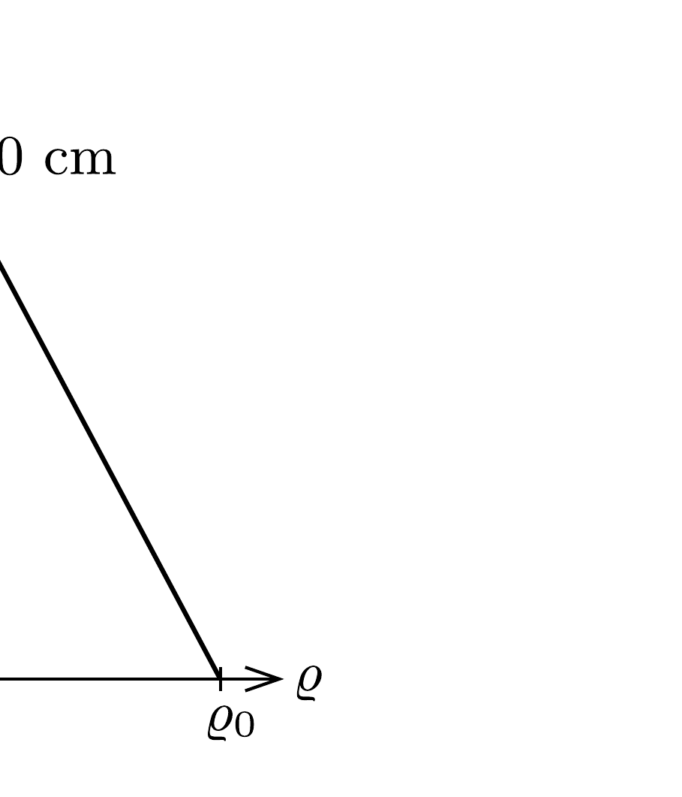
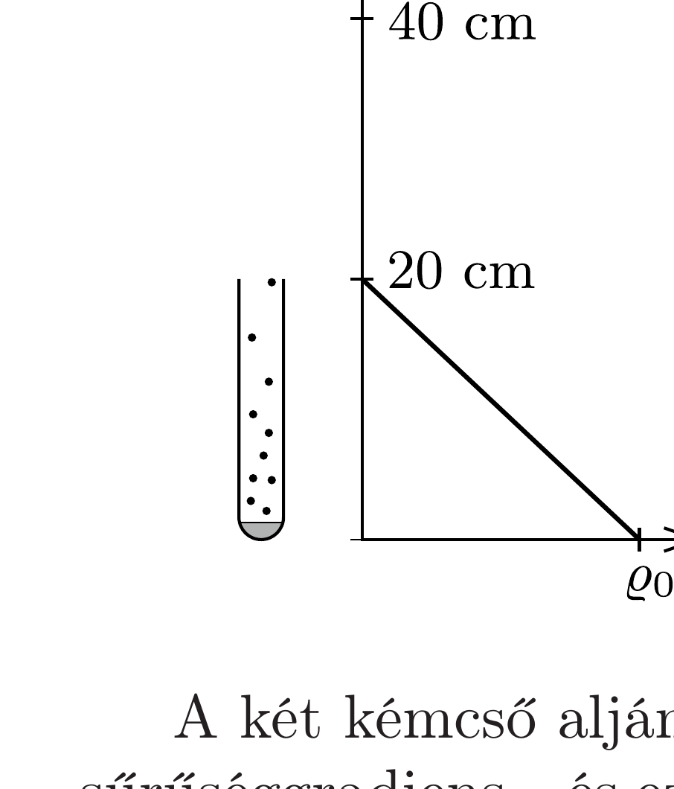
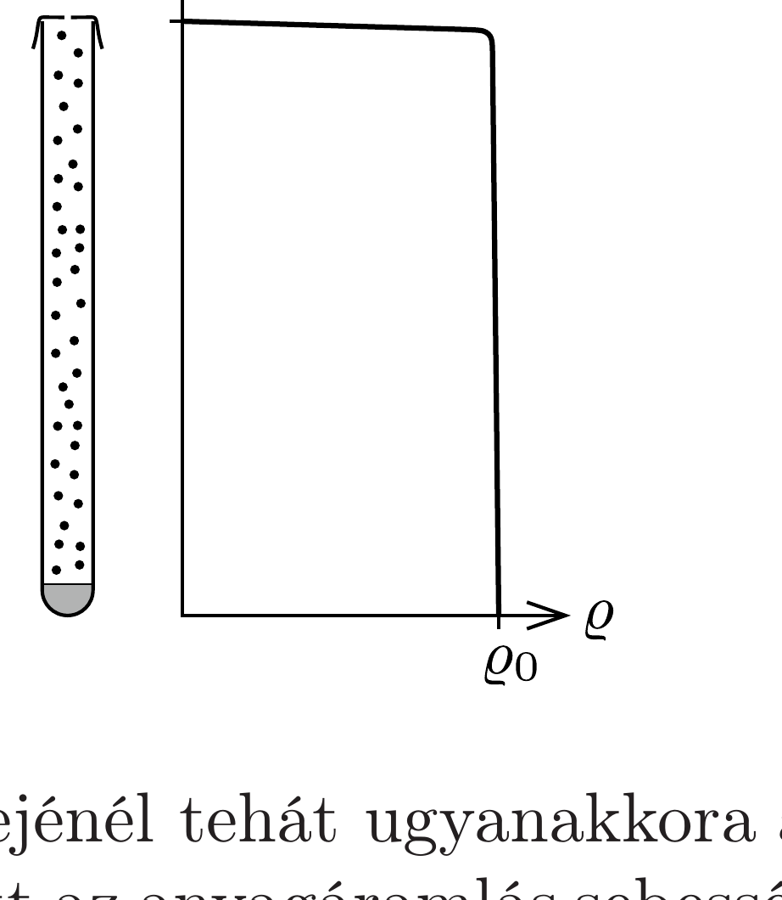
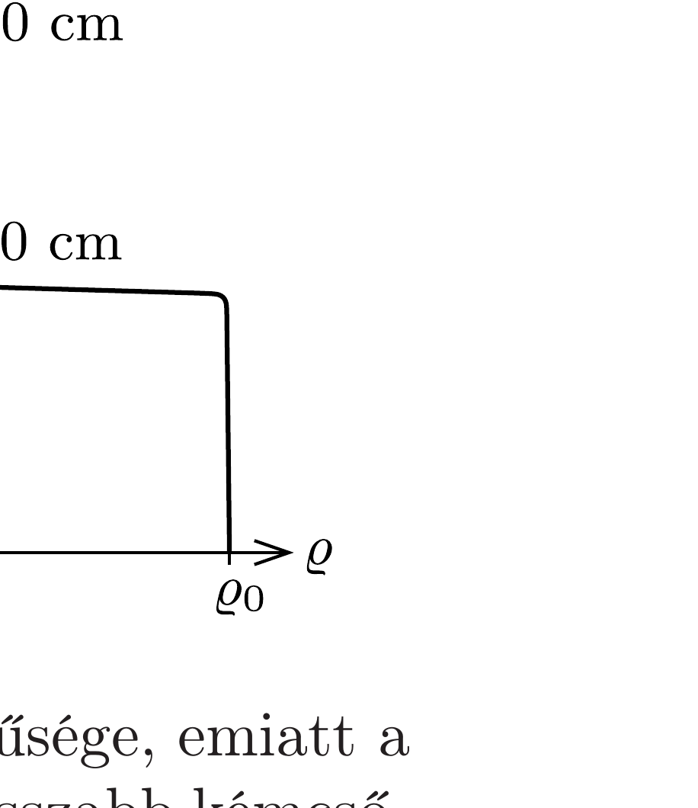
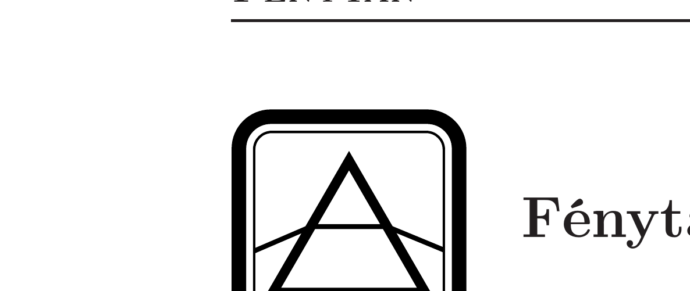

## Útmutatás

Az elpárolgott kölnivíz (fizikai szempontból lényegében víz és alkohol) gőzének koncentrációja a kémcsőben felfelé haladva folyamatosan változik. A gőz diffúzióval jut ki a kémcsőből; az anyagáramlás sebessége arányos a súrúséggradiens (hosszegységre eső súrúségváltozás) nagyságával.

## Megoldás

A vékony kémcsőben nem alakul ki konvekciós anyagáram, a döntő folyamat a diffúzió. Ennek alaptörvénye (a Fick-törvény) szerint az anyagáramlás sebességét a koncentrációgradiens határozza meg; a két mennyiség - a tapasztalat szerint - jó közelítéssel arányos egymással:
\[
\frac{\Delta m}{\Delta t}=-D A \frac{\Delta \varrho}{\Delta z},
\]
ahol $\Delta m$ a $\Delta t$ idő alatt $A$ nagyságú felületen áthaladó gőz tömegét jelöli, $\varrho$ a gőz súrúsége $z$ magasságban, $D$ pedig a kölni átlagos (effektív) diffúziós együtthatója.
$\mathrm{Az} a)$ ábrán látható kezdeti állapotban a folyadék feletti térben nincsen gőz. Emiatt heves párolgás indul meg, és a gőztérben átmenetileg a $b$ ) ábrához hasonló súrúségeloszlás valósul meg. A kölni teljes párolgási idejéhez képest rövid idő alatt a kémcsőben olyan stacionárius állapot alakul ki, melyben a gőz sűrúsége a $c$ ) ábra szerint lineárisan változik; csak így teljesülhet ugyanis, hogy a cső bármely kis részébe időegységenként ugyanannyi gőz lép be alulról, mint amennyi felfelé távozik. A kémcső legalján, ahol a gőz a folyadékkal érintkezik, a gő́z telített
lesz, súrúségét csak a hőmérséklet befolyásolja. A kémcső tetejénél, ahol a szabad légtérrel érintkezik a gőz, a súrúsége gyakorlatilag nulla, ellenkező esetben (ha a súrúség ugrásszerúen megváltozna) nagyon gyors anyagáramlás indulna meg, tehát nem lehetne állandósult állapotról beszélni.

A két kémcső aljánál és tetejénél tehát ugyanakkora a gőz súrúsége, emiatt a súrúséggradiens - és ezzel együtt az anyagáramlás sebessége - a hosszabb kémcsőnél feleakkora, mint a rövidebbnél, ahogy az a $d$ ) ábrán is látható. Ha még azt is figyelembe vesszük, hogy a hosszabb kémcsőben kétszer több kölnivíz van, mint a rövidebb csőben, megállapíthatjuk: a 40 cm-es kémcsőből kb. négyszer hosszabb idő alatt párolog el a $2 \mathrm{~cm}^{3}$ kölnivíz, mint a 20 cm-es csőből a feleakkora mennyiség.

Mi történne, ha mindkét kémcső tetejét annyira leragasztanánk, hogy a fedőlapokon csupán egy-egy parányi (egyforma) nyílás maradna? A lyuk kis keresztmetszetén átdiffundáló gőz mennyisége akkor lehetne ugyanakkora, mint a kémcső sokkal nagyobb keresztmetszetén ugyanannyi idő alatt átjutó gőz mennyisége, ha a koncentrációgradiens a kémcsőben sokkal kisebb, mint a lyuk környékén. A súrúség tehát most a kémcső belsejében alig változik - lásd az $e$ ) és $f$ ) ábrákat -, majdnem pontosan a telített gőz súrúségével egyezik meg, és csupán a lyuk közvetlen közelében esik le a külső, zérus értékre. Ilyen körülmények között a kémcső hossza nem játszik szerepet, és a párolgási idők aránya csak a tömegek arányától függ, esetünkben 2 : 1.

