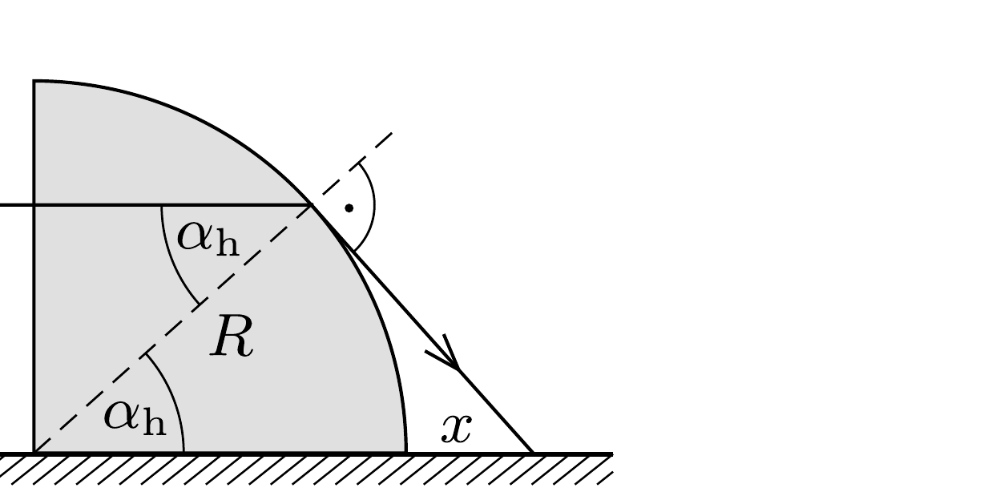

## Útmutatás

Sem a negyedhenger közvetlen közelében, sem egy meghatározott távolság után nem éri fény az asztalt. Az asztal közeli pontjait a teljes visszaverődés miatt nem érheti fény, míg a megvilágított tartomány távolabbi határát úgy határozhatjuk meg, ha a negyedhenger asztalhoz közeli részét sík-domború hengerlencsének tekintjük.

## Megoldás

Tekintsük a fénynyalábot egymással párhuzamos fénysugarakból állónak! A sugarak irányváltoztatás nélkül haladnak át a negyedhenger függőleges síklapján, majd különböző beesési szöggel érik el a palástot. A fénysugarakhoz tartozó beesési merőlegesek mindig sugárirányúak.

Minél magasabban lép be egy fénysugár a negyedhengerbe, annál nagyobb lesz a beesési szöge a hengerpaláston. Az ábrán látható esetben a beesési szög éppen a teljes visszaverődés határszöge, tehát csak az ennél alacsonyabban érkező fénysugarak léphetnek ki a negyedhengerből (különböző mértékú fénytörés után). A határhelyzet az ábra alapján meghatározható:
\[
\sin \alpha_{\mathrm{h}}=\frac{1}{n}=\frac{2}{3}, \quad \text { továbbá } \quad \frac{R}{R+x}=\cos \alpha_{\mathrm{h}},
\]
amiból $x=1,71 \mathrm{~cm}$, tehát a negyedhenger mögött ekkora távolsággal kezdi megvilágítani a fény az asztalt.

Az asztalhoz egyre közelebb haladó, vízszintes fénysugarak beesési szöge egyre kisebb, így egyre kevésbé térülnek el a fénytörés következtében. Geometriai számításokkal belátható, hogy a kisebb beesési szögü fénysugarak egyre messzebb érik el az asztal felületét. Könnyen arra gondolhatunk, hogy a fényfolt elvileg akármilyen messze eljuthat az asztalon, hiszen az asztal síkjában érkező sugár irányváltoztatás nélkül lép ki. Ez azonban tévedés! A fénysugarak útját (például a beesési szög függvényében) végigkövetve láthatjuk, hogy a fény nem is jut olyan messzire az asztallapon.

A hosszadalmas (bár trigonometriai közelítésekkel leegyszerúsíthető) számolás helyett egy egyszerú „trükk” segítségével is megkaphatjuk a fényfolt legtávolabbi pontját. Tekinthetjük úgy, mintha az asztalhoz közel haladó fénysugarak előbb egy $R$-nél kicsivel kisebb vastagságú plánparalel lemezen, majd egy ehhez kapcsolódó vékony, $R$ görbületi sugarú síkdomború hengerlencsén haladnának át. A meróleges beesés miatt a plánparalel lemez hatása figyelmen kívül hagyható. A síkdomború lencse $f$ fókusztávolságát a vékony lencsékre érvényes
\[
\frac{1}{f}=(n-1)\left(\frac{1}{R_{1}}+\frac{1}{R_{2}}\right)
\]
formula alapján számíthatjuk ki, ahol $R_{1}$ és $R_{2}$ a lencsét két oldalról határoló felületek görbületi sugara. Esetünkben $R_{1}=R$, valamint $R_{2} \rightarrow \infty$, innen a fókusztávolság, vagyis a fényfolt legtávolabbi részének távolsága a negyedhengertől:
\[
f=\frac{R}{n-1}=10 \mathrm{~cm} .
\]
