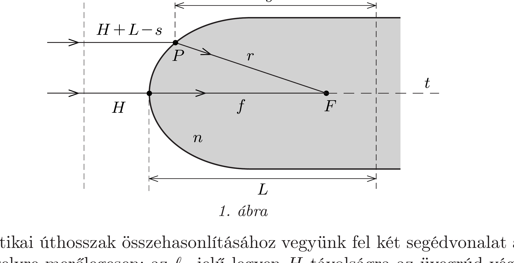
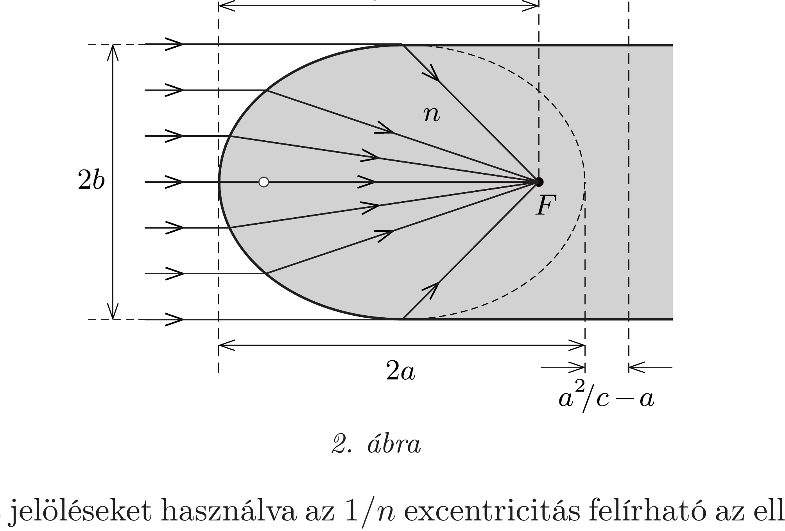
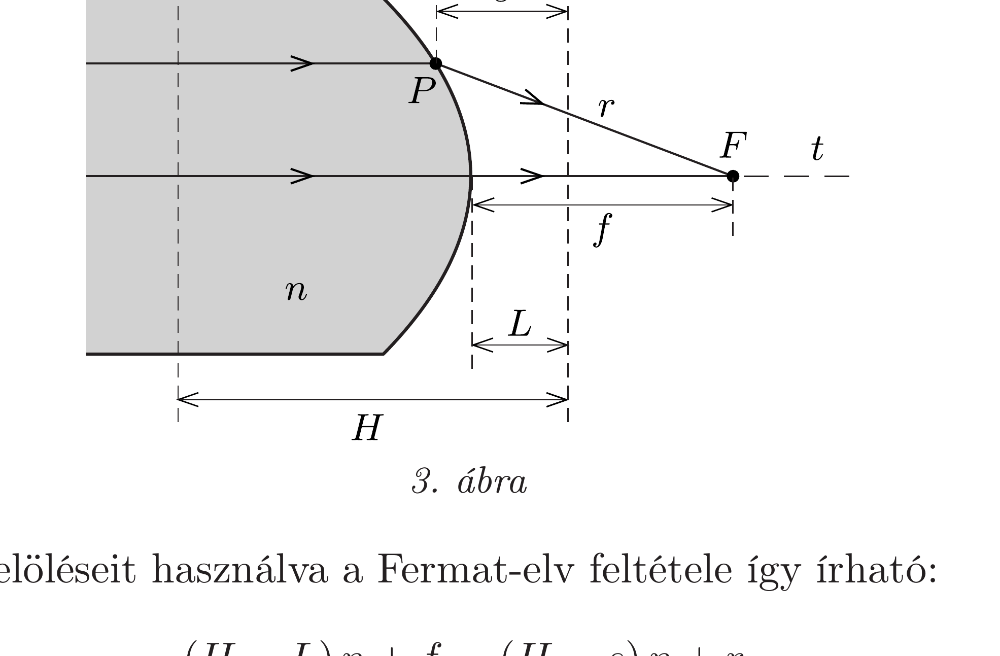

## Útmutatás

Használjuk a Fermat-elvet!

## Megoldás

A Fermat-elv értelmében a fény két pont (mondjuk $A$ és $B$ ) között olyan pályát fut be, hogy az optikai úthossza (a geometriai útszakaszoknak az aktuális törésmutatóval súlyozott összege) extremális, általában a lehető legrövidebb legyen; ez az állítás egyenértékú azzal, hogy a terjedési idő a „szomszédos” pályákhoz képest minimális. Ha a fény $A$-ból $B$-be különböző útvonalakon is haladhat (a feladatban éppen ilyen helyzet áll fenn), akkor a különböző utaknak megfelelő optikai úthosszaknak egyenlőknek kell lenniük, hiszen ha bármelyik optikai úthossz kisebb vagy nagyobb lenne, mint a hozzá közeli másik útvonalé, akkor a Fermat-elv követelménye nem teljesülne.

Először vizsgáljunk egy olyan (gyakorlatilag) párhuzamos fénynyalábot, amely egy nagyon távoli, a rúd szimmetriatengelyén fekvő pontszerú forrásból $(S)$ érkezik (1. ábra). Az elrendezés forgásszimmetriája miatt elegendő a rúd $t$ tengelyén átmenő síkmetszetet vizsgálni. Tekintsünk egy tetszőleges fénysugarat, ami a rúd legömbölyített felületét a $P$ pontban éri el, majd fénytörés után egyenes vonalban halad a rúdban az $F$ fókuszpontig. A Fermat-elv szerint ennek a sugárnak az optikai úthossza egyenlő a fényforrásból az $F$ pontba eljutó bármely más fénysugár optikai úthosszával, így például az optikai tengely mentén egyenesen haladó sugáréval is.

Az optikai úthosszak összehasonlításához vegyünk fel két segédvonalat az optikai tengelyre merólegesen: az $\ell_{1}$ jelú legyen $H$ távolságra az üvegrúd végétől a levegőben, míg az $\ell_{2}$ jelzésú helyezkedjen el $L$ távolságra az üvegrúd csúcsától az $F$ fókuszpont másik oldalán. Jelöljük a $P$ pont és az $F$ fókusz távolságát $r$ rel, továbbá a $P$ pont és az $\ell_{2}$ segédvonal közötti távolságot $s$-sel, amint ez az 1. ábrán látható. A nagyon távoli $S$ fényforrás (amit nem mutat az ábra) és az $\ell_{1}$ segédvonal közötti útvonalak hossza megegyezik, így elegendő innentől vizsgálni az úthosszak egyenlőségét. A Fermat-elv kritériuma teljesül, ha
\[
H+n f=(H+L-s)+n r .
\]
Látható, hogy $H$ tetszőlegesen választható (pozitív) érték lehet, hiszen úgyis kiesik az egyenletből. Ha a szintén tetszőleges $L$ távolságot éppen $n f$ nagyságúnak választjuk, akkor a Fermat-elv követelménye így egyszerúsödik:
\[
s=n r, \quad \text { azaz } \quad \frac{1}{n}=\frac{r}{s} .
\]

Tehát a $P$ ponttól az $F$-ig tartó $r$ távolság és a $P$-től az $\ell_{2}$ segédvonalig tartó $s$ távolság aránya egy rögzített szám $(1 / n<1)$.

Megjegyzés. Úgy túnhet, mintha ez az egyszerú feltétel az $\ell_{2}$ segédvonal „fondorlatos” megválasztásának a következménye lenne, de ez nem igaz! Ha egy másik $L^{\prime}$ távolságot választanánk az üvegrúd csúcsától, akkor az előzővel egyenértékú $s^{\prime}=n r$ összefüggést kapnánk, ahol $s^{\prime}=s+n f-L^{\prime}$, és végül ugyanarra a következtetésre jutnánk.

A kúpszeletek egyik (kevésbé ismert) definíciója szerint az ellipszis a sík azon pontjainak mértani helye, melyekre fennáll, hogy egy adott ponttól (a fókuszponttól) mért távolságuk és egy adott egyenestől (a vezéregyenestól) mért távolságuk aránya egy 1-nél kisebb állandó, melyet az ellipszis $\varepsilon$ numerikus excentricitásának neveznek. Esetünkben ugyanez a feltétel érvényes az üvegrúd végének pontjaira is $(r / s=\varepsilon<1)$, ha az $\ell_{2}$ segédvonalat tekintjük vezéregyenesnek, az $F$ pontot az ellipszis geometriai fókuszának, az excentricitás pedig a törésmutató reciproka: $\varepsilon=1 / n$.

A szokásos jelöléseket használva az $1 / n$ excentricitás felírható az ellipszis nagytengelyével $(2 a)$ és a két fókusza közötti távolsággal $(2 c)$ :
\[
\frac{1}{n}=\frac{c}{a} .
\]
Az $\ell_{2}$ vezéregyenes és az ellipszis középpontja közötti távolság (lásd a 2. ábrát):
\[
L-a=\frac{a^{2}}{c} .
\]
Ezekből az ellipszis fél nagytengelye és fél kistengelye kifejezhető:
\[
a=\frac{n}{n+1} f \quad \text { és } \quad b=f \sqrt{\frac{n-1}{n+1}} .
\]

A keresett felület tehát egy forgási ellipszoid, melyet úgy kapunk meg, hogy az ellipszist megforgatjuk a nagytengelye körül. Az üvegrúd optikai értelemben
vett fókusza egybeesik az ellipszoid egyik (a távolabbi) geometriai fókuszával. A 2. ábrán látható, hogy a fókuszálandó fénynyaláb átméróje nem lehet nagyobb az ellipszoid $2 b$ kistengelyénél.

Megjegyzés. A feladat koordinátageometriai módszerrel is megoldható. Vegyünk fel egy derékszögú koordináta-rendszert úgy, hogy origója essen az üvegrúd legömbölyített végének csúcspontjára, pozitív $x$ tengelye haladjon az optikai tengely mentén az üvegrúd belseje felé, míg az $y$ tengely legyen erre merőleges (tetszóleges irányban). A felület $(x, y)$ pontján megtörő fénysugárra a Fermat-elv feltétele:
\[
x+n \sqrt{y^{2}+(f-x)^{2}}=n f,
\]
amit algebrai átalakításokkal a következő alakra hozhatunk:
\[
\left(\frac{n+1}{n f}\right)^{2}\left(x-\frac{n f}{n+1}\right)^{2}+\frac{n+1}{f^{2}(n-1)} y^{2}=1 .
\]
Ez a kifejezés a korábbi megoldás jelöléseit használva így írható:
\[
\frac{(x-a)^{2}}{a^{2}}+\frac{y^{2}}{b^{2}}=1,
\]
ami megegyezik az ellipszis megszokott egyenletével, azonban most az ellipszis középpontja az $x$ tengely mentén el van tolva az origóból $a$ távolsággal.

Hasonló érveléssel kaphatjuk meg annak a feltételét, hogy a rúdban haladó, tengellyel párhuzamos fénynyaláb a rúdon kívüli $F$ pontba fókuszálódjon.

A 3. ábra jelöléseit használva a Fermat-elv feltétele így írható:
\[
(H-L) n+f=(H-s) n+r .
\]
Ha $L$-et úgy választjuk meg, hogy kielégítse az $L=f / n$ egyenlőséget, akkor tetszőleges $H$ esetén fennáll, hogy $r / s=n=$ állandó.

Újra geometriai ismereteinket kell alkalmaznunk: „A hiperbola azon pontok mértani helye a síkon, melyeknek egy ponttól (az egyik fókusztól) és egy egyenestől (a vezéregyenestől) mért távolságainak aránya állandó, és ez az állandó (amit
a hiperbola excentricitásának nevezünk) egy 1-nél nagyobb szám." Esetünkben az excentricitás éppen az üvegrúd anyagának $n$ törésmutatójával egyezik meg, és a hiperbola egyik fókusza az üvegrúd optikai értelemben vett fókuszpontjával azonos. Ezek szerint a feladat második részének a megoldása egy forgási hiperboloid felszínének egy darabja. Most a nyaláb fókuszálható átmérőjének csak a rúd átmérője szab határt.
