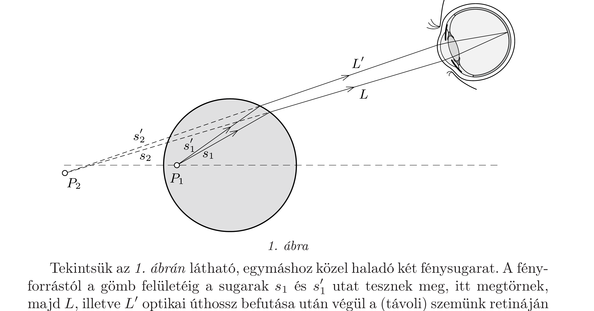
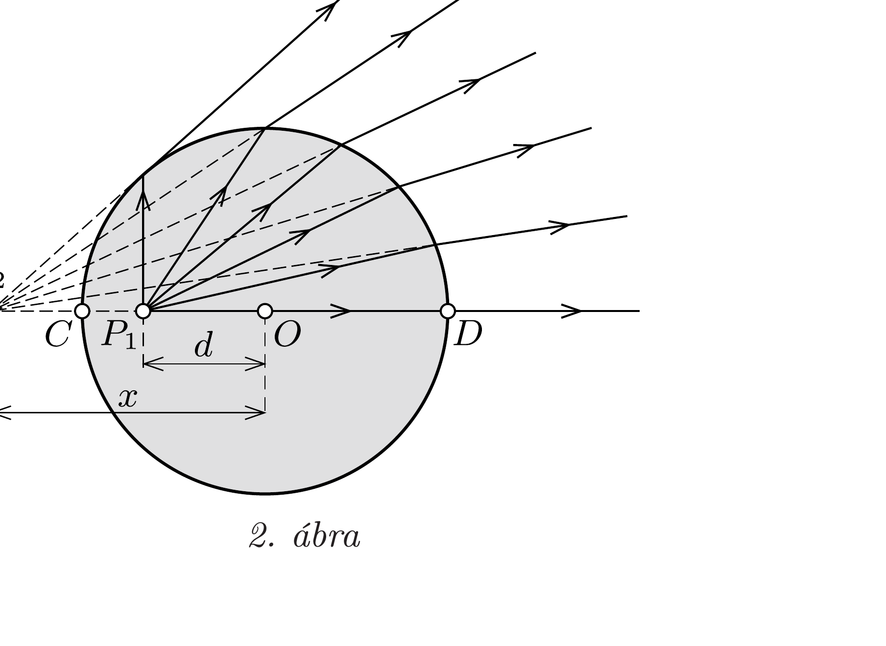
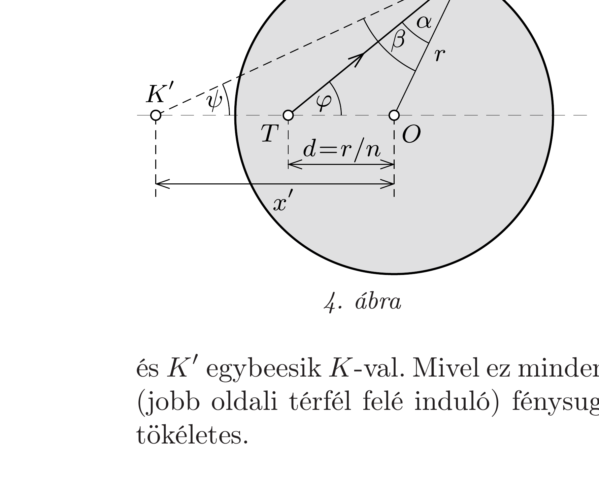

## Útmutatás

Ha két, azonos pontból induló, egymáshoz közeli fénysugár egy pontban újra találkozik, akkor a Fermat-elv szerint a két sugármenet optikai úthosszai egyenlőek. Széttartó sugarakra ez úgy alkalmazható, ha leképező eszközzel (mondjuk egy lencsével vagy a szemünkkel) egy pontba fókuszáljuk őket. Ennek segítségével megmutatható, hogy tökéletes képalkotás esetén bármely sugármenetre igaz az, hogy a fényforrástól a fénysugár töréspontjáig megtett optikai úthossz megegyezik a töréspont és a képpont távolságával.

A Fermat-elv helyett a Snellius-Descartes-törvény segítségével is megoldhatjuk a feladatot, például egy speciális (a gömbből érintőlegesen kilépő) sugármenet vizsgálatával.

## Megoldás

I. megoldás. Válasszuk optikai tengelynek a pontszerú fényforráson és a gömb középpontján átmenő egyenest. Ha a fényforrást a gömb belsejében valamely általános $P_{1}$ pontba helyezzük, a kialakuló látszólagos kép nem lesz pontszerú. Bár az optikai tengely közelében haladó keskeny sugárnyaláb az optikai tengelyen, jó közelítéssel egy pontban fókuszálódik, de a tengelytől jobban eltávolodó, egymással kis szöget bezáró fénysugarak meghosszabbításai nem ugyanebben a pontban metszik egymást.

Tekintsük az 1. ábrán látható, egymáshoz közel haladó két fénysugarat. A fényforrástól a gömb felületéig a sugarak $s_{1}$ és $s_{1}^{\prime}$ utat tesznek meg, itt megtörnek, majd $L$, illetve $L^{\prime}$ optikai úthossz befutása után végül a (távoli) szemünk retináján találkoznak. A Fermat-elv szerint a fény két pont között olyan útvonalon halad, melynek megtételéhez szükséges idő (és így a két pont közötti optikai úthossz is) az egymáshoz közeli pályák közül a lehető legkisebb. Ha a fény két közeli pályán is eljut az egyik pontból a másikba, akkor a két pályán az optikai úthosszak megegyeznek:
\[
n s_{1}+L=n s_{1}^{\prime}+L^{\prime} .
\]

A szemünk a $P_{1}$ pontba helyezett fényforrást a vizsgált két fénysugár meghosszabbításának $P_{2}$ metszéspontjában érzékeli. Ez a metszéspont általában nem esik az optikai tengelyre, és helyzete függ a vizsgált két fénysugár megválasztásától (azaz a szemünk helyzetétől). Ha a $P_{2}$ pontban keletkező virtuális kép helyére gondolatban egy fényforrást helyezünk, ismét alkalmazhatjuk a Fermat-elvet az
1. ábrán látható két sugárra. A $P_{2}$ ponttól a szemünk retinájáig megtett optikai úthosszak egyenlőek:
\[
s_{2}+L=s_{2}^{\prime}+L^{\prime} .
\]
Képezzük az (1) és (2) egyenletek különbségét:
\[
n s_{1}-s_{2}=n s_{1}^{\prime}-s_{2}^{\prime} .
\]
Ez az összefüggés jellemzi tehát két közeli fénysugár metszéspontjának helyét. Egymáshoz képest nagy szögben haladó fénysugarakra hasonló egyenlőség általában nem igaz, kivéve azt a speciális esetet, amikor a (3) egyenlet mindkét oldalán nulla áll, vagyis bármely sugármenetre $s_{2} / s_{1}=n$. Ez teljesíthető, ha az üveggömb felülete éppen a $P_{1}$ és $P_{2}$ pontok egyik Apollóniosz-gömbjével esik egybe ${ }^{7}$. Ekkor a $P_{2}$ pont helyzete nem függ a közeli fénysugarak megválasztásától, minden sugár meghosszabbítása ugyanazon a ponton megy keresztül (amely a szimmetria miatt az optikai tengelyre esik).

Tökéletes képalkotás esetén tehát a gömb bármely pontja $n$-szer távolabb helyezkedik el a képponttól, mint a fényforrástól. Ez igaz a 2. ábrán látható $C$ és $D$ pontokra is:
\[
\frac{x-r}{r-d}=n, \quad \frac{x+r}{d+r}=n,
\]
ahol $x$ a képpont távolsága a gömb $O$ középpontjától. Ebből a két egyenletből meghatározhatjuk a keresett távolságokat:

\[
d=\frac{r}{n} \quad \text { és } \quad x=n r \text {. }
\]
II. megoldás. Tekintsük a gömb 3. ábrán látható síkmetszetét (ez a $k_{1}$ kör), és jelöljük a pontszerú fényforrás keresett helyzetét $T$-vel, a keletkező (tökéletes) képpontot pedig $K$-val. Vizsgáljuk azt a fénysugarat, amely a gömbből éppen érintőlegesen lép ki, és jelöljük a kilépési pontot $A$-val. A tökéletes képalkotás miatt ennek a fénysugárnak a meghosszabbítása átmegy a $K$ ponton. A megtört fénysugár merőleges a gömb $O$ középpontjából az $A$ pontba húzott sugárra, ezért a törési szög $\beta=90^{\circ}$. A Snellius-Descartes-törvény szerint
\[
\frac{\sin \beta}{\sin \alpha}=n,
\]

\footnotetext{
${ }^{7}$ Apollóniosz tétele szerint a sík azon pontjainak mértani helye, melyek a sík két rögzített pontjától mért távolságának aránya (1-től különböző) állandó, egy kör (Apollóniosz-kör), térben pedig ezen kör megforgatásából adódó gömb.

Apollóniosz időszámításunk kezdete előtt 262-től 190-ig élt; a kúpszeletekről írt munkájában ő vezette be az ellipszis, a parabola és a hiperbola kifejezéseket.

azaz a vizsgált fénysugár $\alpha$ beesési szögére fennáll a $\sin \alpha=1 / n$ összefüggés.
A (4) egyenlet igaz a gömbből kilépő többi fénysugárra is (azaz a $k_{1}$ kör $K$ ponton átmenó szelőire), ezért az összes lehetséges sugármenet közül $\sin \alpha$ akkor maximális, ha $\sin \beta$ értéke a lehető legnagyobb, nevezetesen 1 . Az $\alpha$ szög tehát éppen az $A$ pontnál érintőlegesen kilépő sugár esetén maximális, ami azt jelenti, hogy az $A$ ponthoz közeli pontokban kilépő fénysugarak beesési szöge mind ugyanakkora. Ebből következik, hogy a $T O$ szakasz fölé rajzolt, $\alpha$ szögü $k_{2}$ látószögkörív éppen érinti a $k_{1}$ kört az $A$ pontban. (Ellenkező esetben a $k_{1}$ és $k_{2}$ körök metszenék egymást az $A$ pontban, így az $A$ pontnál kilépő fénysugár kilépési pontját kicsit elmozdítva a beesési szög csökkenne vagy növekedne.) A $k_{2}$ kör átméróje tehát az $A O$ szakasz, így az $O T A$ háromszögnek $k_{2}$ a Thalész-köre, az OTA szög pedig derékszög.

Az $O T A$ derékszögü háromszög $T O$ befogója nem más, mint a keresett $d$ távolság, ezért
\[
\sin \alpha=\frac{d}{r},
\]
ahonnan $d=r / n$. Az OTA és OAK háromszögek hasonlóságából a kép és a gömb középpontjának távolságára $x=n r$ adódik.

Hátravan még annak belátása, hogy a $T$ pontból (a jobb oldali térfél felé) induló, majd a gömbön megtörő valamennyi fénysugár meghosszabbítása a $K$ ponton halad keresztül. Jelöljük a $T$-ből $\varphi$ szögben kiinduló fénysugár törési ponját $A^{\prime}$-vel (4. ábra), és számítsuk ki, hogy ezen fénysugár meghosszabbítása mekkora $x^{\prime}$ távolságban metszi az optikai tengelyt.

Írjuk fel az $O T A^{\prime}$ háromszögre a szi-

nusztételt, és használjuk ki, hogy $d=r / n$ :
\[
\frac{\sin \alpha}{\sin \varphi}=\frac{d}{r}=\frac{1}{n} .
\]
Ebből, valamint a (4) Snellius-Descartestörvényből $\sin \beta=\sin \varphi$ adódik, és mivel hegyesszögekről van szó, ebből $\beta=\varphi$ következik. Igaz továbbá, hogy $\varphi+\alpha=$ $\psi+\beta$, tehát fennáll az $\alpha=\psi$ összefüggés is. Innen, valamint az $O K^{\prime} A^{\prime}$ háromszögre felírható szinusztételből következik, hogy
\[
x^{\prime}=r \frac{\sin \beta}{\sin \psi}=r \frac{\sin \beta}{\sin \alpha}=n r,
\]
és $K^{\prime}$ egybeesik $K$-val. Mivel ez minden ( $90^{\circ}$-nál nem nagyobb) $\varphi$-re, tehát minden (jobb oldali térfél felé induló) fénysugárra igaz, a képalkotás ezekre a sugarakra tökéletes.
