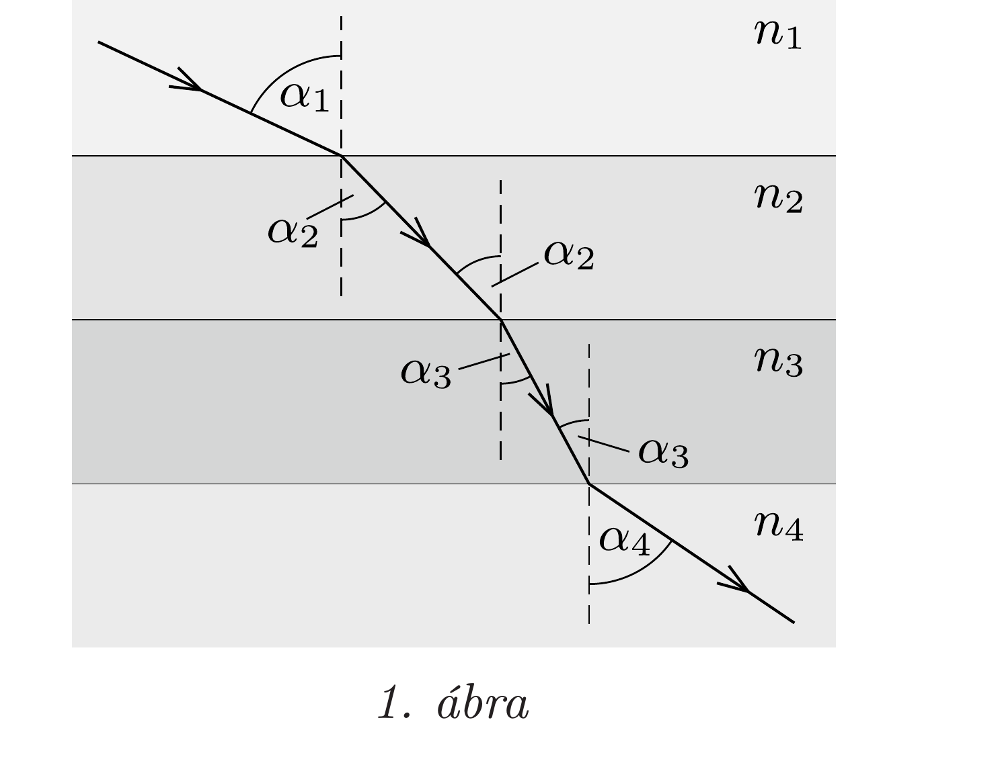
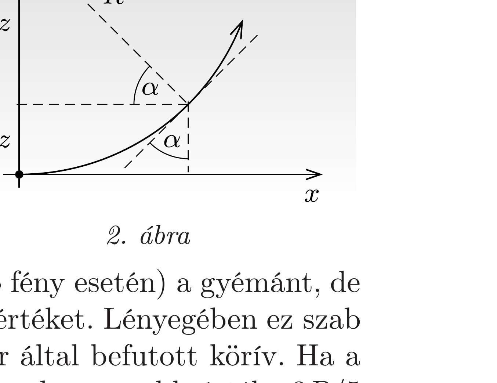

## Útmutatás

Képzeletben szeleteljük fel a közeget $z$-re merőlegesen vékony rétegekre. Az egyes rétegeket tekintsük különböző törésmutatójú plánparalel lemezeknek, és állapítsuk meg, hogy milyen összefüggés érvényes a réteg törésmutatója és a fénysugár beesési szöge között.

## Megoldás

Az 1. ábrán egymás után elhelyezett, különböző abszolút törésmutatójú plánparalel lemezeket láthatunk, amelyeken vékony fénysugár halad át. A Snellius-Descartes-törvény alkalmazásával a következő összefüggéseket ismerhetjük fel:
\[
\frac{\sin \alpha_{2}}{\sin \alpha_{1}}=\frac{n_{1}}{n_{2}}, \quad \frac{\sin \alpha_{3}}{\sin \alpha_{2}}=\frac{n_{2}}{n_{3}}, \ldots
\]
Megállapíthatjuk, hogy a beesési szög szinusza és az abszolút törésmutató szorzata a helytől független állandó:
\[
n_{1} \sin \alpha_{1}=n_{2} \sin \alpha_{2}=\ldots=n \sin \alpha=\text { állandó. }
\]

A folytonosan változó törésmutatójú közegre is érvényes ez az összefüggés, hiszen a közeget tekinthetjük úgy, mintha vékony plánparalel lemezekből épülne fel. Helyezzük a koordináta-rendszer origóját oda, ahonnan a fénysugár indul. Itt a beesési szög 90°-os, és ha ugyanitt a törésmutató $n_{0}$ értékú, akkor a fenti összefüggés így írható:
\[
n(z) \sin \alpha=n_{0} .
\]

Tételezzük fel, hogy a fény $R$ sugarú köríven halad, és vizsgáljuk a 2. ábrán feltüntetett $z$ koordinátájú helyet. Alkalmazzuk az előbbiekben megállapított összefüggést:
\[
n_{0}=n(z) \sin \alpha=n(z) \frac{R-z}{R},
\]
amibớl a törésmutató helyfüggése:
\[
n(z)=\frac{R}{R-z} n_{0} .
\]

A legnagyobb törésmutatójú ismert anyag (látható fény esetén) a gyémánt, de még ennek törésmutatója sem éri el az $n_{\text {max }}=2,5$-ös értéket. Lényegében ez szab határt annak, mekkora lehet maximálisan a fénysugár által befutott körív. Ha a törésmutató $n_{0}=1$-től $n_{\max }=2,5$-ig változik, akkor $z$ legnagyobb értéke $3 R / 5$ lehet, ami 66,4°-os középponti szögú körívnek felel meg.

A gyakorlatban pontosan körív mentén nehezen „terelhető“ a fény, olyan oldatot azonban lehet készíteni, amelyben a koncentráció - és ezzel együtt a törésmutató - függőleges irányban folytonosan változik. Ilyen oldatban a fénysugár nem egyenesen, hanem valamilyen „sima" görbe mentén terjed.

Megjegyzések. 1. Felmerülhet a kérdés, hogy miért kezd el görbülni az $x$ tengely mentén belépő fénysugár. Ennek oka az, hogy végtelen vékony fénysugár nincs, a „sugár” mindig valamilyen véges vastagságú nyalábot jelent. A nyaláb keresztmetszete mentén a törésmutató (vagyis a terjedési sebesség) változik, emiatt a hullámfront elfordul, és a nyaláb eltérül.
2. Nyáron a felforrósodott talaj fölötti levegőben függőlegesen felfelé haladva gyors ütemben csökken a hőmérséklet, ezáltal a sürúség és a törésmutató is növekszik. Az ebben a közegben elgörbülő fénysugarak okozzák a délibáb jelenségét.
