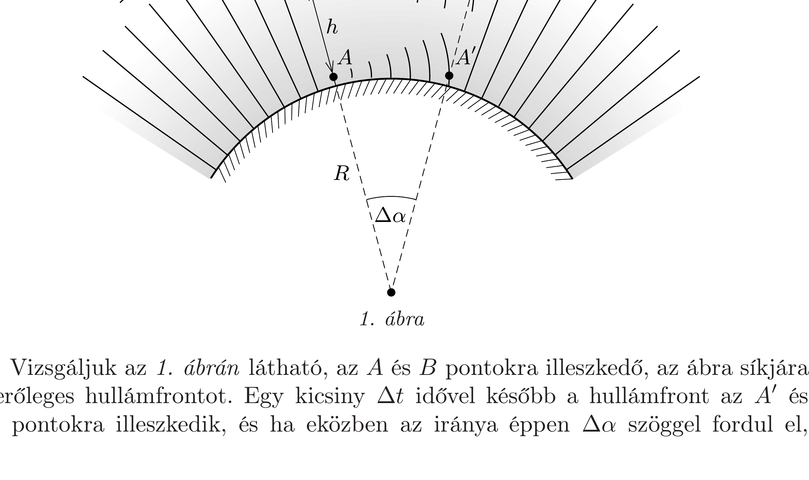
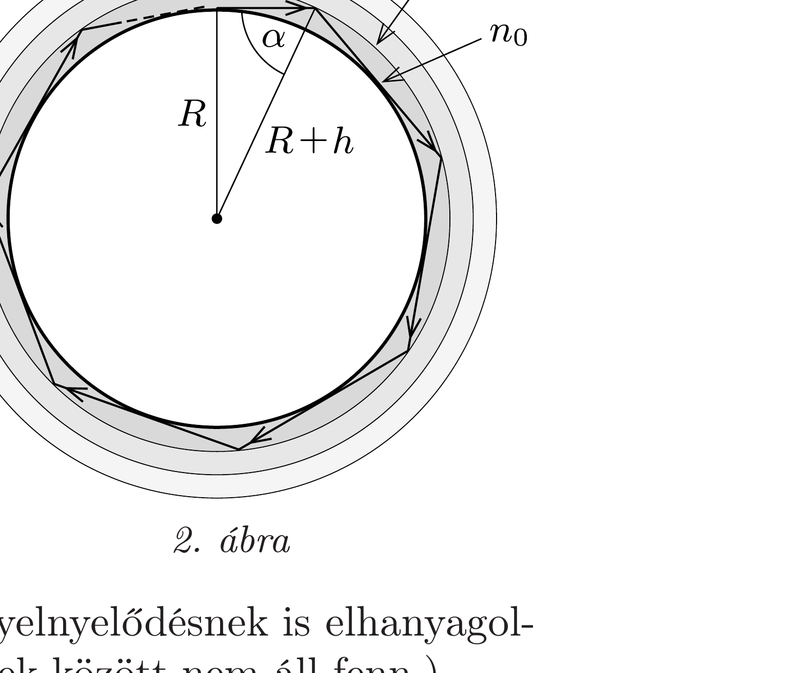

## Útmutatás

A Fermat-elv szerint az egymáshoz nagyon közeli fénysugarak ugyanannyi idő alatt futják be a pályájukat.

A Huygens-elv alkalmazása is eredményre vezethet. Eszerint az azonos fázisú felületek minden pontjából elemi gömbhullámok indulnak ki, melyek a fény $c / n$ fázissebességével terjedve kialakítják az új fázisfelületet. A geometriai optika szóhasználatának megfelelő „fénysugár” (amely csak közelítő leírásmód) a fázisfelületekre merőleges irányban halad.

Teljes visszaverődések sorozatával is értelmezhetjük az „elkanyarodó” fény jelenségét.

## Megoldás

I. megoldás. A Fermat-elv szerint az egymáshoz nagyon közeli fénysugarak ugyanannyi idő alatt futják be a pályájukat. Alkalmazzuk ezt az $R$ sugarú bolygó felszínének közelében $2 R \pi$ utat $c / n_{0}$ sebességgel befutó fény és a $h$ magasságban $(h \ll R) c / n(h)$ sebességgel haladó fényre:
\[
\frac{2 R \pi}{c} n_{0}=\frac{2(R+h) \pi}{c} n(h)=\frac{2 \pi R n_{0}}{c} \cdot \frac{1+h / R}{1+\varepsilon h} .
\]
Ez az összefüggés akkor teljesül különböző $h \neq 0$ értékekre, ha $R=1 / \varepsilon$.
II. megoldás. A Huygens-elv szerint az azonos fázisú felületek (hullámfrontok) minden pontjából elemi gömbhullámok indulnak ki, melyek a hullám terjedési sebességével haladnak. Ez a sebesség (ún. fázissebesség) a vákuumbeli $c$ fénysebességnek $1 / n(h)$-szorosa, ahol $n(h)$ a közeg törésmutatója az aktuális helyen.

Vizsgáljuk az 1. ábrán látható, az $A$ és $B$ pontokra illeszkedő, az ábra síkjára merőleges hullámfrontot. Egy kicsiny $\Delta t$ idővel később a hullámfront az $A^{\prime}$ és $B^{\prime}$ pontokra illeszkedik, és ha eközben az iránya éppen $\Delta \alpha$ szöggel fordul el,
akkor a rá merőleges fénysugarak „vízszintesen” haladnak tovább. Ennek feltétele a fázissebességekkel kifejezve:
\[
\begin{gathered}
B B^{\prime}=(R+h) \Delta \alpha=\frac{c}{n(h)} \cdot \Delta t, \\
A A^{\prime}=R \Delta \alpha=\frac{c}{n_{0}} \cdot \Delta t .
\end{gathered}
\]
A két egyenletet elosztva egymással:
\[
1+\frac{h}{R}=\frac{n_{0}}{n(h)}=1+\varepsilon h,
\]
amiből $R=1 / \varepsilon$ következik, összhangban az I. megoldás eredményével.
Megjegyzés. A kétféle megoldás nem független egymástól, hiszen a geometriai optika keretei között megfogalmazott Fermat-elv hullámoptikai megalapozását éppen a Huygens-elv biztosítja.
III. megoldás. A körbefutó fény jelenségét teljes visszaverődések sorozataként is értelmezhetjük (2. ábra). Közelítsük a folytonosan változó törésmutatójú légkört kicsiny $h \ll R$ vastagságú rétegekkel, és egy-egy rétegen belül tekintsük a törésmutatót állandónak. Ha teljesül az
\[
\frac{n(h)}{n_{0}}=\sin \alpha=\frac{R}{R+h},
\]
vagyis az $R=1 / \varepsilon$ feltétel, akkor a vízszintesen elinduló fénysugár a réteg tetejénél teljes visszaverődést szenved, és teljes visszaverődé-

sek sorozata után „körbefutva" visszaérkezhet a kiindulási helyre. (Természetesen ehhez még a fényelnyelődésnek is elhanyagolhatóan kicsinek kellene lennie, ami reális körülmények között nem áll fenn.)
