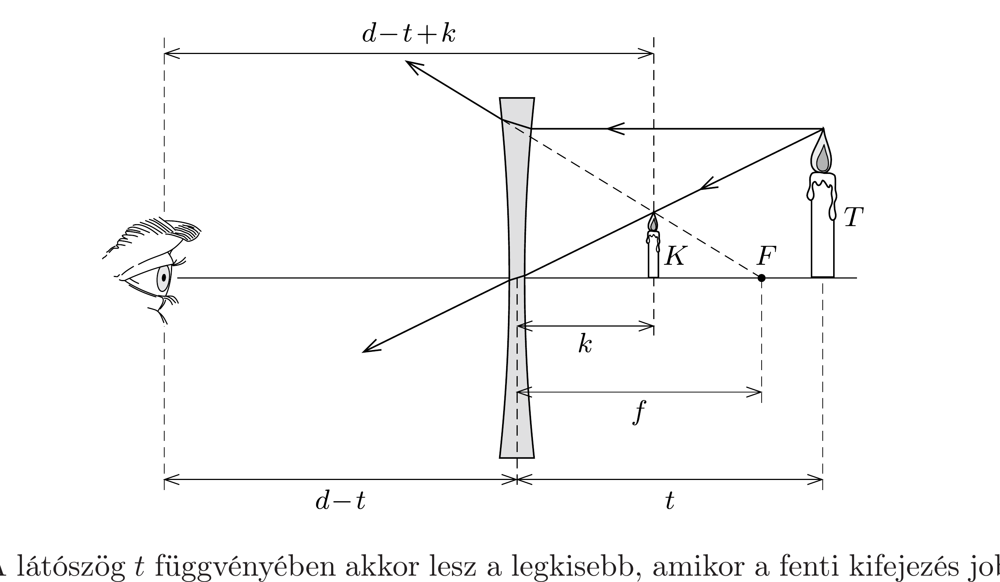

## Útmutatás

A kép látszólagos nagyságát nem a kép mérete, hanem a látószöge szabja meg.

## Megoldás

A rövidlátók szemüvegének lencséje szórólencse. Jelöljük a szórólencse (negatív) fókusztávolságát $-f$-fel, a tárgy és a szemünk távolságát $d$-vel, a tárgy méretét pedig $T$-vel (lásd az ábrát)! A keletkező (virtuális) kép távolsága a lencsétől a lencsetörvény szerint
\[
\frac{1}{-k}+\frac{1}{t}=\frac{1}{-f}, \quad \text { azaz } \quad k=\frac{t f}{t+f},
\]
a kép mérete pedig
\[
K=\frac{k}{t} T=\frac{f}{t+f} T .
\]

A kép látszólagos nagyságát azonban nem $K$, hanem az a $\varphi$ látószög határozza meg, amely alatt a kép látszik. Ennek nagysága (a tárgytávolsághoz képest kis tárgyat tételezve fel):
\[
\varphi=\frac{K}{d-t+k}=\frac{f T}{t(d-t)+f d},
\]
ahol $d$ a szemünk és a tárgy távolsága.

A látószög $t$ függvényében akkor lesz a legkisebb, amikor a fenti kifejezés jobb oldalán a nevezó a legnagyobb. A $t$ és $(d-t)$ pozitív mennyiségekre felírhatjuk a számtani és mértani középértékek közötti egyenlőtlenséget:
\[
t(d-t) \leq\left[\frac{t+(d-t)}{2}\right]^{2}=\frac{d^{2}}{4} .
\]
Egyenlőség $t=d / 2$ esetén áll fenn, ekkor lesz a $\varphi$ látószög a lehető legkisebb. A tárgyat tehát akkor látjuk a legkisebbnek, amikor a lencsét ugyanolyan messze tartjuk a szemünktől, mint a tárgytól. Érdekes, hogy ez a feltétel független a lencse fókusztávolságától.
