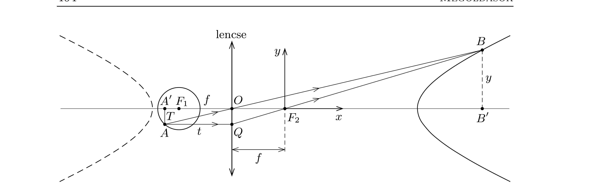

## Útmutatás

Kövessük nyomon a gömb egy felületi pontjáról kiinduló fénysugarak útját! A megoldás egy kúpszelet alakú görbének az optikai tengely körüli megforgatásából adódó forgásfelület lesz.

## Megoldás

Tételezzük fel, hogy a gömb átlátszó (tehát a felületének bármely pontjából eljuthat a fény a lencséhez), de a belsejének törésmutatója nem különbözik a levegőétől, így a fénysugarak csak a lencsénél törnek meg. A gyakorlatban ilyen helyzet például egy gömbfelület alakú, vékony, de nem nagyon súrú szövésú dróthálóval valósítható meg.

A gömbfelület forgásszimmetriája miatt elegendő a gömb egy síkmetszetének, az optikai tengelyre illeszkedő egyik főkörének képét meghatároznunk, a teljes kép ezen görbe megforgatásából adódó forgásfelület lesz.

Tekintsük a lencse egyik $\left(F_{1}\right)$ fókuszpontja körüli $r$ sugarú kör valamely $A$ pontját, és szerkesszük meg két nevezetes sugár segítségével az $A$-nak megfelelő $B$ képpontot az ábrán látható módon. Célszerú a $B$ pontot a másik $\left(F_{2}\right)$ fókuszpontba helyezett derékszögü koordináta-rendszerbeli $(x, y)$ számpárral jellemezni.

Az $O A^{\prime} A$ és $O B^{\prime} B$ háromszögek hasonlóságából
\[
\frac{y}{x+f}=\frac{T}{t},
\]
az $F_{2} B^{\prime} B$ és $F_{2} O Q$ háromszögek hasonlóságából pedig
\[
\frac{y}{x}=\frac{T}{f}
\]
következik. (A szokásos módon $t$ az $A$ pontnak megfelelő tárgytávolságot, $T$ pedig a tárgy méretét jelöli.) Ezekből az arányokból $T$ és $t$ kifejezhető $x$ és $y$ segítségével:
\[
T=f \frac{y}{x}, \quad \text { illetve } \quad t=f+\frac{f^{2}}{x} .
\]
Az $A$ és $F_{1}$ pontok távolsága rögzített érték (a gömb $r$ sugara):
\[
(t-f)^{2}+T^{2}=r^{2},
\]
ahonnan $t$ és $T$ behelyettesítése, valamint algebrai átalakítások után a következót kapjuk:
\[
\left(\frac{r x}{f^{2}}\right)^{2}-\left(\frac{y}{f}\right)^{2}=1 .
\]
Ez az összefüggés egy hiperbolát ír le, melynek az optikai tengellyel párhuzamos „valós féltengelye” $f^{2} / r$, „képzetes féltengelye" pedig $f$ hosszúságú.

A teljes gömbfelület képe a hiperbola mindkét ágának megforgatásából adódó ún. kétköpenyú forgáshiperboloid lesz. A gömb egyik ( $t>f$ módon jellemezhető) felének képe valódi kép, ennek síkmetszetét az ábra jobb oldalán folytonos vonallal ábrázoltuk. A másik, lencséhez közelebb eső félgömb képe látszólagos kép, ennek a bal oldali „köpeny" felel meg (síkmetszetét szaggatott vonal jelzi). A lencse fókuszsíkjában fekvő kör pontjairól nem jön létre kép, a hozzá közeli pontok képei pedig valamelyik hiperboloid-felületen nagyon messze (határesetben a „végtelenben") alakulnak ki. Ha a gömb nem átlátszó, akkor természetesen csak a lencséhez közelebbi felének virtuális képe jön létre.

Megjegyzés. A megoldás során feltételeztük, hogy a lencse vékony és a képalkotás torzításmentes. Ez utóbbihoz az (is) szükséges, hogy a képalkotásban résztvevő fénysugarak az optikai tengellyel majdnem párhuzamosan haladjanak, ez pedig akkor teljesül, ha a lencse fókusztávolsága a gömb sugaránál is és a lencse átmérőjénél is sokkal nagyobb. A megoldásban szereplő ábra méretaránya tehát erósen torzított, vagy ha ténylegesen ilyenek az arányok, akkor a kiszámított képfelületnek csak egy kis darabját szabad elfogadnunk.

Hasonló okok miatt nincs sok értelme a lencsébe nyúló, vagy azt magába foglaló gömb $(r \geq f)$ esetét tanulmányoznunk. Matematikailag érdekes ugyan a paraméterek teljes tartományának vizsgálata, és az $r>f$ eset a „dróthálóba bújtatott” lencsével még fizikailag is megvalósítható, a leképezés torzításai miatt azonban ennek elemzése a ténylegesen tapasztalható képalkotás szempontjából érdektelen.
