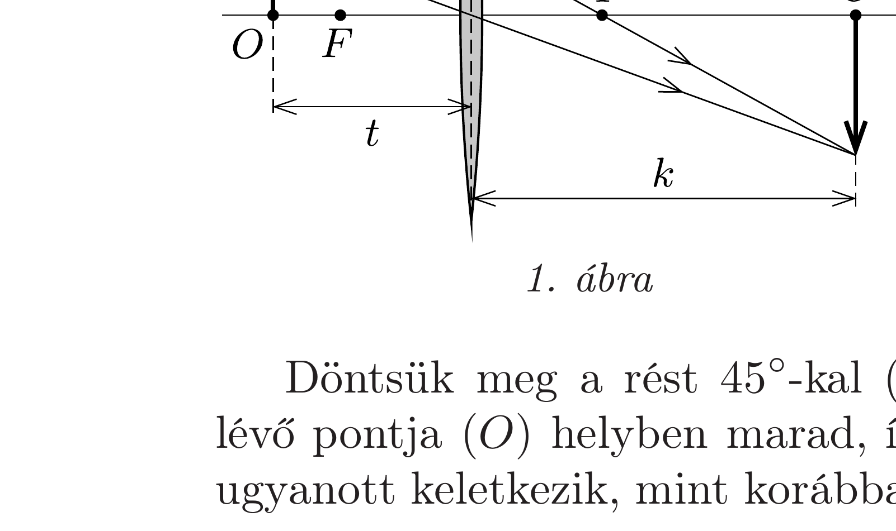
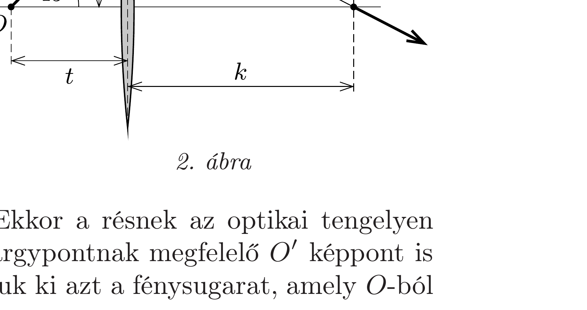

## Útmutatás

Használjuk fel azt a tényt, hogy a lencse egyenest egyenesbe képez le.

## Megoldás

Vizsgáljuk először a lencse által a függőleges résről alkotott képet (1. ábra)! A nagyítás kétszeres, ezért a képtávolság a tárgytávolság kétszerese $(k=2 t)$.

Döntsük meg a rést $45^{\circ}$-kal (2. ábra)! Ekkor a résnek az optikai tengelyen lévő pontja $(O)$ helyben marad, így az $O$ tárgypontnak megfelelő $O^{\prime}$ képpont is ugyanott keletkezik, mint korábban. Válasszuk ki azt a fénysugarat, amely $O$-ból

45°-ban indul, vagyis a rés pontjain halad keresztül. A lencsén való áthaladás után a megtört fénysugár a rés képének összes pontján áthalad. Az ernyốt úgy kell megdönteni, hogy ez a megtört fénysugár az ernyő síkjában haladjon. Meg kell tehát határoznunk a megtört fénysugárnak a függőlegessel bezárt $\alpha$ szögét. A 2. ábráról leolvasható, hogy $\operatorname{tg} \alpha=k / t=2$. Innen $\alpha=63,4^{\circ}$ adódik, tehát ekkora szöggel kell az ernyő felső felét a lencse felé megdönteni, hogy a résről továbbra is éles képet kapjunk.
