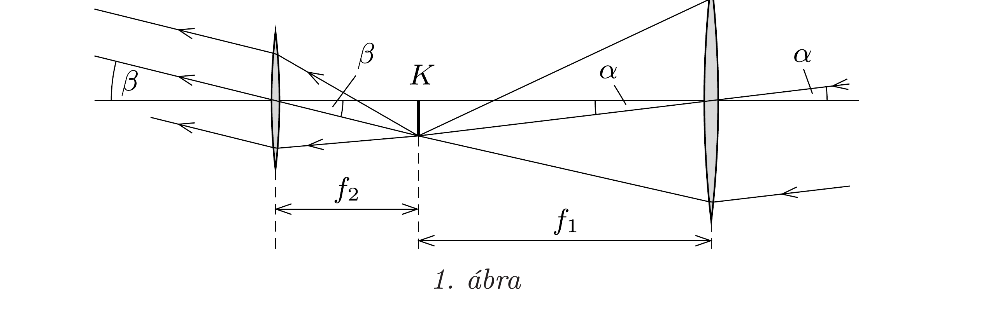
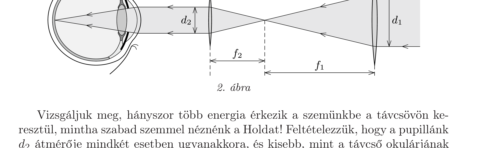
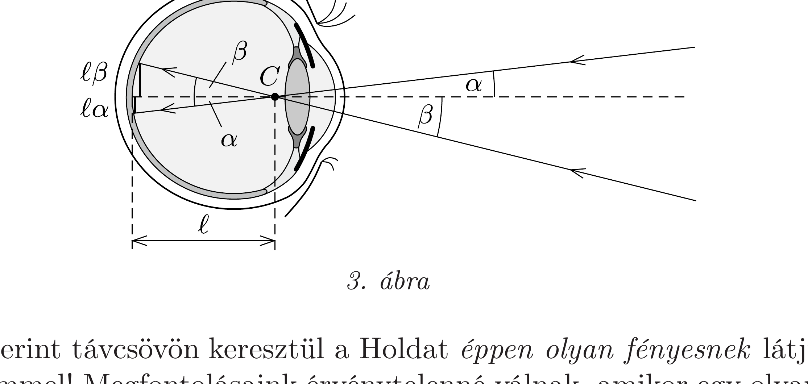

## Útmutatás

A Hold látszólagos fényességét a retina megvilágításának erôssége (vagyis az ideghártya egységnyi felületére érkező fény teljesítménye) határozza meg. Távcsövön keresztül nézve több energia érkezik a szemünkbe, mint amikor szabad szemmel nézzük a Holdat, de a keletkező kép területe is nagyobb a távcsöves megfigyelés esetében.

## Megoldás

Tekintsük például a két gyújtőlencséből összeállított Kepler-távcsövet! (Más távcsövekre hasonló elemzés készíthető.) A távoli tárgyakról az $f_{1}$ fókusztávolságú objektív (tárgylencse) majdnem pontosan a fókuszsíkjában alkot képet. Ha ezt a képet egy $f_{2}$ fókusztávolságú szemlencsén (okuláron) keresztül nézzük, akkor ennek a fókuszsíkja is majdnem pontosan a kép helyére esik, hiszen a szemünket „végtelenre állítjuk”, nagyon távol keressük a képet.

Az erôsen eltorzított méretarányú 1. ábráról leolvashatjuk, hogy a távcső szögnagyítása (a Hold két „széléről” érkező fénysugarak látószög-növekedési faktora):
\[
N_{\mathrm{sz}}=\frac{\beta}{\alpha} \approx \frac{\operatorname{tg} \beta}{\operatorname{tg} \alpha} \approx \frac{\left(K / f_{2}\right)}{\left(K / f_{1}\right)}=\frac{f_{1}}{f_{2}} .
\]

Vizsgáljuk meg, hányszor több energia érkezik a szemünkbe a távcsövön keresztül, mintha szabad szemmel néznénk a Holdat! Feltételezzük, hogy a pupillánk $d_{2}$ átmérője mindkét esetben ugyanakkora, és kisebb, mint a távcső okulárjának átmérője. A 2. ábrán (amely csak a majdnem párhuzamosan érkező fénysugarakat
mutatja, a képalkotást nem ábrázolja) látható, hogy időegységenként a szemünkbe jutó fény mennyisége a távcső esetén
\[
\left(\frac{d_{1}}{d_{2}}\right)^{2}=\left(\frac{f_{1}}{f_{2}}\right)^{2}=N_{\mathrm{sz}}^{2}
\]
faktorral nagyobb, mint az távcső nélkül lenne.
Végül hasonlítsuk össze a retinán keletkező kép méretét a kétféle megfigyelésnél. A retinán keletkező kép lineáris mérete jó közelítéssel egyenesen arányos a tárgy látószögével, a kétféle kép területének aránya tehát a szögnagyítás négyzetével, $N_{\mathrm{sz}}^{2}$-tel egyenlő.

Megjegyzés. A szem több töröfelületből álló, bonyolult optikai rendszer, amelynek múködése nem írható le egyetlen vékony lencse segítségével. A szembe érkezó fénysugarak két lényeges helyen törnek meg: először a szaruhártyán (cornea), másodszor pedig a szemlencsén. A szemet kitöltő közegek (csarnokvíz és üvegtest) törésmutatója a levegőétól jelentósen különböző, 1,3 körüli érték, ezért a fénytörés jelentós része már a szaruhártyán bekövetkezik. A belül változó törésmutatójú, vastag szemlencse a rajta áthaladó fénysugarak irányát az éles kép elérése érdekében csak „korrigálja”.

Mindezek ellenére a szem képalkotása jól közelíthető egyetlen, gömb alakú „helyettesítő" törőfelülettel, melynek $C$ középpontján áthaladó fénysugarak irányváltoztatás nélkül jutnak a retinára (3. ábra). Innen látható, hogy a szabad szemmel, illetve távcsóvel történő megfigyeléseknél keletkező képek mérete egyenesen arányos az $\alpha$ és $\beta$ látószögekkel.

Ezek szerint távcsövön keresztül a Holdat éppen olyan fényesnek látjuk, mint szabad szemmel! Megfontolásaink érvénytelenné válnak, amikor egy olyan kicsiny látószögú égitestet figyelünk meg, amelynek képe nem kiterjedt terület, hanem csak egyetlen fotoreceptorra esik fény a retinán (illetve egy digitális kamerában egyetlen pixelt világít meg). Ilyen esetekben a távcső megnöveli a beérkező fény teljesítményét, amit nem ront le a kép méretének növekedése, tehát a csillagot fényesebbnek észleljük.

Megjegyzés. Amennyiben a távcső okulárja kisebb átmérőjú lenne, mint a kitágult pupillánk (a gyakorlatban nem ez a helyzet!), akkor a távcsövön keresztül a Hold halványabbnak látszana, mint szabad szemmel. Ugyanezt a hatást eredményezi a pupilla összeszúkülése, ami reflexszerúen történik, ha erós fénybe nézünk.
