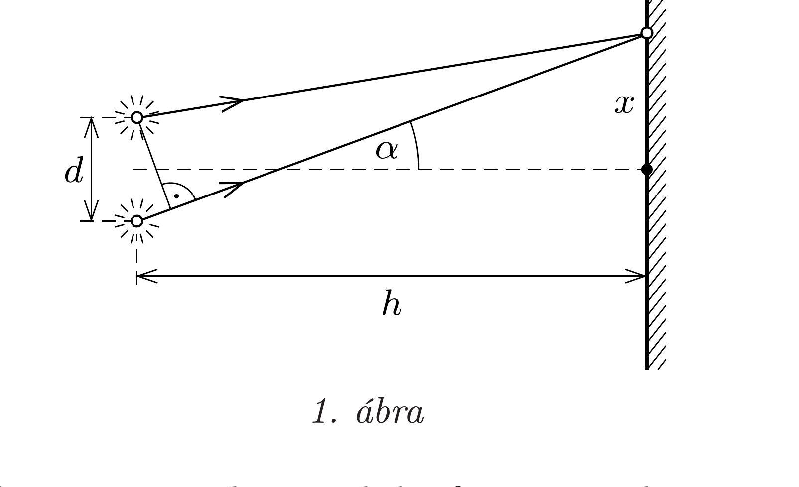
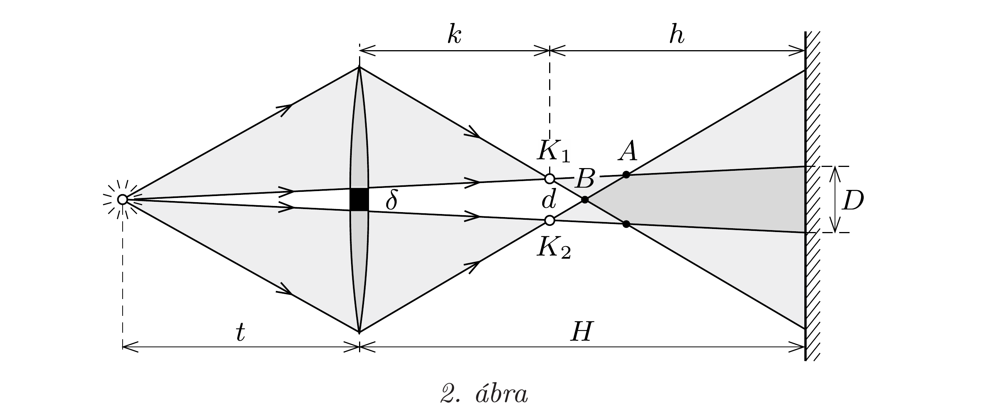

## Útmutatás

A két féllencse egy-egy pontszerú, valódi képet állít elő a fényforrásról. Ezek a képek, mint koherens pontforrások hoznak létre interferenciát az ernyőn. Az ernyőnek csak azon a részén figyelhetünk meg interferenciacsíkokat, ahol a két képpontból érkező fénynyalábok átfednek.

## Megoldás

A lencse két fele a pontforrásról egy-egy pontszerú, valódi képet alkot, melyek koherens fényforrásként viselkedve interferenciát hoznak létre az ernyőn. Ezért érdemes előbb megizsgálni, hogy milyen interferenciaképet hoz létre két, egymástól $d$ távolságra lévő, koherens, $\lambda$ hullámhosszúságú, monokromatikus fényt kibocsátó pontforrás a tőlük $h \gg d$ távolságra elhelyezett ernyőn.

A tér azon pontjaiban tapasztalhatunk maximális erósítést, mely pontoknak a két fényforrástól mért távolságának különbsége éppen a $\lambda$ hullámhossz egész számú többszöröse. Ez azt jelenti, hogy az erósítési helyek olyan kétköpenyú forgási hiperboloidokon helyezkednek el, melyek szimmetriatengelye illeszkedik a két fényforrásra. Az ernyőn ezeknek a hiperboloidoknak a tengelyükkel párhuzamos síkmetszeteit figyelhetjük meg, ezért a kialakuló interferenciacsíkok (nagyon enyhén görbülő) hiperbola alakúak lesznek. A csíkok súrúsége a hiperbolasereg szimmetriatengelyén a legnagyobb, ezért a továbbiakban csak a fényforrásokra illeszkedő, az ernyőre merőleges síkban elhelyezkedő fénysugarakkal foglalkozunk (1. ábra).

Az 1. ábrán látható, $\alpha$ szögben induló fénysugarakra a maximális erőśítés feltétele:
\[
d \sin \alpha=n \lambda,
\]
ahol $n$ egész szám. Kis $\alpha$ szögekre használhatjuk a $\sin \alpha \approx x / h$ közelítést, ezzel
\[
\frac{x d}{h}=n \lambda, \quad \text { azaz } \quad x=n \frac{\lambda h}{d} .
\]
Azt kaptuk tehát, hogy a szomszédos interferenciacsíkok távolsága $\Delta=\lambda h / d$.
Most térjünk rá arra a kérdésre, hogy milyen képeket alkot a pontszerú fényforrásról a félbevágott gyújtőlencse! A leképezési törvény szerint
\[
\frac{1}{t}+\frac{1}{k}=\frac{1}{f},
\]
amiből a $k$ képtávolságra
\[
k=\frac{t f}{t-f}
\]
adódik. A (nem méretarányos) 2. ábráról a megfelelő háromszögek hasonlóságát felhasználva leolvasható, hogy ha a két féllencse közötti rés vastagsága $\delta$, akkor a
keletkező $K_{1}$ és $K_{2}$ képek $d$ távolságára fennáll a
\[
\frac{d}{\delta}=\frac{t+k}{t}
\]
összefüggés, amelyből
\[
d=\frac{t+k}{t} \delta=\frac{t \delta}{t-f} .
\]

A lencse által előállított $K_{1}$ és $K_{2}$ képek interferenciacsíkokat hoznak létre az ernyőn, melyek távolsága (ahogy előbb láttuk) $\Delta=\lambda h / d$, ahol $h$ a képek és az ernyő távolsága:
\[
h=H-k=\frac{H(t-f)-t f}{t-f} .
\]
A szomszédos interferenciacsíkok távolsága tehát
\[
\Delta=\frac{\lambda(H(t-f)-t f)}{t \delta} .
\]
Interferenciát csak az ernyő azon részén figyelhetünk meg, ahol a két képből érkező fénynyalábok átfednek. Ismét a megfelelő háromszögek közötti hasonlóságot használva kapjuk az átfedési tartomány $D$ szélességét:
\[
D=\delta \frac{H+t}{t} .
\]
Az ernyőn látható interferenciacsíkok száma:
\[
N \approx \frac{D}{\Delta}=\frac{\delta^{2}}{\lambda} \frac{H+t}{H(t-f)-t f} .
\]
A rendelkezésre álló adatok behelyettesítése után $N \approx 46,7$ eredményt kapunk, azaz 47 interferenciacsíkot láthatunk az ernyőn.

Megjegyzés. A feladatban megadott számadatok esetén az ernyő távolabb helyezkedik el a lencsétól, mint a 2. ábrán látható $A$ pont. Ellenkező esetben az átfedési tartomány $D$ méretét máshogy kellene számolni, ehhez azonban szükségünk lenne a lencse átmérőjére. Ha az ernyốt a $B$ pontnál közelebb helyezzük a lencséhez, nem jön létre interferencia.
