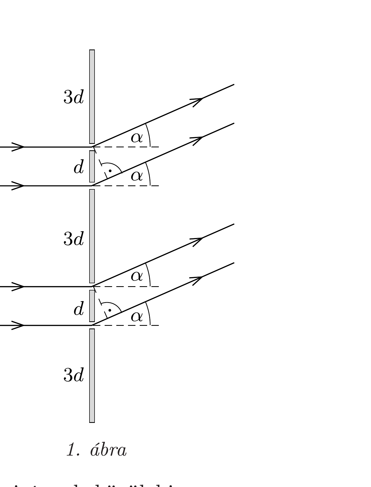
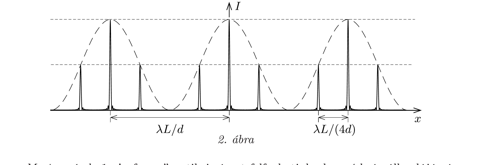

## Útmutatás

A furcsa optikai rács felfogható két $4 d$ rácsállandójú, egymáshoz képest $d$ távolsággal eltolt hagyományos optikai rács szuperpozíciójaként. Az ernyő különböző pontjaiban mérhető fényintenzitás egyenesen arányos az oda jutó fényhullámok eredő amplitúdójának négyzetével.

## Megoldás

Először képzeljük el, milyen lenne a diffrakciós kép, ha minden második rést (a másodikat, negyediket stb.) kitakarnánk! Ekkor a $4 d$ távolságra elhelyezkedő rések egy szokásos optikai rácsot alkotnának, az $n$-edik elhajlási maximum ernyőn mérhető $x_{n}$ helyzetét pedig a
\[
4 d \sin \alpha_{n}=n \lambda, \quad \sin \alpha_{n} \approx \operatorname{tg} \alpha_{n}=x_{n} / L
\]
összefüggésekből számíthatjuk ki:
\[
x_{n}=n \frac{\lambda L}{4 d} .
\]
(Felhasználtuk, hogy $d \gg \lambda$, vagyis az elhajlási szögek kicsik.) Ugyanilyen lenne az elhajlási kép, ha a másik réssort (azaz az első, harmadik stb.

rést) takarnánk ki. Ha mindkét réssoron átengedjük a fényt, akkor az (1) egyenlet által meghatározott irányok közül bizonyos irányokban (azaz bizonyos $n$ értékeknél) részleges vagy teljes kioltást tapasztalhatunk. Azt kell tehát megvizsgálnunk, hogyan adódik össze a két, $d$ távolsággal eltolt, $4 d$ periódusú réssoron áthaladó fény amplitúdója.
A következő négy eset lehetséges:
- 1. Ha $n=4 k+1$ (ahol $k$ egész), akkor a két réssoron áthaladó fény közötti útkülönbség $\lambda / 4$, ami $\pi / 2$ fáziskülönbségnek felel meg. Két, $\pi / 2$ fáziskülönbséggel találkozó, azonos amplitúdójú (azaz térerósségvektorú) hullám összegének amplitúdója a tér egy rögzített pontjában:
\[
E_{\text {eredö }}(t)=E_{0} \sin \omega t+E_{0} \sin \left(\omega t+\frac{\pi}{2}\right)=E_{0} \sin \omega t+E_{0} \cos \omega t,
\]
amely $\sqrt{2}$ kiemelése után egyetlen szinuszfüggvénnyé alakítható:
\[
E_{\text {eredö }}(t)=\sqrt{2} E_{0}\left(\frac{1}{\sqrt{2}} \sin \omega t+\frac{1}{\sqrt{2}} \cos \omega t\right)=\sqrt{2} E_{0} \sin \left(\omega t+\frac{\pi}{4}\right) .
\]
Az amplitúdó tehát az egy réssoron átjutó fény amplitúdójának $\sqrt{2}$-szerese. Mivel a fény intenzitása az amplitúdó négyzetével arányos, így az eredő intenzitás az egy réssor esetében mérhetó intenzitásnak a kétszerese lesz.
Ugyanehhez az eredményhez úgy is eljuthatunk, ha az amplitúdókat forgóvektorként (más néven fázisvektor) adjuk össze. Ekkor két egyforma nagyságú, egymással 90°-os szöget bezáró „amplitúdóvektort” kell összeadnunk, amelyek eredője az eredeti vektoroknál $\sqrt{2}$-ször hosszabb, és azokkal 45°-os szöget zár be.
- 2. Ha $n=4 k+2$, akkor a két réssor közötti fáziskülönbség $\pi$, tehát ilyen irányokban tökéletes kioltást tapasztalunk.
- 3. Ha $n=4 k+3$, a fáziskülönbség $3 \pi / 2$, így az amplitúdó (az első esethez hasonlóan) az egyetlen réssoron áthaladó fény amplitúdójának $\sqrt{2}$-szerese, az intenzitás pedig a kétszerese lesz.
- 4. Ha $n=4 k$, akkor minden sugár erősíti egymást, az amplitúdó tehát egyetlen réssoron áthaladó fény amplitúdójának kétszerese, az intenzitás pedig négyszerese lesz.

Összefoglalva: a 2. ábrán folytonos vonallal ábrázolt intenzitáseloszlás alakul ki, a nagy intenzitású csúcsok közötti távolság $\lambda L / d$.

Megjegyzések. 1. A „furcsa” optikai rácsot felfoghatjuk olyan $4 d$ rácsállandójú rácsként is, melyet nem egyszerú rések, hanem $d$ réstávolságú (Young-féle) kettősrések alkotnak. Egy $4 d$ rácsállandójú, (igen keskeny résekből álló) hagyományos optikai rács intenzitáseloszlása azonos magasságú, egymástól $\lambda L /(4 d)$ távolságra elhelyezkedő, éles csúcsokból áll. Belátható, hogy egyetlen, $d$ réstávolságú kettősrés elhajlási képe a 2 . ábrán szaggatott vonallal jelölt koszinuszfüggvény. A furcsa rács esetén mérhető intenzitáseloszlást úgy kaphatjuk meg, hogy az említett két intenzitáseloszlást összeszorozzuk.
2. Szembetúnó, hogy az optikai rácson a 4-szer ritkább periodikus mintázat 4-szer súrúbb mintát eredményez az elhajlási képen. Ez a fajta fordított arányosság általánosan igaz a diffrakciós jelenségeknél: a legnagyobb mintázat alakítja ki a diffrakciós kép legfinomabb részleteit, és fordítva, a rács legapróbb mintázata adja az elhajlási kép nagyléptékú szerkezetét. A feladatban a $d$ és $4 d$ távolságokon kívül van egy harmadik méretskála is, amit eddig elhanyagoltunk: a rések szélessége. Ha ezt is figyelembe vennénk, akkor ez az elhajlási képben egy hosszú periódusú modulációt eredményezne. (A 2. ábrán látható intenzitáseloszlást meg kellene szorozni az egy rés diffrakciós képének intenzitáseloszlásával.)
3. Az intenzitáscsúcsok nem végtelen „élesek", hanem bizonyos szélességük van, melynek oka a megvilágító lézernyaláb vastagságával áll kapcsolatban. Ha például a megvilágító lézernyaláb vékony (az ernyốtávolság pedig nagy), akkor csak kevés résen halad át fény, ami az intenzitáscsúcsok kiszélesedéséhez vezet. Ezt az állítást legegyszerúbben egy hagyományos („egyenközú“) optikai rács példáján keresztül szemléltethetjük. Ha egy ilyen rács $N$ darab rését világítjuk meg, akkor a maximális erősítési irányokban mind az $N$ résből jövő amplitúdó összeadódik, az eredő amplitúdó tehát $N$-nel, az intenzitáscsúcsok magassága pedig $N^{2}$-tel arányos. A rácson átjutó fény által szállított teljesítmény arányos $N$-nel, és ugyanígy kell viselkednie az intenzitáscsúcsok alatti területnek
is (hiszen az energia megmarad). Ez pedig csak úgy lehetséges, ha az intenzitáscsúcsok szélessége $1 / N$-nel arányos.
