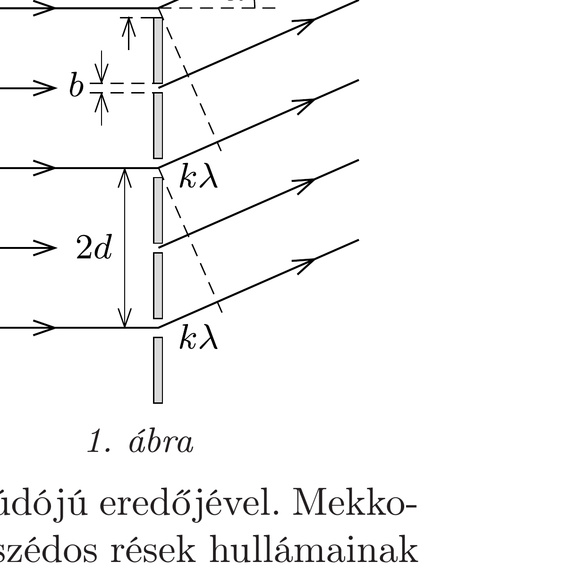
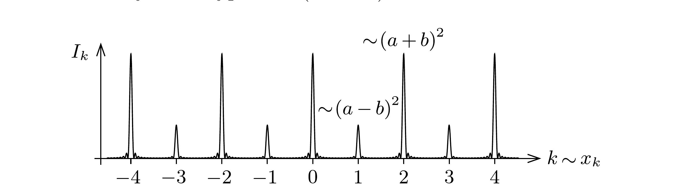

## Útmutatás

Az elhajlási képről a Huygens-Fresnel-elv alapján tehetünk kijelentéseket. Eszerint az egyes réseken áthaladó „elemi hullámok” amplitúdó- és fázishelyes összege adja meg az eredő hullámot, ennek amplitúdó-négyzetével arányos az ernyő egyes pontjaiba érkező fény intenzitása. Egy-egy résbő́l érkező hullám amplitúdója a rés szélességével arányos, fázisát pedig az optikai úthossz határozza meg.

## Megoldás

A rácsra merőlegesen esik monokromatikus fény, emiatt a résekből kilépő fényhullámok fázisa kilépéskor egyenlő, amplitúdójuk pedig (keskeny rések esetén) arányos a rések szélességével. (Ez utóbbi állítás következik a Huygens-Fresnel-elvből, hiszen egy $n$-szer szélesebb rés felfogható $n$ darab egymás melletti résként, és az ezeken átjutó elemi fényhullámok mindegyike ugyanakkora, azonos fázisú járulékot eredményez az eredő hullámban.)

Az ernyő́n látható fény intenzitása az eredő hullámamplitúdó négyzetével arányos. $N \gg 1$ rés esetén nagyon sok hullám interferenciáját kell tanulmányoznunk; az interferencia eredménye a találkozáskor fellépő fáziskülönbségektől, az pedig az útkülönbségektől függ. Ha a szomszédos résekből jövő hullámok között valamekkora fáziskülönbség van, a sok hullám járuléka általában kioltja egymást. Kivételt csak az az eset képez, amikor minden második résből azonos fázisban érik el az ernyốt a hullámok. Ekkor mind a páros, mind pedig a páratlan sorszámú rések hullámai erősítik egymást, eredő amplitúdójuk
\[
E_{\text {páros }}=K \cdot \frac{N}{2} b, \quad \text { illetve } \quad E_{\text {páratlan }}=K \cdot \frac{N}{2} a .
\]
(A $K$ állandó nagysága függ a rácsra eső fény erốsségétő̆l és az ernyố távolságától, pontos értéke azonban a továbbiakban nem lényeges.)

Melyek azok az irányok, amelyeknél a fenti feltétel teljesül? Az 1. ábráról leolvasható, hogy amennyiben az eredeti iránnyal $\alpha$ szöget bezáró irányban tovaterjedő hullámokra fennáll, hogy
\[
2 d \sin \alpha=k \lambda, \quad(k=0, \pm 1, \pm 2, \ldots)
\]
a páros és a páratlan hullámok külön-külön azonos fázisban adódnak össze (tehát erósítik egymást).

Most már csak két hullámot kell összegeznünk, a páros sorszámú rések $E_{\text {páros }}$ amplitú-

dójú eredőjét a páratlan sorszámú rések $E_{\text {páratlan }}$ amplitúdójú eredőjével. Mekkora a fáziskülönbség ezen hullámok között? Mivel a szomszédos rések hullámainak útkülönbsége $k \lambda / 2$, páros $k$-ra a két hullám azonos, páratlan $k$-ra pedig ellentétes előjellel összegződik. Ezek szerint az ernyőt $\alpha_{k}$ szögben érő fény (vagyis a $k$-adik elhajlási maximum) intenzitása
\[
I_{k} \sim \begin{cases}(a+b)^{2}, & \text { ha } k \text { páros } \\ (a-b)^{2}, & \text { ha } k \text { páratlan. }\end{cases}
\]
A $k$-adik intenzitáscsúcs a rácstól $L$ távolságban lévó ernyốn az eltérülésmentes fény helyétől
\[
x_{k}=L \operatorname{tg} \alpha_{k} \approx L \sin \alpha_{k}=k \frac{L \lambda}{2 d}
\]
távolságra keletkezik. (Felhasználtuk, hogy $d \gg \lambda$ miatt az elhajlási szögek kicsik.)
Az ernyő́n tehát egymástól egyenlő távolságra aránylag éles, apró fénypontokat (foltokat) látunk, de ezek intenzitása nem egyforma: felváltva követik egymást az erósebb és a halványabb fénypontok (2. ábra).

Ha $a \approx b$, akkor a 3. ábra $a$ ) részén látható intenzitáseloszlást, ha pedig $a \gg b$, akkor a $b$ ) részen bemutatott intenzitáseloszlást figyelhetjük meg az ernyőn.

![\item[a)]](../../figures/333plus/figures/333+-p473-f2.png)

![\item[b)]](../../figures/333plus/figures/333+-p473-f3.png)

3. ábra
