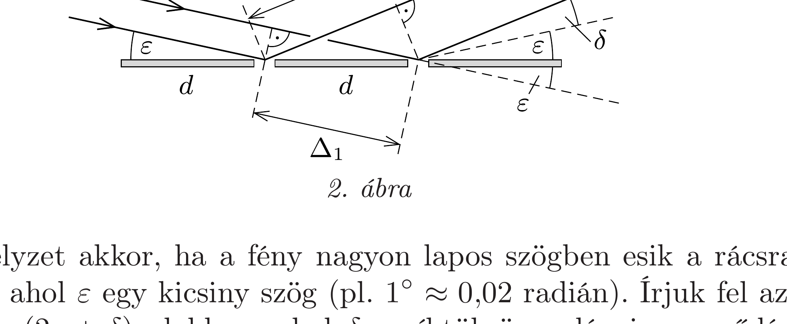

## Útmutatás

Vizsgáljuk meg, hogy milyen irányokban lesz a különböző réseken áthaladó fénysugarak útkülönbsége a hullámhossz egész számú többszöröse. A lézerfény beesési irányából tekintve a rácsra annak rácsállandóját $d \cos \varphi$ méretúnek „látjuk”. Tévedés lenne ebbő́l arra következtetni, hogy az elhajlási irányok egy ilyen (súrúbb) rácsra merőlegesen eső fény elhajlási képével egyezik meg.

## Megoldás

Nézzük a rácsot (és a lézersugarat) függőleges irányból (1. ábra). Az útkülönbség két tagból, a rács előtti és a rács utáni részek járulékából tevődik össze:
\[
\Delta_{1}+\Delta_{2}=d\left[\sin \varphi+\sin \left(\alpha_{k}-\varphi\right)\right]=k \cdot \lambda,
\]
ahonnan az interferenciás erősítés feltétele:
\[
\text { (1) } \quad \sin \varphi\left(1-\cos \alpha_{k}\right)+\cos \varphi \sin \alpha_{k}=k \frac{\lambda}{d} \text {, }
\]

Megjegyzések. 1. Az $\alpha=0$ szögre tetszóleges $\varphi$ esetén teljesül a hullámerősítés (1) feltétele $k=0$ mellett. Ez a nulladrendú maximum, a változatlan irányban továbbhaladó fény esete.
2. Merőlegesen tartott rács $(\varphi=0)$ esetén $(1)$-ből természetesen visszakapjuk a szokásos
\[
\sin \alpha_{k}=k \frac{\lambda}{d} \quad(k=0, \pm 1, \pm 2, \ldots)
\]
egyenletet.
3. $\varphi \neq 0$ esetén az eltérítés feltétele nem szimmetrikus a $k \leftrightarrow(-k)$ cserére, ezért a nulladrendú maximumhoz képest jobbra és balra különböző szögekben térül el a fény.

Az aszimmetrikus eltérítési szögek is jól mutatják, hogy téves az a naiv elképzelés, miszerint a ferdén tartott rács úgy téríti el a fényt, ahogy azt egy súrúbb, $d^{\prime}=d \cos \alpha$ rácsállandójú rács tenné.
4. Az (1) egyenlet $\alpha<\varphi-90^{\circ}<0$ esetén is érvényes. Ilyenkor a fény a rácsnak ugyanazon térfelén halad tovább, mint ahol a lézer található, a rács tehát „visszatükrözi" a fényt. Ebben a tartományban is találunk $k=0$-nak megfelelő, a hullámhossztól független eltérítési irányt: $\alpha=2 \varphi-180^{\circ}$, ami a geometriai optikából is ismert síktükrön történő visszaverődésnek felel meg.

A merőlegesen vagy ahhoz közeli szögekben beeső lézerfény esetén csak akkor kaphatunk szabad szemmel is jól látható interferenciát, ha a $d$ rácsállandó nagyságrendileg ugyanolyan kicsi, mint a látható fény (ezred milliméternél is kisebb) hullámhossza. Ha $d$ milliméteres nagyságrendú, vagy még ennél is nagyobb, akkor a (2) egyenlet szerinti $\alpha_{k}$ szögek annyira kicsik lennének, hogy az ernyőn a „foltocskák” egymásba lógnának, összemosódnának. Emiatt hiába is próbálnánk pl. egy múanyagvonalzó 1 mm-es beosztású skálájára ejtett lézerfénnyel a fény hullámtermészetét „megfigyelni”, nem járnánk sikerrel.

Más a helyzet akkor, ha a fény nagyon lapos szögben esik a rácsra. Legyen $\varphi=90^{\circ}-\varepsilon$, ahol $\varepsilon$ egy kicsiny szög (pl. $1^{\circ} \approx 0,02$ radián). Írjuk fel az eltérülés szögét $\alpha=-(2 \varepsilon+\delta)$ alakban, ahol $\delta$ a síktükrön való visszaverődés szögétől való - feltehetően kicsi - eltérés (2. ábra). Ezekkel a változókkal a hullámerősítés feltétele (mint az akár az (1) egyenletből, akár a 2 . ábráról leolvasható):
\[
\cos \varepsilon-\cos (\varepsilon+\delta)=-k \frac{\lambda}{d}
\]

Innen ( $\varepsilon$ és $\delta$ kicsiny voltát felhasználva)
\[
\frac{1}{2} \delta^{2}+\varepsilon \delta+k \frac{\lambda}{d}=0
\]
vagyis
\[
\delta_{k}=\sqrt{\varepsilon^{2}-2 k \lambda / d}-\varepsilon
\]
adódik. Ha például $\varepsilon$ néhány fokos szög, és $d=1 \mathrm{~mm}$, akkor a $\delta_{k}$ szögek is néhány fok nagyságrendúek. Emiatt akár egy közönséges iskolai múanyagvonalzó (a fény hullámhosszánál kb. $10^{4}$-szer durvább) milliméteres beosztása is képes reflexiós elhajlási képet előidézni, ha a vonalzóra kicsiny szögben ejtjük a lézerfényt. Az elhajlási kép kísérleti vizsgálatával, tehát vonalzóval is „meg tudjuk mérni” egy ismeretlen lézer hullámhosszát.
