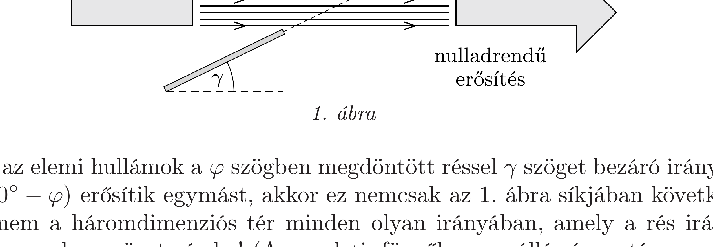
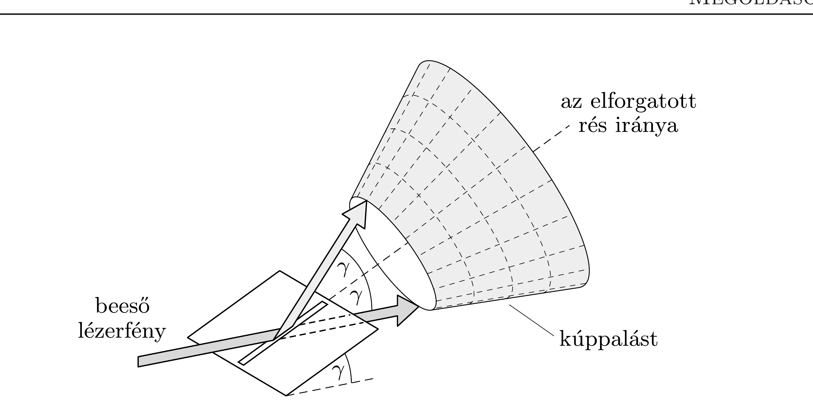
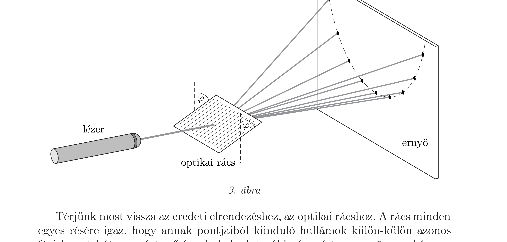

## Útmutatás

Érdemes először rács helyett egyetlen keskeny rés által létrehozott elhajlást vizsgálni. A résen irányváltoztatás nélkül áthaladó fénynyaláb sugarai zérus útkülönbséggel érkeznek az ernyőre, itt tehát erósítést tapasztalunk. Keressük meg, hogy ezen kívül még a tér mely irányaiban lesz a fénysugarak útkülönbsége nulla. Szükségünk lesz a kúpszeletekre vonatkozó ismereteinkre.

## Megoldás

Vizsgáljuk meg először, milyen lenne az elhajlási kép, ha az optikai rács helyére egyetlen, vékony rést helyeznénk! Ha a résre merőlegesen esik a fény $(\varphi=0)$, akkor a távoli ernyő́n egy vízszintes, folytonosan változó intenzitású egyenes fénycsíkot látunk, amely a rés kioltási irányainak megfelelő helyeken megszakad. Ha a rés elegendően vékony, akkor a kioltási helyek távol helyezkednek el egymástól, így az ernyőn kialakuló fénycsík folytonos lesz.

Ha a rést előredöntjük a megadott vízszintes tengely körül, akkor a lézerből jövő fénynyaláb eredeti irányában továbbra is erósítést tapasztalunk. Ez azért van így, mert igaz ugyan, hogy a rés különböző pontjaiba (a lézertől mért távolságok különbözősége miatt) más-más fázissal érkezik a síkhullám, de a résen áthaladva és az eredeti irányban terjedve éppen akkora útkülönbséggel érkeznek az elemi hullámok az ernyőhöz, hogy a teljes fáziskülönbség közöttük nulla (lásd az oldalnézeti 1. ábrát).

Ha az elemi hullámok a $\varphi$ szögben megdöntött réssel $\gamma$ szöget bezáró irányban $\left(\gamma=90^{\circ}-\varphi\right)$ erósítik egymást, akkor ez nemcsak az 1. ábra síkjában következik be, hanem a háromdimenziós tér minden olyan irányában, amely a rés irányával ugyancsak $\gamma$ szöget zár be! (Az eredeti, függőlegesen álló rés esetén $\gamma=90^{\circ}$, ezért kaptunk ott az ernyőn vízszintes vonalat.) A résen elhajló fény erósítési irányai tehát a 2. ábrán látható, egyetlen vízszintes alkotóval rendelkező kúppalástra illeszkednek. A kúp csúcsa a rés közepe, tengelyének iránya a rés iránya, fél nyílásszöge a fenti $\gamma$, amely az elforgatás szögének pótszöge.

Az ernyő́n keletkező kép az ernyő́ síkjának és a 2. ábrán látható kúppalástnak a metszésvonalaként kialakuló kúpszelet, amely ellipszis, parabola vagy hiperbola lehet. Parabolát éppen akkor kapunk, ha az ernyő́ síkja a kúp valamelyik alkotójával párhuzamos. Esetünkben ez akkor következik be, ha a kúpnak van függőleges alkotója. Vízszintes alkotója az eredeti fénysugár, függőleges tehát csak akkor lehet a másik alkotó, ha a kúp nyílásszöge $90^{\circ}$. Ekkor $\gamma=45^{\circ}, \varphi=90^{\circ}-\gamma=45^{\circ}$, ez az elforgatási szög szerepelt példaként a feladatban.

Térjünk most vissza az eredeti elrendezéshez, az optikai rácshoz. A rács minden egyes résére igaz, hogy annak pontjaiból kiinduló hullámok külön-külön azonos fázisban, tehát egymást erósítve haladnak tovább, és ezért az ernyőn egy kúpszelet mentén fényes vonalat hoznának létre, ha a többi rés nem lenne jelen. A rács különböző rései azonban általában különböző fázisú hullámokat juttatnak az ernyőre, és csak a kúpszelet bizonyos pontjaiban fog teljesülni, hogy ezen hullámok fáziskülönbsége $2 \pi$ egész számú többszöröse. Ezekben a pontokban az ernyőn fé-
nyes foltokat, a többi helyeken viszont gyakorlatilag nulla megvilágítást észlelünk, ahogy azt a 3. ábra mutatja.
