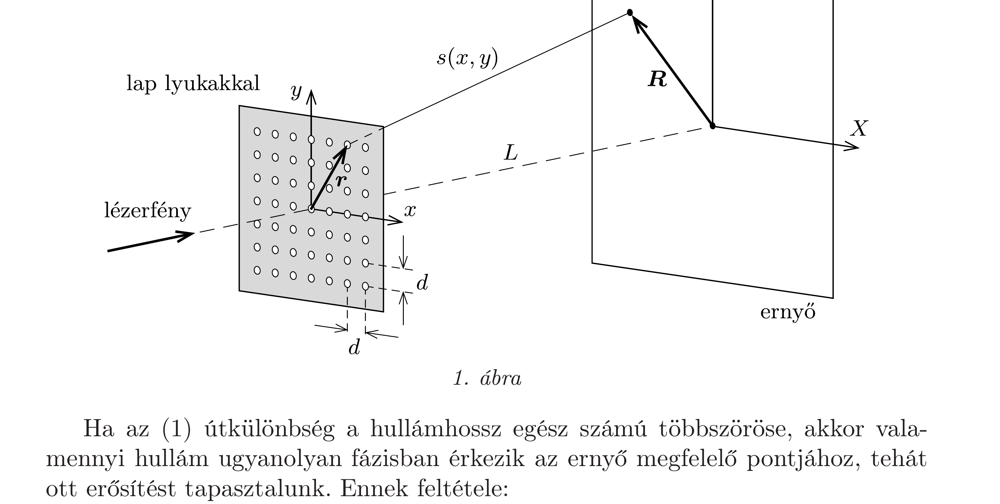
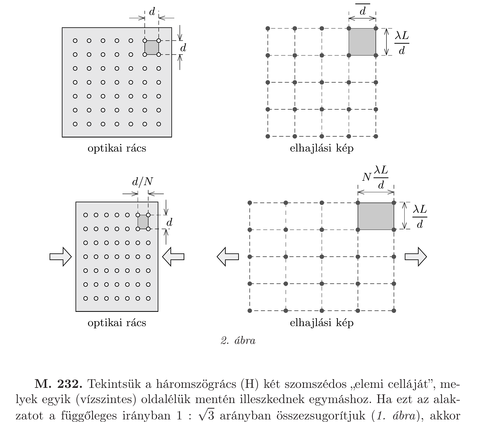

## Útmutatás

Az ernyőn olyan pontokban tapasztalunk interferencia-maximumot (fényes foltocskákat), ahová az összes lyukból ugyanolyan fázisban érkeznek meg a fényhullámok (Huygens-Fresnel-elv). Fogalmazzuk meg ennek matematikai feltételét a lyukak helyzetét megadó $\boldsymbol{r}=(x, y)$ és az ernyőn az erősítési pontba mutató $\boldsymbol{R}=(X, Y)$ vektorok segítségével!

## Megoldás

A lapon lévó lyukak helyzete az $\boldsymbol{r}=(x, y)$ síkbeli vektorral adható meg (1. ábra), ahol $x$ és $y$ is a $d$ rácsállandó egész számú többszöröse. Egy ilyen lyuk és az ernyő $\boldsymbol{R}=(X, Y)$ helyvektorú pontjának távolsága:
\[
s(x, y)=\sqrt{L^{2}+(X-x)^{2}+(Y-y)^{2}} \approx \sqrt{L^{2}+X^{2}+Y^{2}-2(x X+y Y)},
\]
hiszen $x$ és $y$ általában sokkal kisebbek, mint $X$ és $Y$. Ez a távolság közelítőleg így is írható:
\[
\begin{aligned}
s(x, y) & =\sqrt{L^{2}+X^{2}+Y^{2}} \sqrt{1-2 \frac{x X+y Y}{L^{2}+X^{2}+Y^{2}}} \approx \\
& \approx \sqrt{L^{2}+X^{2}+Y^{2}}-\frac{x X+y Y}{\sqrt{L^{2}+X^{2}+Y^{2}}} .
\end{aligned}
\]
Az $x$ és $y$ koordinátájú lyukakból érkező fényhullám és egy (önkényesen) kiválasztott, mondjuk az $x=y=0$-nak megfelelő hullám útkülönbsége
\[
\Delta s=-\frac{x X+y Y}{\sqrt{L^{2}+X^{2}+Y^{2}}} \approx-\frac{x X+y Y}{L} .
\]
(Felhasználtuk, hogy $L$ sokkal nagyobb, mint az ernyő mérete.)

Ha az (1) útkülönbség a hullámhossz egész számú többszöröse, akkor valamennyi hullám ugyanolyan fázisban érkezik az ernyő megfelelő pontjához, tehát ott erősítést tapasztalunk. Ennek feltétele:
\[
\boldsymbol{r} \cdot \boldsymbol{R}=x X+y Y=\text { egész szám } \cdot(\lambda L) .
\]

Figyelembe véve $x$ és $y$ lehetséges értékeit, a (2) feltétel
\[
X=n \cdot \frac{\lambda L}{d} \quad \text { és } \quad Y=m \cdot \frac{\lambda L}{d}
\]
esetén teljesíthető, ahol $n$ és $m$ tetszőleges egész számok. Eszerint az elhajlási képen is négyzetrácsot látunk, melynek rácsállandója $\lambda L / d$.

Ha az optikai rácsot valamelyik irányban, mondjuk az $x$ tengely mentén $N$ edrészére zsugorítjuk, a (2) feltétel akkor marad érvényben, ha az elhajlási maximumhelyek $X$ koordinátája $N$-szeresére növekszik. A téglalaprács elrendezésú lyukrendszeren áthaladó fény elhajlási képe az ernyőn tehát ugyancsak téglalaprácsot alkot, annak méretaránya ugyanakkora, mint a lyuksor téglalapjainak méretaránya, de a szereposztás fordított: minél kisebb valamelyik irányban a lyukak távolsága a lapon, annál messzebb helyezkednek el az intenzitáscsúcsok az ernyőn ugyanebben az irányban (2. ábra).

