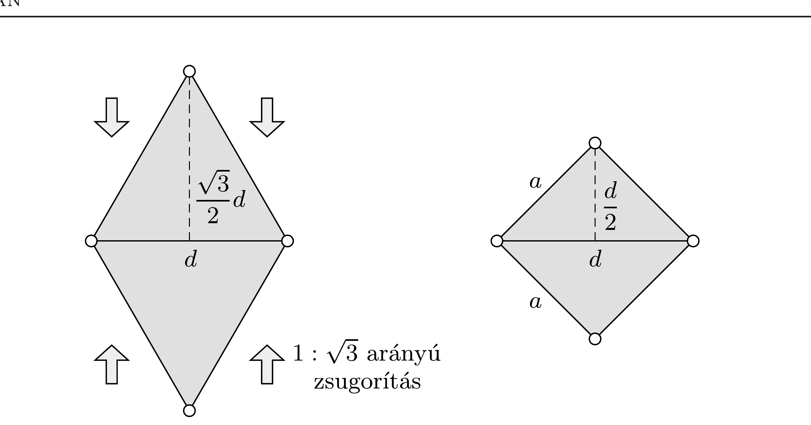
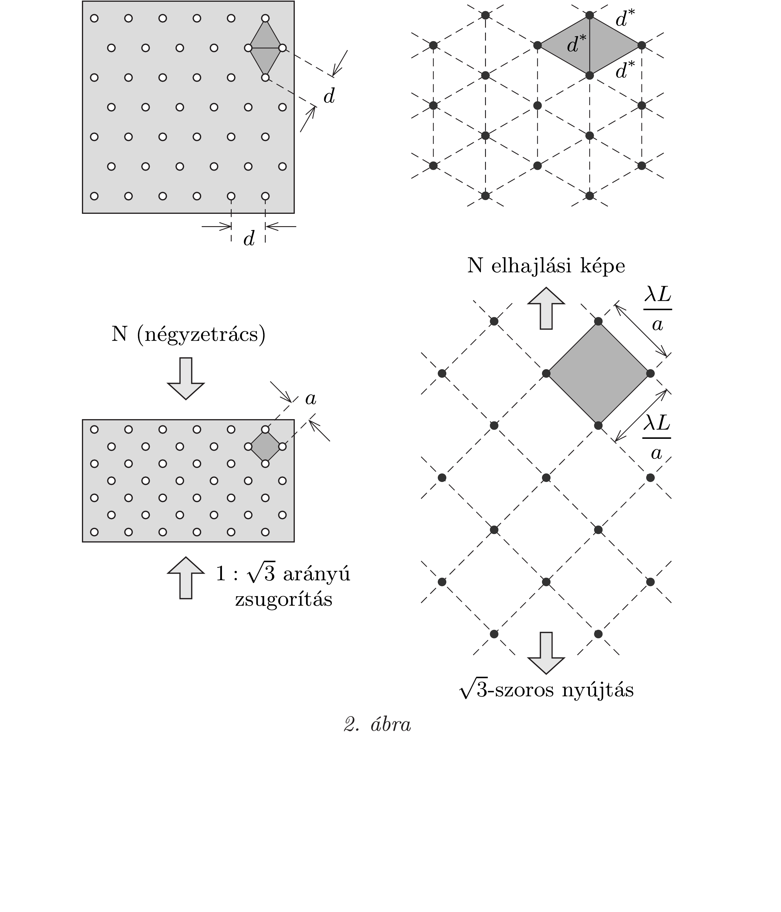

## Útmutatás

Egy négyzetrács alkalmas irányú és arányú nyújtással szabályos háromszögráccsá alakítható át, és viszont. Hogy mi történik eközben az elhajlási kép mintázatával, az kiderül az előzó feladat megoldásából.

## Megoldás

Tekintsük a háromszögrács (H) két szomszédos „elemi celláját”, melyek egyik (vízszintes) oldalélük mentén illeszkednek egymáshoz. Ha ezt az alakzatot a függőleges irányban $1: \sqrt{3}$ arányban összezsugorítjuk (1. ábra), akkor olyan négyzetet kapunk, amelynek oldaléle $a=d / \sqrt{2}$.

Az $a$ rácsállandójú négyzetrács (N) elhajlási képe ugyanilyen állású, $\lambda L / a=$ $\sqrt{2} \lambda L / d$ rácsállandójú négyzetrács lesz (lásd az elő̃ző feladatot). Az előző feladat megoldásából az is következik, hogy N elhajlási képe a H rács elhajlási képének $1: \sqrt{3}$ arányú, függőleges irányú nyújtásával adódik, a keresett mintázat tehát N elhajlási képének ugyanilyen arányú zsugorításával kapható meg (2. ábra).

H diffrakciós képe tehát egy olyan rács, amelynek elemi cellái ugyancsak szabályos háromszögek és a háromszögek oldaléle
\[
d^{*}=\frac{2}{\sqrt{3}} \frac{\lambda L}{d} .
\]
Érdekes, hogy amíg a lyukas lapon lévő szabályos háromszögek egyik oldala vízszintes, a másik kettő pedig „ferde”, az ernyőn megfigyelhető H rács háromszögeinek állása más: nincs vízszintes oldaluk, viszont az egyik oldalélük függőleges.
