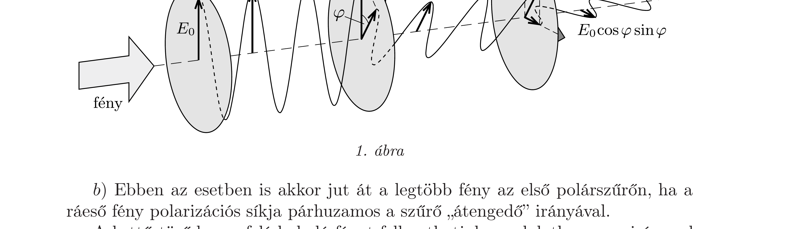
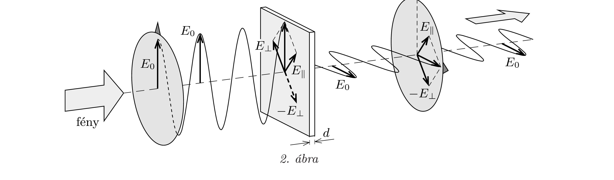

## Útmutatás

a) A polárszúrők csak a polarizációs irányukkal párhuzamos elektromos térerősségú fényt engedik át. A fény intenzitása arányos az amplitúdó négyzetével.
b) Meglepő, de a $d$ lemezvastagság és az $\boldsymbol{e}$ irány megfelelő választása esetén a bejövő fény 100\%-a is átjuthat a rendszeren.

## Megoldás

a) Az első polárszúrőn átmenő fény intenzitása akkor a lehető legnagyobb, ha a ráeső fény már eleve polarizált, polarizációjának síkja pedig párhuzamos a szűró polarizációs irányával. Ekkor az elsó polárszűrőn (az elnyelődést elhanyagolva) a teljes beesó intenzitás áthalad.

Jelöljük a beeső fény maximális elektromos térerősségét (amplitúdóját) $E_{0}$-lal (1. ábra). Az elsó szúrőhöz képest $\varphi$ szöggel elforgatott második polárszúrő felé haladó fény felbontható a szúrő „átengedő“ irányába eső és arra meróleges polarizációjú összetevőkre. A második szúrő e két komponens közül csak az $E_{0} \cos \varphi$ térerősségú összetevőt engedi át. Hasonlóan, a harmadik szűrőn áthaladó fény amplitúdója:
\[
E=E_{0} \cos \varphi \cos \left(90^{\circ}-\varphi\right)=E_{0} \cos \varphi \sin \varphi=\frac{1}{2} E_{0} \sin 2 \varphi .
\]
Ennek abszolút értéke akkor a legnagyobb, ha $\sin 2 \varphi= \pm 1$, azaz $\varphi= \pm 45^{\circ}$. Ekkor az átjutott fény amplitúdója a beeső amplitúdónak éppen fele, az amplitúdó négyzetével arányos fényintenzitás tehát negyedrészére csökken.

b) Ebben az esetben is akkor jut át a legtöbb fény az első polárszürőn, ha a ráesó fény polarizációs síkja párhuzamos a szúrő „átengedő“ irányával.

A kettőstörő lemez felé haladó fényt felbonthatjuk gondolatban az $\boldsymbol{e}$ iránnyal párhuzamos $\left(E_{\|}\right)$, és arra meróleges $\left(E_{\perp}\right)$ polarizációjú komponensekre. A lemezbe belépő két komponens (a különböző törésmutatók miatt) a lemez vastagságától függő fáziskülönbséggel lép ki a lemezből. Itt a kétféle polarizációjú összetevő szuperpozíciója adja meg a továbbhaladó fény polarizációját, amely a fáziskülönbség
értékétől függően maradhat lineáris, de kialakulhat elliptikus vagy cirkuláris polarizáció is.

Ha a kettőstörő lemezen áthaladó két komponens közötti fáziskülönbség $\pi$, vagy annak páratlan számú többszöröse, akkor a lemezből kilépve a két komponens ellentétes fázisban találkozik, amire úgy is tekinthetünk, mintha valamelyik összetevő (mondjuk $E_{\perp}$ ) előjelet váltana. Ennek feltétele:
\[
\left|n_{1} d-n_{2} d\right|=(2 k+1) \frac{\lambda}{2}, \quad \text { ebből } \quad d=\left(k+\frac{1}{2}\right) \frac{\lambda}{\left|n_{1}-n_{2}\right|},
\]
ahol $k$ egész szám. Az eredő polarizáció ilyenkor lineáris marad, a fény amplitúdójának nagysága nem változik, de a polarizáció síkja elfordul.

Ha a lemez $\boldsymbol{e}$ orientációs iránya 45°-os szöget zár be mindkét polárszúrő polarizációs irányával, akkor a lemezen áthaladó fény polarizációs síkja (a 2. ábrán látható módon) éppen 90°-kal fordul el. Így a harmadik polárszűrő már nem tudja megváltoztatni a fény amplitúdóját. Az (1) összefüggéssel megadott vastagságú lemez és $\varphi= \pm 45^{\circ}$-os orientáció esetén tehát a beeső (megfelelően polarizált) fény intenzitásának 100\%-a átjuthat a rendszeren.

Megjegyzések. 1. Ha a rendszerre beesó fény polarizálatlan (vagyis két, egymásra merőlegesen polarizált fényhullám időben gyorsan, de egyenletesen változó keveréke), akkor már az első polárszűrő felére csökkenti a fény erősségét, akárhogy is forgatjuk azt. Az a) esetben ekkor az átjutó fény intenzitása a beesón intenzitásnak legfeljebb 1/8 része, a $b$ ) esetben pedig a fele.
2. Optikai kísérletekben a lineárisan polarizált fény polarizációs síkjának elforgatására gyakran használják az (1) képletnek megfelelő vastagságú kettőstörő lemezt, amelyet (a két, egymásra merőleges polarizációjú komponens optikai útkülönbsége miatt) kettöstörő $\lambda / 2$-es lemeznek neveznek. Létezik kettőstörő $\lambda / 4$-es és $\frac{3}{4} \lambda$-ás lemez is, ezekkel lineárisan polarizált fényt lehet cirkulárisan polarizálttá (és vissza-)alakítani (lásd a következó feladatot).
