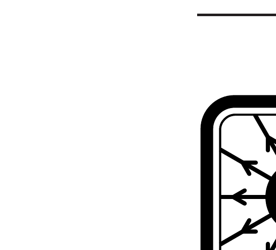
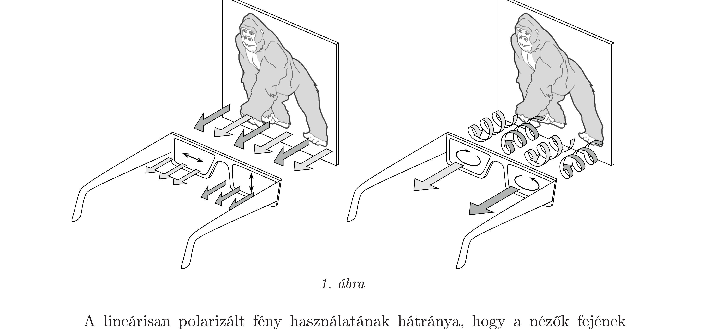
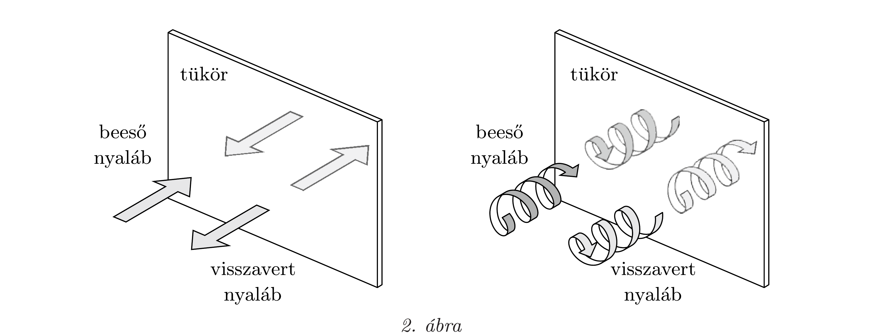
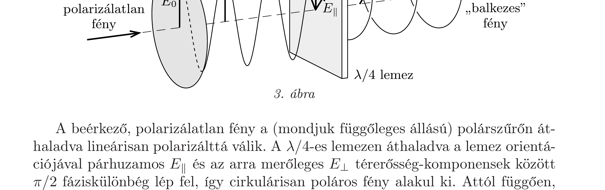
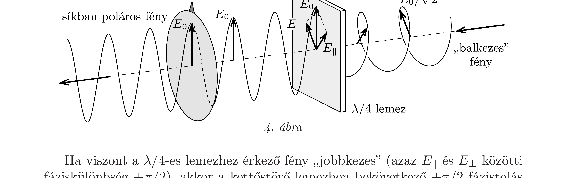
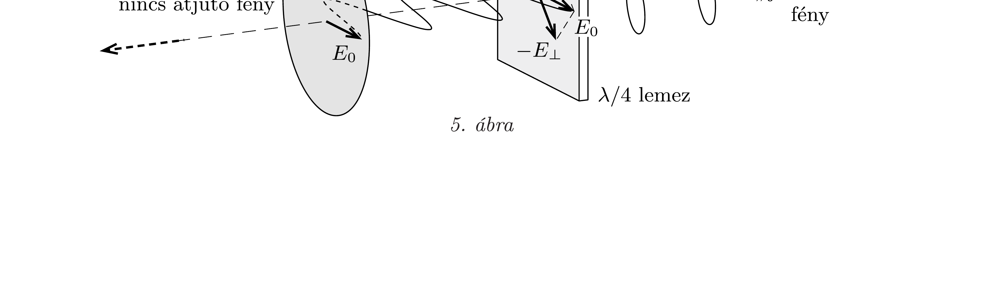

## Útmutatás

a) A takarításkor talált 3D-s szemüveg „lencséi” (valójában fóliái) lineáris polárszűrók, melyek egymásra merőleges állásúak.
b) Az a) esettől merőben eltéró tapasztalat arra utal, hogy az újonnan szerzett 3D-s szemüveg cirkulárisan poláros fénnyel múködik. Ilyen fényt lineárisan poláros fényből az előző feladatban is szereplő kettőstörő lemezzel lehet előállítani (és analizálni), ha a lemez vastagsága és az orientációja megfelelő.

\section*{Elektrosztatika I. (ponttöltések, szigetelők)}

## Megoldás

A 3D-s mozifilmek úgy készülnek, hogy a forgatás során minden egyes jelenetet két, kicsit eltéró nézőpontú kamerával vesznek fel. A mozifilm vetítése során a kamerák által rögzített felvételeket két külön projektorral vetítik
a vászonra: az egyik vetített kép a bal szemnek, míg a másik a jobb szemnek szól. Ahhoz, hogy a jobb és bal szemünkbe csak a kívánt képről kiinduló fénysugarak jussanak el, a fény polarizációjának jelenségét használják.

A régebbi típusú 3D-s mozikban a két vetítőgép lencséje után egy-egy (egymásra merőleges orientációjú) lineáris polárszűró van elhelyezve. A speciális, fémszemcsékkel (általában ezüstszemcsékkel) bevont vászonról a nézőközönség felé visszaszóródó fény megőrzi polarizációjának síkját. A nézők által hordott szemüvegkeretben szintén két, egymásra merőleges állású polárszűrő található, melyek orientációja összhangban van a vetített képek polarizációs irányával. A polárszúrók az orientációjukkal párhuzamos polarizáltságú fényt átengedik, az erre merólegesen polarizált fényt viszont nem: így érik el, hogy a jobb és a bal szem csak a kívánt képet lássa (lásd az 1. ábra bal felét).

A lineárisan polarizált fény használatának hátránya, hogy a nézők fejének megdöntésekor a polárszürőkön a nem kívánt fény egy része is áthalad, szellemkép keletkezik. Az újabb típusú 3D-s mozikban ezért cirkulárisan polarizált fényt használnak. Az egyik vetítőgép jobbra, a másik pedig balra cirkulárisan polarizált fényt vetít az ezüstös vászonra. A visszaszóródó fény nemkívánatos részének kiszúréséről a 3D-s szemüveg fóliái gondoskodnak (1. ábra jobb fele), melyek azonban - mint látni fogjuk - nem egyszerú polárszúrők, hiszen azok átengednék a cirkulárisan poláros fény egy részét.

Most már rátérhetünk Péter kísérleteinek elemzésére.
a) A nagytakarításkor talált, régi 3D-s szemüveg szemüveg biztosan lineáris polárszüróket tartalmazott. Péter becsukott (mondjuk bal oldali) szeméről kiinduló, polarizálatlan fénysugarak a szemüveg bal oldali fóliáján áthaladva lineárisan polarizálttá válnak. A polarizáció iránya a tükörről való visszaverődés közben nem változik meg (lásd a 2. ábra bal felét), így ezek a sugarak nem jutnak át (a bal oldali fóliához képest keresztezett állású) jobb oldali polárszúrőn: a becsukott szem
nem látszik a tükörben, helyette Péter csak elsötétült „szemüveglencsét” lát. A nyitott (jobb oldali) szeméről kiinduló fénysugarak viszont a tükörről visszaveródve átjutnak a jobb oldali polárszűrőn, ezért láthatja Péter a nyitott szemét a tükörben.

b) Az a tény, hogy az új 3D-s szemüveg éppen ellentétesen viselkedik, mint a régi, arra utal, hogy ebben az esetben a tükörről visszavert fénynek a haladási irányán kívül más tulajdonsága is megváltozik. Mivel a lineárisan poláros fény polarizációját a tükör nem változtathatja meg, ezért cirkulárisan poláros fénnyel van dolgunk.

Cirkulárisan poláros fényt egy polárszűrővel és egy hozzá képest 45°-os orientációjú, ún. $\lambda / 4$-es lemezzel lehet létrehozni a 3. ábrán látható módon. $\mathrm{A} \lambda / 4$-es lemez egy kettőstörő anyagból készült plánparalel lemez, amelynek törésmutatója az orientációs irányával párhuzamos polarizációjú fényre nézve más, mint az arra merőleges polarizációjú fény esetében (lásd az előző feladat megoldását). Emiatt a kétféle polarizációjú komponens között optikai útkülönbség lép fel, amely a $\lambda / 4$-es lemez esetén éppen a hullámhossz negyede.

A beérkező, polarizálatlan fény a (mondjuk függőleges állású) polárszűrőn áthaladva lineárisan polarizálttá válik. A $\lambda / 4$-es lemezen áthaladva a lemez orientációjával párhuzamos $E_{\|}$és az arra merőleges $E_{\perp}$ térerősség-komponensek között $\pi / 2$ fáziskülönbég lép fel, így cirkulárisan poláros fény alakul ki. Attól függően,
hogy a kétféle polarizációjú komponens közül melyik halad gyorsabban a kettőstörő lemezben, a kialakuló cirkuláris polarizáció lehet „jobbkezes” vagy „balkezes”. A 3. ábrán látható esetben a $\lambda / 4$-es lemezünk olyan, hogy „balkezes” fény keletkezik. Ha „jobbkezes" fényt szeretnénk ugyanebből az anyagból készült kettőstörő lemezzel elóállítani, akkor ahhoz más vastagságú, ún. $\frac{3}{4} \lambda$-ás lemezre van szükség (amelynél a két térerősség-komponens közötti fáziskülönbség $3 \pi / 2$ ).

Péter új 3D-s szemüvegében olyan fóliák vannak, amelyek kiszűrik a jobbra, illetve balra cirkulárisan poláros fényt. Ezek a cirkuláris „analizátorok” a 3. ábrán látható elrendezéshez nagyon hasonlóan múködnek, de a cirkulárisan poláros fény előbb a kettőstörő lemezen, utána pedig a polárszűrőn halad át. Ha a 3. ábrán is szereplő kettőstörő $\lambda / 4$-es lemezre „balkezes“ fény esik (amelyben $E_{\|}$és $E_{\perp}$ között $-\pi / 2$ fáziskülönbség van), akkor a 3. ábrán látható folyamat fordítottja megy végbe, és a lemezben bekövetkező $+\pi / 2$ fázistolás hatására függőleges irányú lineáris polarizációjú fény keletkezik (4. ábra). Ezt a fényt a függőleges irányú polárszűró átengedi.

Ha viszont a $\lambda / 4$-es lemezhez érkező fény „jobbkezes" (azaz $E_{\|}$és $E_{\perp}$ közötti fáziskülönbség $+\pi / 2$ ), akkor a kettőstörő lemezben bekövetkező $+\pi / 2$ fázistolás hatására végül vízszintes irányú lineárisan polarizált fény jön létre, amelyet a polárszürő nem enged át (5. ábra). Az ilyen felépítésú „szemüveglencse” tehát a „balkezes" fényt átengedi, de a „jobbkezest” nem. Ha a $\lambda / 4$-es lemezt $\frac{3}{4} \lambda$-ás lemezre cseréljük, akkor a „lencse” fordítva múködik: a „jobbkezes” fényt engedi át, a „balkezest" viszont nem. Ezen az elven múködik tehát a cirkulárisan polarizált fényt használó 3D-s mozi (1. ábra jobb fele).

Most már megmagyarázhatjuk Péter második kísérletét. A becsukott (mondjuk bal) szemről kiinduló fénysugarak a bal oldali „szemüveglencsén” áthaladva (mondjuk balra) cirkulárisan polarizálttá válnak (hiszen előbb a polárszűrőn, utána pedig a kettőstörő lemezen haladnak át). A „balkezes” fény viszont a tükörről „jobbkezesként” verődik vissza (hasonlóan ahhoz, ahogy a balkezes kesztyú tükörképe is jobbkezes kesztyǘ, lásd a 2. ábra jobb felét), ezért a szemüveg jobb oldali fóliáján akadály nélkül át tud jutni. Péter ezért láthatja becsukott szemét a tükörben. Ezzel ellentétben a (jobb oldali) nyitott szemét nem láthatja, hiszen a jobb oldali szemről kiinduló fény a szemüveg fóliáján áthaladva „jobbkezessé” válik, ami a tükörről „balkezes” fényként visszaverődve nem juthat át a szemüveg jobb oldali fóliáján.

Megjegyzések. 1. A kettőstörő $\lambda / 4$-es lemez múködési elvéből következik, hogy csak bizonyos hullámhosszú (adott színú), lineárisan polarizált fényt képes cirkulárisan polarizálttá (és viszont) változtatni. Vékony bevonatok alkalmazásával azonban elérhető, hogy a látható fény hullámhossztartományának jelentős részében is „viszonylag jól” múködjön a kettóstörő lemez.
2. Egyes 3D-s mozik és otthoni televíziók esetén nem polárszürős szemüveggel, hanem aktív (elektronikával vezérelt) folyadékkristályos lencsékkel felszerelt szemüveggel oldják meg a két szembe jutó képek szeparálását. A 3D-s TV-k képernyőjén 100-200 Hz frekvenciával, felváltva villannak fel a két szemnek szánt képkockák. A szemüvegeket rádióhullámok, infravörös jelek vagy vezeték segítségével lehet szinkronizálni a TV felvillanásaival. Ennek eredményeképp a folyadékkristályos „szemüveglencsék” a rájuk kapcsolt feszültség hatására (mindig a megfeleló pillanatban) felváltva sötétülnek el vagy világosodnak ki, így nyújtva otthoni háromdimenziós filmélményt.

\section*{Elektrosztatika I. \\ (ponttöltések, szigetelők)}
