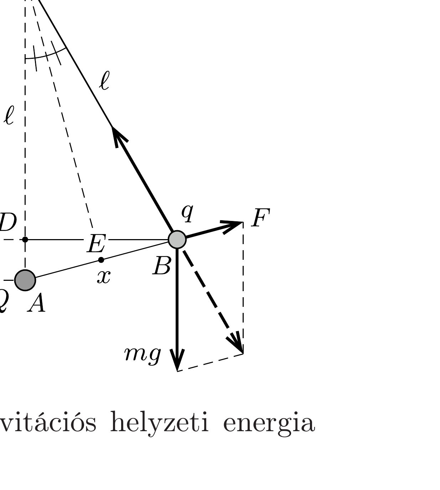

## Útmutatás

Első ránézésre úgy túnhet, hogy néhány adat hiányzik. Ne aggódjunk emiatt! Írjuk fel az erőegyensúly feltételét, és számítsuk ki a rendszer elektrosztatikus energiáját ebben az új egyensúlyi helyzetben!

## Megoldás

Jelöljük a szálon függő golyócska töltését $q$-val, a másik test töltését $Q$-val, a szál hosszát $\ell$-lel, a testek távolságát egyensúlyi állapotban pedig $x$-szel. Az ábráról leolvasható a kitérülő golyócska egyensúlyának feltétele:
\[
\frac{m g}{F}=\frac{\ell}{x},
\]
ahol
\[
F=k \frac{q Q}{x^{2}}
\]
a golyóra ható Coulomb-erő.
Az $A B D$ és $A C E$ háromszögek hasonlóak, ezért fennáll:
\[
\frac{x}{2}: \ell=h: x .
\]
Az (1)-(3) egyenletekből a töltések távolságára
\[
x=k \frac{q Q}{2 m g h},
\]
a rendszer elektrosztatikus energiájára pedig
\[
W_{\mathrm{el}}=k \frac{q Q}{x}=2 m g h
\]

adódik. A keresett munka az elektrosztatikus és a gravitációs helyzeti energia együttes növekedésével egyezik meg:
\[
W=2 m g h+m g h=3 m g h .
\]
Érdekes, hogy ez a munka sem a töltések nagyságától, sem a felfüggesztő szál hosszától nem függ.
