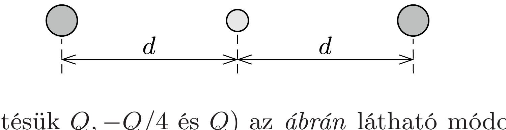

## Útmutatás

Egyensúlyban maradnak-e a ponttöltések, ha az egész töltésrendszert arányosan felnagyítjuk (a töltések távolságát ugyanolyan arányban megnöveljük)? A stabilitás vizsgálatához hasznos lehet a Gauss-törvény.

## Megoldás

A töltések távolságát arányosan, mondjuk $\lambda$-szorosára növelve a közöttük ható erő $1 / \lambda^{2}$-szeresére változik. Ha az eredeti elrendezésben minden töltés egyensúlyban volt, akkor az új („átskálázott”) helyzetben is valamennyi töltésre ható eredő erón nulla marad. Emiatt az eredeti töltéseloszlást munkavégzés nélkül tetszőleges (akár „végtelen“) nagyra „fújhatjuk fel”. A rendszer energiája az egymástól nagyon messze lévő töltések esetén nulla, és mivel nem végeztünk munkát, az eredeti töltésrendszer összes elektrosztatikus energiájának is nullának kellett lennie.

Valamelyik (mondjuk az $i$-edik) töltés egyensúlyi helyzetének stabilitását úgy vizsgálhatjuk meg, hogy megnézzük az összes többi töltés által létrehozott $\boldsymbol{E}(\boldsymbol{r})$ elektromos eróteret az $i$-edik töltés helyén, illetve annak kis környezetében. A kiszemelt töltésre ható erő:
\[
\boldsymbol{F}(\boldsymbol{r})=Q_{i} \sum_{k \neq i} \boldsymbol{E}_{k}(\boldsymbol{r})=Q_{i} \boldsymbol{E}(\boldsymbol{r}) .
\]

Az $i$-edik töltés $\boldsymbol{r}_{i}$ helyvektorú egyensúlyi helyzete akkor lenne stabil, ha az $\boldsymbol{F}(\boldsymbol{r})$ erótér (az $\boldsymbol{r}_{i}$ hely közelében) a $Q_{i}$ töltést az $\boldsymbol{r}_{i}$ ponthoz közelíteni akarná. Ha ez teljesülne, akkor az $\boldsymbol{E}(\boldsymbol{r})$ elektromos erőtér fluxusa az $\boldsymbol{r}_{i}$ pontot körülvevő kicsiny zárt felületre nem lehetne nulla (hanem $Q_{i}$ előjelétől függően negatív vagy pozitív szám lenne), ez pedig ellentmond a Gauss-törvénynek, amely szerint egy töltésmentes térrészt körülfogó zárt felületen az elektrosztatikus mező fluxusa mindig nulla. Ezek szerint a töltésrendszer egyensúlyi helyzete biztosan instabil.

Megjegyzések. 1. A fenti általános megfontolásokat egy konkrét, egyszerũ példával is illusztrálhatjuk.

Ha három test (töltésük $Q,-Q / 4$ és $Q$ ) az ábrán látható módon egy egyenes mentén helyezkedik el, akkor mindhármukra teljesül az eróegyensúly feltétele, és a rendszer elektrosztatikus energiája:
\[
W_{\mathrm{el}}=k \frac{\left(-\frac{1}{4} Q\right) Q}{d}+k \frac{\left(-\frac{1}{4} Q\right) Q}{d}+k \frac{Q^{2}}{2 d}=0 .
\]
Másrészt igaz, hogy ha a középső töltést jobbra kicsiny $x$ távolsággal $(x \ll d)$ kimozdítjuk, akkor a rá ható eredő erő:
\[
F(x)=k \frac{Q^{2}}{4}\left[\frac{1}{(d-x)^{2}}-\frac{1}{(d+x)^{2}}\right] \approx k \frac{Q^{2}}{d^{3}} \cdot x>0 .
\]
Ez az erố jobbra mutat, tehát a középső töltést az egyensúlyi helyzetétól távolítani igyekszik, eszerint annak egyensúlyi helyzete valóban instabil.
2. A megoldásban levezetett, a ponttöltések egyensúlyi helyzetének instabilitására vonatkozó állítás az ún. Earnshaw-tétel ${ }^{8}$ speciális esete. Ez a tétel tetszólegesen bonyolult elektrosztatikus, magnetosztatikus és gravitációs erőkre vagy ezek együttes jelenlétére is kimondja: ilyen erőterekben sem pontszerú, sem a kiterjedt testek nem lehetnek stabil egyensúlyban, amennyiben azok mozgását a newtoni mechanika írja le. A tétel az 1800-as évek végén sok fejtörést okozott a fizikusoknak, mert akkoriban másfajta erốtereket és másfajta mechanikát nem ismertek, és így érthetetlennek tartották az anyagok kétséget kizáróan meglévớ stabilitását. Az ellentmondást a kvantumelmélet oldotta fel, amely az elektron nem-newtoni viselkedésével magyarázza az atomok stabilitását.

A 327. feladat példát mutat arra, hogy egy szupravezető gyürú sztatikus mágneses és gravitációs térben képes stabilan „lebegni”. A szupravezető gyürúben folyó áram erőssége

\footnotetext{
${ }^{8}$ Samuel Earnshaw (1805-1888) angol matematikus és fizikus

az egyensúlyi helyzet körüli kis rezgések során időben változik, így ez a fajta mágneses levitáció nem sérti az időfüggetlen mezőkre vonatkozó Earnshaw-tételt.
