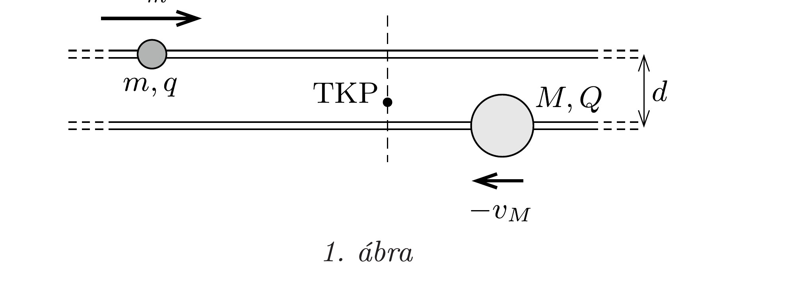
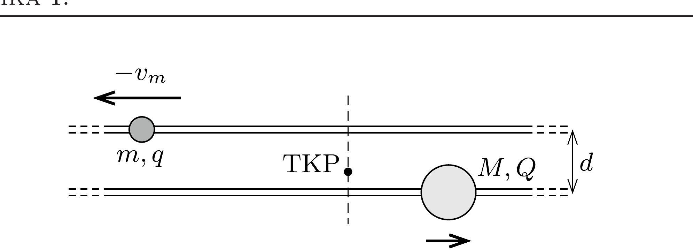
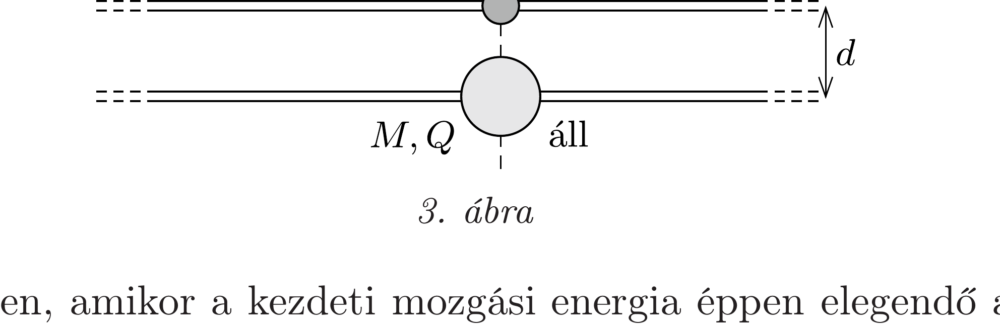

## Útmutatás

Üljünk bele a gyöngyök közös tömegközéppontjához rögzített koordináta-rendszerbe!

## Megoldás

A tömegközépponti koordináta-rendszerből nézve a gyöngyök kezdeti sebessége (a jobbra haladást tekintve pozitívnak):
\[
v_{m}=\frac{M}{m+M} v_{0}, \quad v_{M}=-\frac{m}{m+M} v_{0},
\]
és az arányuk minden pillanatban ugyanannyi marad, hiszen ebből a rendszerből nézve a gyöngyök tömegközéppontja áll (1. ábra).

Ahogy a gyöngyszemek közelednek egymáshoz, a sebességük egyre csökken, ha $q$ és $Q$ azonos előjelúek, illetve növekszik, ha ellentétesek a töltések. Ez utóbbi esetben a gyöngyszemek elhaladnak egymás mellett, majd elegendően eltávolodva egymástól a sebességük a kezdeti értékre áll vissza, hiszen az energiájuk megmarad. Visszatérve az eredeti koordináta-rendszerbe azt állíthatjuk, hogy az $m$ tömegú test sebessége egy átmeneti felgyorsulás után az eredeti $v_{0}$-ra csökken, az $M$ tömegú test pedig egy bizonyos távolsággal (bal felé) elmozdul, és végül megáll.

Megjegyzés. Elvben - megfelelően kis $v_{0}$ kezdősebesség esetén - az is előfordulhat, hogy a tömegközépponti rendszerből szemlélve az egymástól eltávolodott gyöngyök idővel visszafordulnak, azaz kötött állapotban vannak. A feladat szövege szerint azonban a gyöngyök kezdetben „elég messze” helyezkednek el, elektrosztatikus energiájuk tehát a mozgási energia mellett elhanyagolható; a negatív összenergiájú kötött állapot tehát nem áll fenn.

Kicsit részletesebb diszkussziót igényel az egymást taszító gyöngyök esete. Ezek, ha elegendő kezdeti energiával rendelkeznek, elhaladnak egymás mellett, majd ismét eltávolodva egymástól a sebességük (akár a tömegközépponti koordináta-rendszerből, akár a „labor-rendszerből” nézzük) az eredeti értékre áll vissza. Ha viszont a gyöngyök kezdeti mozgási energiája nem elég nagy ahhoz, hogy $d$ távolságra megközelítsék egymást, akkor „visszafordulnak”, és elegendően hosszú idő múlva az $m$ tömegú test a tömegközépponti rendszerben $-v_{m}$ sebességgel balra, az $M$ tömegú pedig $+v_{M}$ sebességgel jobbra fog mozogni (2. ábra).

Ennek az a feltétele, hogy
\[
\frac{1}{2} m v_{m}^{2}+\frac{1}{2} M v_{M}^{2}<\frac{1}{4 \pi \varepsilon_{0}} \frac{q Q}{d},
\]
azaz
\[
\frac{1}{2} \frac{m M}{m+M} v_{0}^{2}<\frac{1}{4 \pi \varepsilon_{0}} \frac{q Q}{d}
\]
fennálljon. (Az $\frac{m M}{m+M}$ mennyiséget a két testből álló rendszer redukált tömegének nevezik.) A testek sebességét a laboratóriumi koordináta-rendszerben úgy kapjuk meg, hogy a tömegközépponti rendszerben mérhető sebességekhez hozzáadjuk a két koordináta-rendszer relatív sebességét, ami éppen $\left|v_{M}\right|$-mel egyenlő:
\[
v_{m}^{*}=\frac{m-M}{m+M} v_{0}, \quad \text { illetve } \quad v_{M}^{*}=\frac{2 m}{m+M} v_{0} .
\]

Határesetben, amikor a kezdeti mozgási energia éppen elegendő ahhoz, hogy a két gyöngyszem $d$ távolságra megközelítse egymást, a gyöngyszemek egymáshoz képest megállnak, vagyis a labor-rendszerből nézve közös
\[
v_{m}=v_{M}=\frac{m v_{0}}{m+M}
\]
sebességgel mozognak tovább (3. ábra). (Ez csak elvi lehetőség, hiszen az együttmozgás állapota a gyöngyök kicsiny relatív elmozdulásaira nézve instabil.)

Megjegyzés. Az egymást taszító gyöngyök esetében lehetséges három eset az egydimenziós mechanikai ütközéseket modellezi. A határeset, amikor a testek együtt mozognak tovább, a rugalmatlan ütközésnek felel meg. Itt csak a mechanikai impulzus marad állandó, a mozgási energia lecsökken. Az egymást valamennyire megközelítő, majd eltávolodó testek sebessége a rugalmas ütközés törvényeiből (az energia- és az impulzusmegmaradásból) számítható értékekkel egyeznek meg. Az egymás mellett elhaladó
(lényegében nem is ütköző, eredeti sebességüket megőrző) testek mozgása összhangban áll a megmaradási tételekkel. Az ennek megfelelő megoldást a mechanikai ütközéseknél el szoktuk vetni (mondván, hogy a testek nem hatolhatnak át egymáson).
