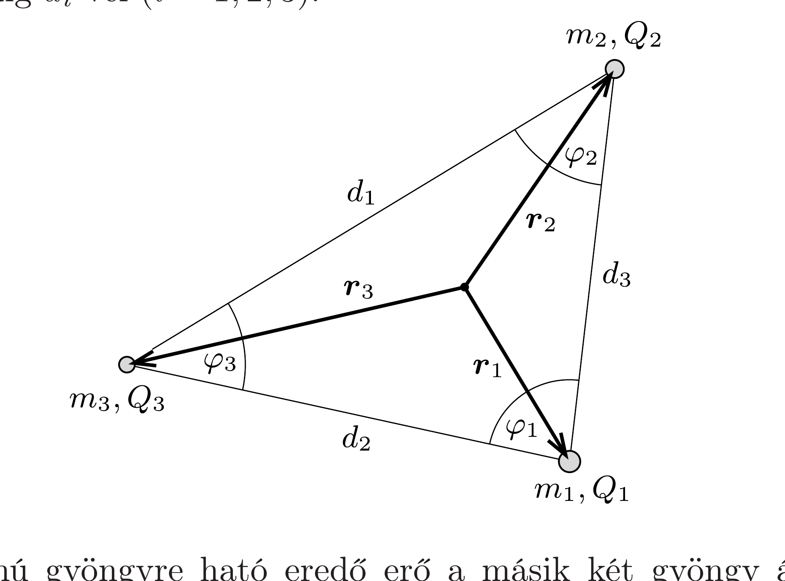

## Útmutatás

A rendszer tömegközéppontja (külső erók hiányában) mozdulatlan marad; érdemes ezt a pontot választani origónak. A gyöngyök akkor mozoghatnak a megadott módon, ha mindegyikük gyorsulása a pillanatnyi helyvektorukkal arányos, és az arányossági tényező mindhárom testre ugyanakkora.

## Megoldás

Válasszuk origónak a gyöngyökből álló rendszer tömegközéppontját (hiszen ez a mozgás során a tömegközéppont-tétel miatt nem mozdul el), és jelöljük (az ábrán látható módon) a gyöngyök helyvektorát $\boldsymbol{r}_{i}$-vel, egymástól mért távolságukat pedig $d_{i}$-vel $(i=1,2,3)$.

Az 1-es számú gyöngyre ható eredő erő a másik két gyöngy által kifejtett elektrosztatikus erők összege:
\[
\boldsymbol{F}_{1}=m_{1} \boldsymbol{a}_{1}=k \frac{Q_{1} Q_{2}}{d_{3}^{3}}\left(\boldsymbol{r}_{1}-\boldsymbol{r}_{2}\right)+k \frac{Q_{1} Q_{3}}{d_{2}^{3}}\left(\boldsymbol{r}_{1}-\boldsymbol{r}_{3}\right) .
\]
A súlypontba helyezett origó miatt
\[
m_{1} \boldsymbol{r}_{1}+m_{2} \boldsymbol{r}_{2}+m_{3} \boldsymbol{r}_{3}=0 .
\]
Fejezzük ki ebből $\boldsymbol{r}_{3}$-at, majd írjuk be az 1-es gyöngy mozgásegyenletébe:
\[
m_{1} \boldsymbol{a}_{1}=k Q_{1}\left[\frac{Q_{2}}{d_{3}^{3}}+\frac{Q_{3}}{d_{2}^{3}}\left(\frac{m_{1}}{m_{3}}+1\right)\right] \boldsymbol{r}_{1}+k Q_{1}\left[\frac{Q_{3}}{d_{2}^{3}} \frac{m_{2}}{m_{3}}-\frac{Q_{2}}{d_{3}^{3}}\right] \boldsymbol{r}_{2} .
\]
Ahhoz, hogy az 1-es számú gyöngy pályája egyenes legyen, szükséges, hogy a gyorsulása a pillanatnyi helyvektorával egyirányú legyen, ezért (2) jobb oldalán $\boldsymbol{r}_{2}$ együtthatójának el kell tǘnnie. Ez akkor teljesül, ha $Q_{2} d_{2}^{3} / m_{2}=Q_{3} d_{3}^{3} / m_{3}$. A másik két gyöngyre is felírható hasonló feltétel, így a következó összefüggést kapjuk:
\[
\frac{Q_{1}}{m_{1}} d_{1}^{3}=\frac{Q_{2}}{m_{2}} d_{2}^{3}=\frac{Q_{3}}{m_{3}} d_{3}^{3}=\lambda,
\]
ahol $\lambda$ mindhárom testre ugyanakkora (de a töltések távolságával együtt időben változó) mennyiség.

Ha a (3) egyenlőségek teljesülnek, akkor a gyöngyszemek gyorsulását az
\[
\boldsymbol{a}_{i}=k \frac{Q_{1} Q_{2} Q_{3}\left(m_{1}+m_{2}+m_{3}\right)}{\lambda m_{1} m_{2} m_{3}} \boldsymbol{r}_{i}, \quad i=1,2,3
\]
formula adja meg. Eszerint a gyöngyök gyorsulásai úgy aránylanak egymáshoz, mint a helyvektoraik hossza, és az arányossági tényező mindhárom testre minden időpillanatban ugyanakkora, így a gyöngyök távolságának aránya időben állandó marad. Ezeket az arányokat a (3) feltételből és a gyöngyök fajlagos töltésének ismert viszonyszámaiból határozhatjuk meg:
\[
d_{1}: d_{2}: d_{3}=\sqrt[3]{\frac{m_{1}}{Q_{1}}}: \sqrt[3]{\frac{m_{2}}{Q_{2}}}: \sqrt[3]{\frac{m_{3}}{Q_{3}}}=1: \frac{1}{\sqrt[3]{2}}: \frac{1}{\sqrt[3]{3}} .
\]
Ilyen távolságarányok esetén a három gyöngy úgy mozog, hogy az általuk kijelölt háromszög a kezdőhelyzet háromszögéhez hasonló marad, és a háromszög szögei (a koszinusztételből kiszámíthatóan):
\[
\varphi_{1}=\arccos \left(\frac{d_{2}^{2}+d_{3}^{2}-d_{1}^{2}}{2 d_{2} d_{3}}\right)=84,2^{\circ} ; \quad \varphi_{2}=52,2^{\circ} ; \quad \varphi_{3}=43,6^{\circ} .
\]

Megjegyzés. A Coulomb-törvény és a Newton-féle gravitációs törvény hasonló alakja miatt a fenti megoldás alkalmazható három, egymás gravitációs terében mozgó (közeledő) tömegpontra is. Ezek pályája akkor lehet egyenes, ha a távolságaik és a „fajlagos gravitációs töltésük" között fennállnak a (3) összefüggések. Mivel azonban a fajlagos gravitációs töltés - a súlyos és a tehetetlen tömeg aránya - minden testre ugyanakkora, az egyenes pályájú mozgás csak $d_{1}=d_{2}=d_{3}$ esetén, vagyis szabályos háromszög csúcsaiban elhelyezkedő testekkel valósulhat meg.
