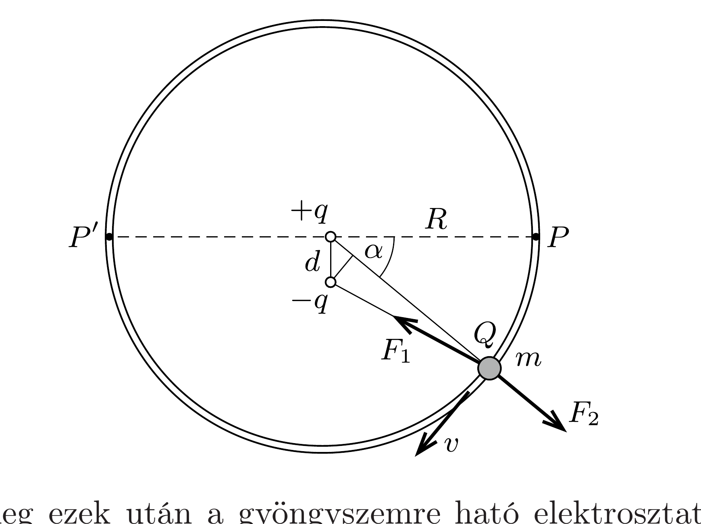

## Útmutatás

Érdemes először azt az erốt meghatározni, amit a huzal fejt ki a gyöngyszemre annak mozgása során. A gyöngyszem sebessége a dipól (egymáshoz nagyon közel elhelyezkedő pozitív és negatív ponttöltés) elektrosztatikus potenciáljának segítségével számítható ki.

## Megoldás

Helyettesítsük az elektromos dipólt egymástól kicsiny $d$ távolságra lévő, $+q$ és $-q$ töltésú pontszerú testekkel, és használjuk a (szándékosan eltúlzott méretarányú) ábrán látható jelöléseket. A $d \ll R$ reláció miatt a $+q$ ponttöltést az egyszerúség kedvéért helyezhetjük az $R$ sugarú kör középpontjába, ez eredményeinket nem fogja befolyásolni. A dipól erősségére a $p=q d$ szorzat (dipólmomentum) jellemzó.

Az energiamegmaradás tétele segítségével számítsuk ki először, hogy mekkora a $P$ pontból kezdősebesség nélkül induló $Q$ töltésú gyöngyszem sebessége az $\alpha$ szöggel jellemezhetó helyen. A gyöngyszem elektrosztatikus potenciális energiájának megváltozása abból származik, hogy a $-q$ töltéstől mért távolsága $d \sin \alpha$ értékkel lecsökken, emiatt
\[
\frac{1}{2} m v^{2} \approx-k q Q\left(\frac{1}{R}-\frac{1}{R-d \sin \alpha}\right) \approx \frac{k q Q d \sin \alpha}{R^{2}}=\frac{k Q p \sin \alpha}{R^{2}},
\]
ahonnan
\[
v=\sqrt{\frac{2 k Q p}{m R^{2}} \sin \alpha} .
\]
Ennek ismeretében a $b$ ) kérdésre már tudunk válaszolni: a gyöngyszem először egy félkör megtétele után a $P^{\prime}$ pontban ( $\alpha=180^{\circ}$-nál) fog megállni, majd visszafordulva - súrlódás és egyéb energiaveszteség hiányában - periodikus mozgást végez $P$ és $P^{\prime}$ között.

Határozzuk meg ezek után a gyöngyszemre ható elektrosztatikus erők radiális (a kör középponja felé mutató) komponenseit, majd ezekből és Newton II. törvényéből számítsuk ki a körpályán maradáshoz szükséges (a huzal által sugárirányban kifejtett) $K$ kényszererőt. A dipól alkotórészei majdnem pontosan ellentétes radiális eróket fejtenek ki, melyek eredője:
\[
F=F_{1}-F_{2} \approx k q Q\left[\frac{1}{(R-d \sin \alpha)^{2}}-\frac{1}{R^{2}}\right] \approx \frac{k q Q 2 d \sin \alpha}{R^{3}}=\frac{2 k Q p \sin \alpha}{R^{3}} .
\]
Ez az eró a dipólus felé mutat (hiszen a vonzóerőt kifejtő $-q$ közelebb van a gyöngyszemhez, mint a taszító $+q$ töltés), így a $v$ sebességú, tehát sugárirányban $v^{2} / R$ gyorsulású gyöngyszem mozgásegyenlete:
\[
m \frac{v^{2}}{R}=\frac{2 k Q p \sin \alpha}{R^{3}}+K .
\]
A sebesség nagyságát megadó (1)-et (2)-be helyettesítve - meglepő módon - a kényszererőre $K=0$ adódik.

A gyöngyszemre tehát sugárirányban (az elektrosztatikus erőkön kívül) nem hat eró, így a gyöngyszem sem fejt ki a huzalra ilyen irányú erőt. (Természetesen a gyöngyszem súlyából származó függőleges erónek jelen kell lennie.) Ha a huzalt eltávolítjuk (de a gyöngyszem függőleges elmozdulását megakadályozzuk), a mozgás ugyanúgy zajlik le, mint a huzalra fúzött gyöngy esetében.

Megjegyzés. Az (1) összefüggésből leolvasható, hogy a gyöngyszem mozgása éppen olyan, mint egy vízszintes helyzetból indított, $R$ hosszúságú fonálingáé alkalmasan választott, $g=k Q p /\left(m R^{3}\right)$ erősségú homogén gravitációs mezőben.
