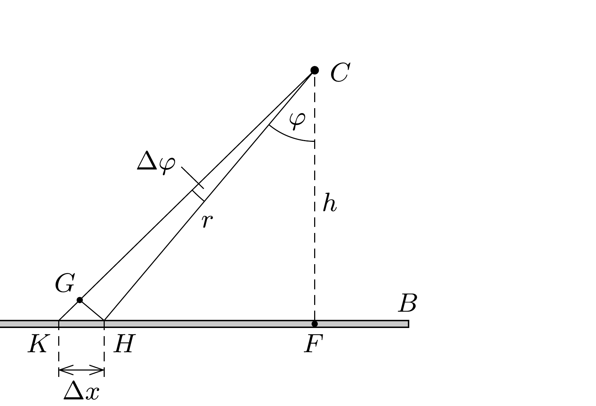
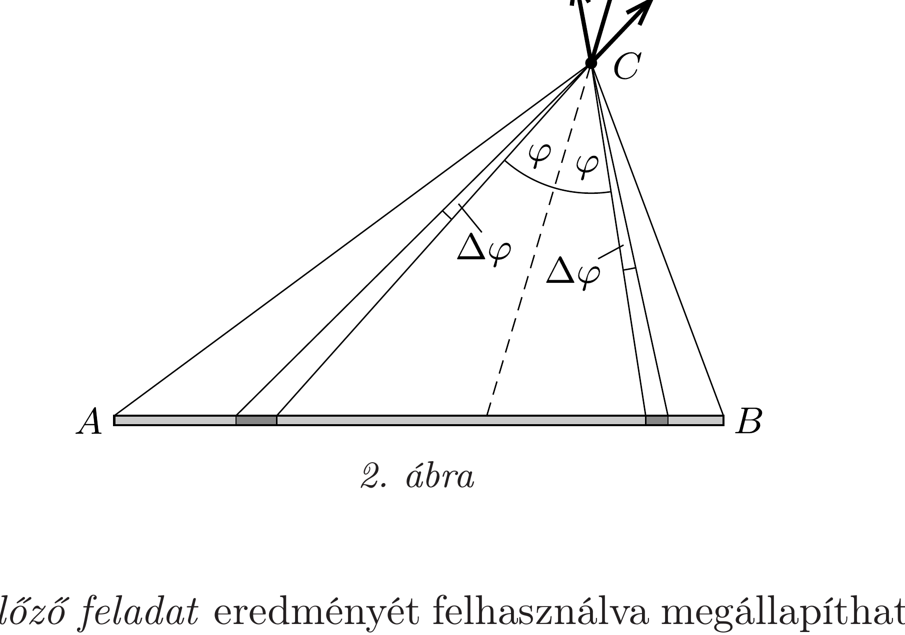

## Útmutatás

Vizsgáljuk meg, mekkora elektromos térerősséget hoz létre a pálcának valamely kicsiny darabkája, amely a $C$ pontból $\Delta \varphi$ szög alatt látszik.

## Megoldás

Jelöljük a $C$ pont és a pálca egyenesének távolságát $h$-val, és tekintsük a pálcának a $C$ pontból kicsiny $\Delta \varphi$ szög alatt látszó $K H$ darabkáját (1. ábra). Az $F H C$ és $G K H$ háromszögek hasonlósága miatt e kis vonaldarabka hossza
\[
\Delta x=G H \cdot \frac{r}{h} \approx r \Delta \varphi \cdot \frac{r}{h}=\frac{r^{2}}{h} \Delta \varphi .
\]

A pálca $K H$ szakaszán $\Delta Q=\lambda \Delta x$ töltés található (ahol $\lambda$ a hosszegységre jutó töltésmennyiség), ennek elektromos

térerőssége a $C$ pontban pedig
\[
\Delta E=\frac{1}{4 \pi \varepsilon_{0}} \frac{\Delta Q}{r^{2}}=\frac{1}{4 \pi \varepsilon_{0}} \frac{\lambda}{h} \Delta \varphi
\]
nagyságú. Ez a mennyiség független a $\varphi$ szögtől, csupán a vonaldarabka látószögének függvénye. Emiatt az $A B C$ háromszög $C$ csúcspontjához tartozó szögfelezőjére szimmetrikusan elhelyezkedő, azonos szögben látszó darabkák elektromos térerősségvektora azonos nagyságú, eredőjük pedig a szögfelező irányába mutat (2. ábra).

