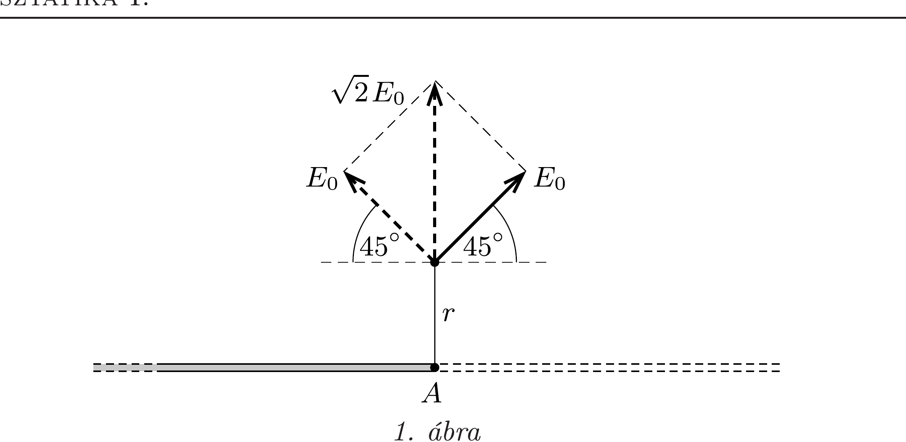
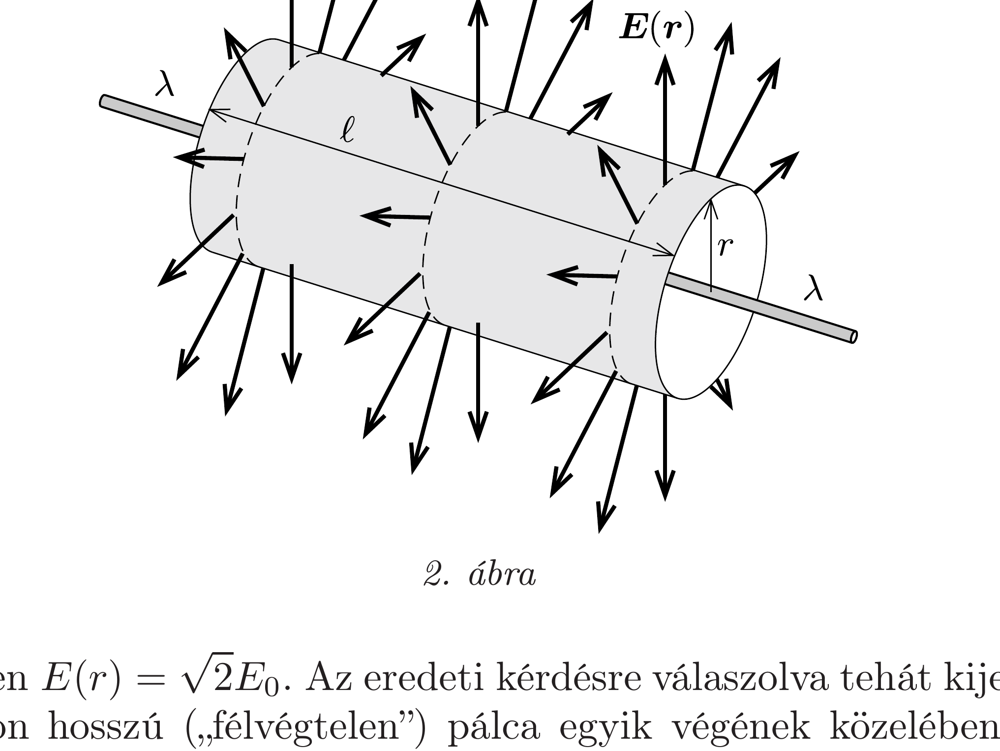

## Útmutatás

Két nagyon hosszú pálcát a végeiknél össze is illeszthetünk.

## Megoldás

Az előzó feladat eredményét felhasználva megállapíthatjuk, hogy egy nagyon hosszú („félvégtelen”) pálca egyik végpontjánál, a pálca végétől merőlegesen mért $r$ távolságban a térerốsség iránya a pálcával 45°-os szöget zár be.

A térerősség $E_{0}$ nagyságát a következő „trükk” segítségével határozhatjuk meg. Illesszünk össze gondolatban két egyenletesen feltöltött, nagyon hosszú pálcát (1. ábra). Az eredő térerősség a két félvégtelen pálca térerősségének vektori összege lesz. Az eredő iránya - a szimmetria miatt - merőleges a pálcára, a térerősség nagysága pedig (az egyes pálcák térerősségének $\sqrt{2}$-szerese) a Gauss-törvényből határozható meg.

Vegyük körül a végtelen hosszú pálca $\ell$ hosszúságú, tehát $\lambda \ell$ töltésú darabját egy $r$ sugarú hengerpalásttal és az azt lezáró körlapokkal (2. ábra). A körlapokon átmenő fluxus nulla, ezért Gauss törvényében csak a paláston kilépő fluxust kell számításba vennünk:
\[
\frac{1}{\varepsilon_{0}} \cdot \lambda \ell=E(r) \cdot 2 \pi r \ell
\]
amelyből a térerősség nagysága a végtelen pálcától $r$ távolságban:
\[
E(r)=\frac{\lambda}{2 \pi \varepsilon_{0}} \cdot \frac{1}{r} .
\]

Esetünkben $E(r)=\sqrt{2} E_{0}$. Az eredeti kérdésre válaszolva tehát kijelenthetjük, hogy a nagyon hosszú („félvégtelen”) pálca egyik végének közelében, a pálcára merőleges síkban, a pálcától $r$ távolságban a térerősség nagysága:
\[
E_{0}=\frac{\sqrt{2} \lambda}{4 \pi \varepsilon_{0} r} .
\]
