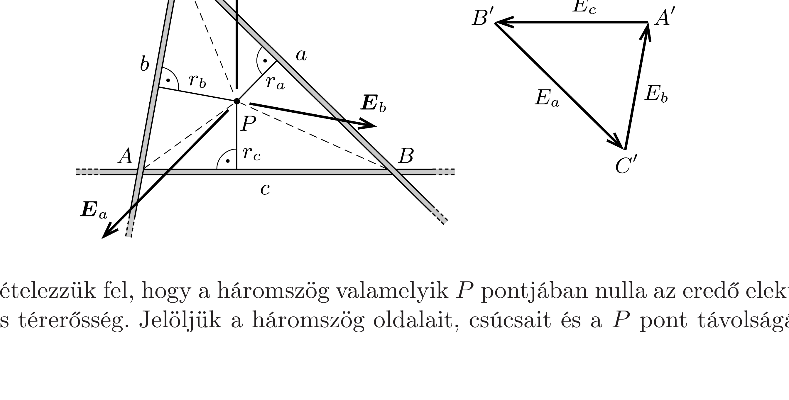

## Útmutatás

A keresett pont csak a pálcák síkjában és a háromszög belsejében lehet. Olyan pontot keresünk, amelyben az eredő elektromos térerősség nulla, vagy ami ezzel egyenértékú: a sík pontjaiban kiszámítható elektrosztatikus potenciálnak szélsőértéke van.

## Megoldás

I. megoldás. Mindegyik pálca olyan elektromos teret hoz létre, amelynek iránya meróleges a pálcára, nagysága pedig a pálcától mért távolsággal fordítottan arányos (lásd pl. a 243. feladat megoldását). Az eredő elektromos térerősség a pálcák síkján kívül biztosan nem lehet nulla, és a pálcák síkjában is csak a háromszög belsejében kerülhet egyensúlyba az odahelyezett ponttöltés.

Tételezzük fel, hogy a háromszög valamelyik $P$ pontjában nulla az eredő elektromos térerősség. Jelöljük a háromszög oldalait, csúcsait és a $P$ pont távolságát
az oldalaktól az ábrán látható módon. Az egyes pálcák elektromos térerősségének nagysága
\[
\left|\boldsymbol{E}_{a}\right|=\frac{\lambda}{2 \pi \varepsilon_{0}} \frac{1}{r_{a}}, \quad\left|\boldsymbol{E}_{b}\right|=\frac{\lambda}{2 \pi \varepsilon_{0}} \frac{1}{r_{b}}, \quad\left|\boldsymbol{E}_{c}\right|=\frac{\lambda}{2 \pi \varepsilon_{0}} \frac{1}{r_{c}},
\]
ahol $\lambda$ a (közös) vonalmenti töltéssúrúséget jelöli. Eszerint
\[
E_{a}: E_{b}: E_{c}=\frac{1}{r_{a}}: \frac{1}{r_{b}}: \frac{1}{r_{c}} .
\]

Ha a $P$ pontban az eredő térerősség nulla, vagyis $\boldsymbol{E}_{a}+\boldsymbol{E}_{b}+\boldsymbol{E}_{c}=0$, akkor ez a három vektor egymás végébe fűzve egy háromszöget alkot. Forgassuk el ezt a vektorháromszöget az óramutató járásával ellentétes irányban 90°-kal (lásd az ábra jobb oldalát). Az így kapott $A^{\prime} B^{\prime} C^{\prime}$ háromszög oldalai párhuzamosak az eredeti $A B C$ háromszög megfelelő oldalaival, a két háromszög tehát hasonló, oldalainak aránya megegyezik:
\[
E_{a}: E_{b}: E_{c}=a: b: c,
\]
amit (1)-gyel összevetve az
\[
a r_{a}=b r_{b}=c r_{c}
\]
egyenlőségeket kapjuk.
Ezek szerint a $P$ pontot az $A B C$ háromszög csúcsaival összekötő három egyenes szakasz a háromszöget 3 egyforma területú részre bontja. Mivel a háromszög súlypontja (és csak az a pontja) rendelkezik ezzel a tulajdonsággal, a ponttöltés egyensúlyi helyzete csakis a súlypont lehet.
II. megoldás. Használjuk az I. megoldás ábráját és jelöléseit! Egyetlen, nagyon hosszú, egyenletesen feltöltött pálca elektromos potenciálja a pálcától $r$ távolságban
\[
U(r)=-\frac{\lambda}{2 \pi \varepsilon_{0}} \ln \frac{r}{r_{0}},
\]
ha a potenciált $r_{0}$ távolságban választjuk nullának. (Ezt az összefüggést az $1 / r$-rel arányos térerősség integrálásával kaphatjuk meg.) A három pálca eredő terének potenciálja az egyes potenciálok összege:
\[
U_{\text {eredö }}(r)=U\left(r_{a}\right)+U\left(r_{b}\right)+U\left(r_{c}\right)=-\frac{\lambda}{2 \pi \varepsilon_{0}} \ln \frac{r_{a} r_{b} r_{c}}{r_{0}^{3}} .
\]
Ha ennek a kifejezésnek (a sík pontjaira korlátozódva) valamely $P$ pontban szélsőértéke van, akkor az odahelyezett ponttöltésre ható erő nulla. (Amennyiben nem így lenne, vagyis a ponttöltésre ható erő nullától különböző lenne, akkor a töltést a rá ható erốvel ellentétes irányban pozitív munkavégzéssel tudnánk csak - egy kicsit - elmozdítani. Ez viszont ellentmond annak, hogy a szélsőérték helyének kis környezetében a potenciál első közelítésben nem változik.)

Megmutatjuk, hogy a (3) összefüggésben szereplő potenciál a háromszög súlypontjában a legnagyobb. Mivel az $U(r)$ potenciál a $P$ pont helyzetétől csak a $V=r_{a} r_{b} r_{c}$ szorzaton keresztül függ, továbbá a logaritmus monoton növekvő függvény, a potenciál szélsőértékét a $V$ kifejezés maximuma adja meg. Szorozzuk meg $V$-t egy ismert nagyságú ( $P$ helyzetétől független) kifejezéssel,
\[
V \cdot \frac{a b c}{8}=\frac{a r_{a}}{2} \frac{b r_{b}}{2} \frac{c r_{c}}{2} \equiv T_{a} T_{b} T_{c},
\]
ahol $T_{a}, T_{b}$ és $T_{c}$ rendre a $B P C, C P A$ és $A P B$ háromszögek területét jelöli. Ezen területek összege egy meghatározott érték (az $A B C$ háromszög területe), így a szorzatuk (a számtani-mértani közepekre vonatkozó egyenlőtlenség miatt) akkor maximális, amikor mind a három terület ugyanakkora.

Ezek szerint a ponttöltés egy olyan pontban lehet egyensúlyban, amelyre igaz, hogy ezt a pontot és a csúcspontokat összekötő egyenesek a háromszöget 3 egyenlő területú részre osztják. Ez a pont pedig a háromszög súlypontja.

Megjegyzés. A háromszög súlypontjába helyezett ponttöltés egyensúlya - ha a töltött testet csak a pálcák síkjában engednénk elmozdulni - a pálcákéval azonos elójelú töltés esetén stabil, ellentétes töltésnél pedig instabil lenne. Ha azonban a pálcák síkjára merőleges mozgás lehetőségét is figyelembe vesszük, kiderül, hogy az egyensúly minden esetben instabil, összhangban a 236. feladatban említett Earnshaw-tétellel.
