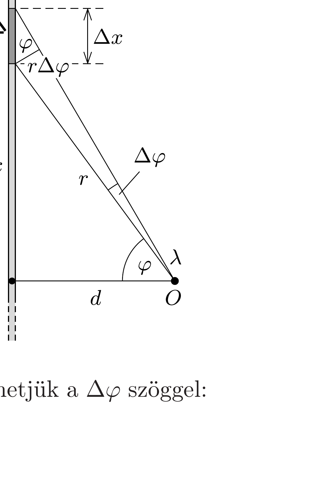

## Útmutatás

Határozzuk meg, hogy mekkora erőt fejt ki az egyik pálca elektromos erốtere a másik pálca kicsiny darabkáira. Érdemes a kicsiny darabkákat azzal a szöggel jellemezni, amely alatt a másik pálca legközelebbi pontjából nézve látszanak.

## Megoldás

Valamelyik (a feladat ábráján mondjuk a jobb oldali) pálca által keltett elektromos térerősség meróleges a pálcára, nagysága a pálcától $r$ távolságban a Gauss-törvény alapján határozható meg (lásd a 243. feladat megoldását):
\[
E(r)=\frac{\lambda}{2 \pi \varepsilon_{0}} \cdot \frac{1}{r} .
\]
Ábrázoljuk most az eredeti elrendezést úgy, hogy az egyik pálca merőleges legyen a rajz síkjára, tehát egyetlen $O$ pontnak látszódjék, ahogy azt az ábra mutatja. A másik pálcának az ábrán látható $P$ ponttól $x$ távolságra lévő, kicsiny $\Delta x$ hosszúságú, az $O$ pontból $\Delta \varphi$ szög alatt látszó darabkáján $\Delta Q=\lambda \Delta x$ töltés található. Erre a töltésre az elekromos mezó a szálra merőleges irányban
\[
\Delta F=E_{\perp}(r) \Delta Q=\frac{\lambda^{2}}{2 \pi \varepsilon_{0}} \cdot \frac{1}{r} \cos \varphi \cdot \Delta x
\]
nagyságú erốt fejt ki. (A szállal párhuzamos irányú komponensek az eredő erő számításánál kiejtik

egymást.)

Az ábrán sötétebben jelölt kicsiny szakasz hosszát kifejezhetjük a $\Delta \varphi$ szöggel:
\[
\Delta x=\frac{r \Delta \varphi}{\cos \varphi},
\]
így a vizsgált szakasz töltéseire ható erőre a
\[
\Delta F=\frac{\lambda^{2}}{2 \pi \varepsilon_{0}} \cdot \Delta \varphi
\]
összefüggés adódik.
A müanyagpálcára ható teljes eró az egyes darabkáira ható $\Delta F$-ek összegeként számolható. Mivel a nagyon hosszú pálca egésze az $O$ pontból $\pi$ szögben látszik, a keresett eredő erő
\[
F=\sum \Delta F=\frac{\lambda^{2}}{2 \pi \varepsilon_{0}} \sum \Delta \varphi=\frac{\lambda^{2}}{2 \varepsilon_{0}}=2 \pi k \lambda^{2},
\]
ahol $k$ a Coulomb-törvényben szereplő állandó.
Érdekes, hogy az eredő erő nem függ a pálcák közötti $d$ távolságtól. (Ez a furcsa „távolságfüggés” mindaddig érvényes, amíg $d$ sokkal kisebb a pálcák „igen nagy" hosszánál.)
