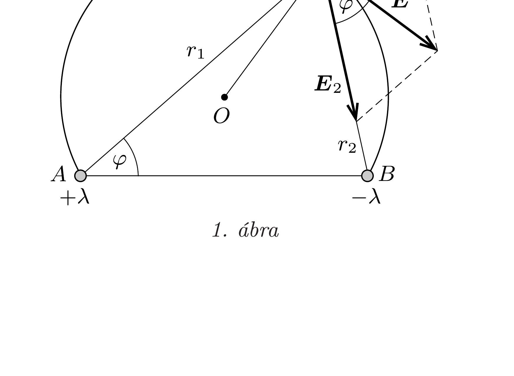
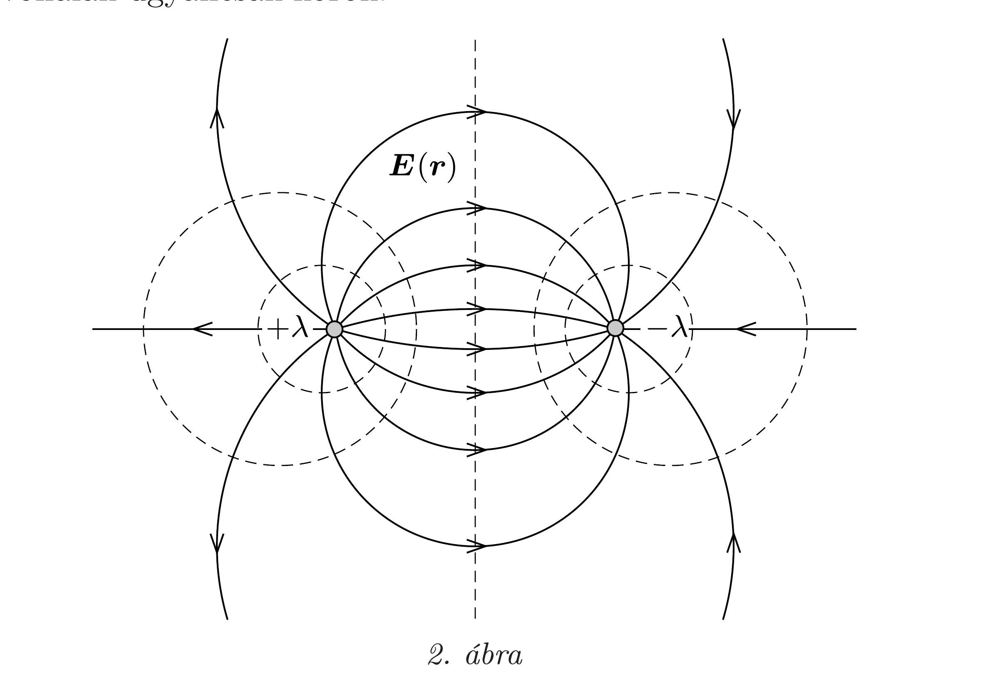

## Útmutatás

Az egyes pálcák által létrehozott térerősségjárulékok nagysága fordítottan arányos a tőlük mért távolsággal. Ennek felhasználásával és egy frappáns geometriai gondolattal próbáljuk meg belátni, hogy az erővonalak körív alakúak!

## Megoldás

Vizsgálódjunk a pálcákra merőleges síkban, és legyenek a pálcák és a sík döféspontjai $A(+)$ és $B(-)$, egy tetszőleges pont a síkban pedig $P$ (lásd az 1. ábrát)! Egyetlen hosszú, egyenletesen feltöltött pálca által létrehozott $\boldsymbol{E}_{i}$ térerősség nagysága (lásd a 243. feladat megoldását) fordítottan arányos a pálcától mért $r_{i}$ távolsággal $(i=1,2)$, ezért a két pálca által keltett térerősségjárulékok nagyságára fennáll az
\[
\frac{\left|\boldsymbol{E}_{1}\right|}{\left|\boldsymbol{E}_{2}\right|}=\frac{r_{2}}{r_{1}}
\]
egyenlőség. Ebből és a váltószögek egyenlőségéből látszik, hogy az $A B P$ háromszög hasonló a térerősségvektorok által meghatározott háromszöghöz, ezért az eredó térerősségvektor a $P B$ szakasszal ugyanakkora szöget zár be, mint a $P A B$ szög. Ez viszont azt jelenti, hogy az $A B P$ háromszög ( $O$ középpontú) köréirt körét a $P$ pontbeli eredő térerősség érinti, hiszen van két szögünk $(P A B \varangle$, illetve az $\boldsymbol{E}$ és $\boldsymbol{E}_{2}$ vektorok által bezárt szög), melyek egyenlőségük miatt a kör ugyanazon $P B$ ívéhez tartozó kerületi szögek.

A fentiekből következik, hogy az eredő térerősségvektor a sík tetszőleges pontjában érintője az $A, B$ és a kiszemelt pontra illeszkedő körívnek, a pálcák által létrehozott erővonalak tehát körív alakúak. A pálcák eróvonalképe a 2. ábrán látható. Belátható (lásd a 285. feladatot), hogy az ábrán szaggatottan jelölt ekvipotenciális vonalak ugyancsak körök.

