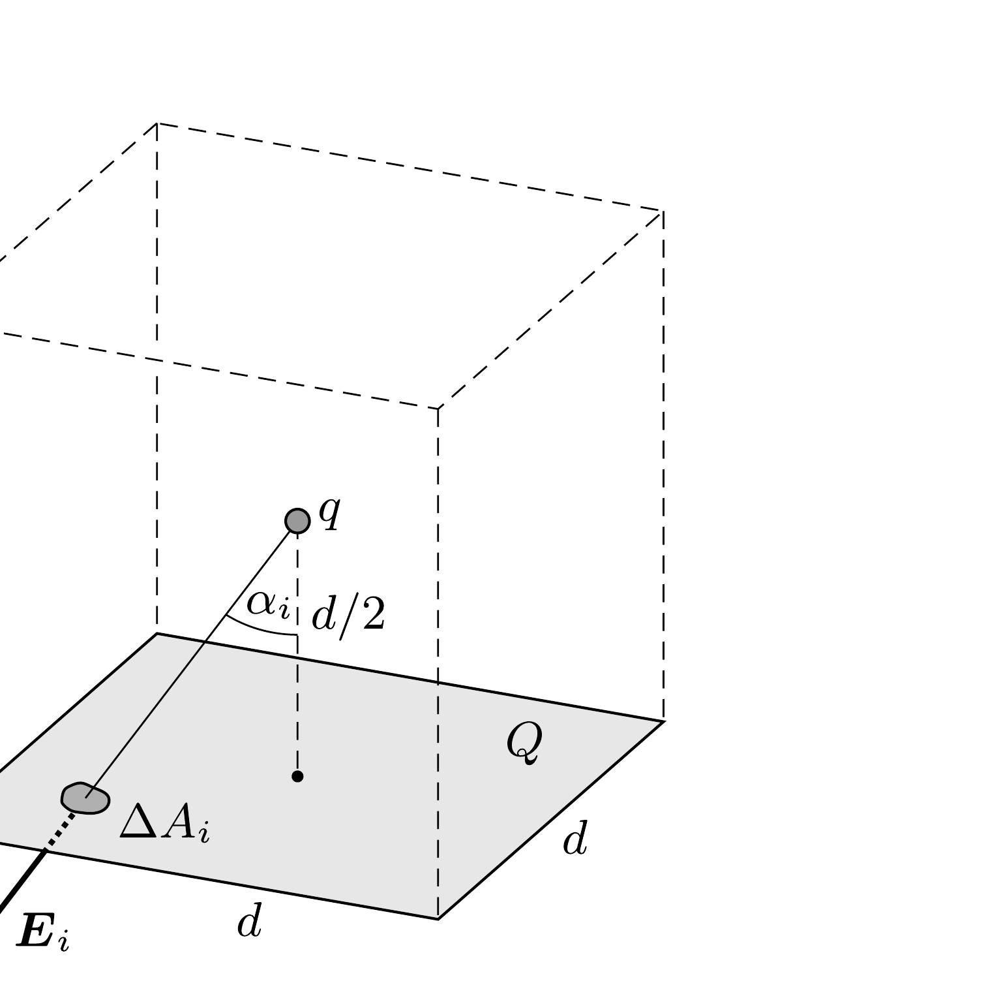

## Útmutatás

Hasonlítsuk össze a lemez kis darabkája által a ponttöltésre kifejtett erốt és a $q$ töltésnek ugyanezen felületdarabkán átmenő fluxusát!

## Megoldás

Newton III. törvénye értelmében ugyanakkora erốvel hat a szigetelőlemez a ponttöltésre, mint a ponttöltés a lemezre. Számítsuk ki ez utóbbi erő nagyságát! Ehhez osszuk fel a lemezt gondolatban kis darabkákra, és jelöljük az $i$-edik lemezdarabka területét $\Delta A_{i}$-vel! Az egyenletes felületi töltéseloszlás miatt ennek a darabkának a töltése
\[
\Delta Q_{i}=\frac{Q}{d^{2}} \Delta A_{i}
\]
nagyságú, így a rá ható elektromos eró nagysága $F_{i}=E_{i} \Delta Q_{i}$, ahol $E_{i}$ a $q$ ponttöltés által a darabka helyén létrehozott térerősség nagysága. A szigetelőlemezre ható erőt az egyes lemezdarabkákra ható erők vektori összegeként számíthatjuk. A szimmetria miatt az eredő eró a lemezre merőleges lesz, így elegendő csak az ilyen irányú erőkomponenseket összegeznünk:
\[
F=\sum_{i} F_{i} \cos \alpha_{i}=\sum_{i} E_{i} \frac{Q}{d^{2}} \Delta A_{i} \cos \alpha_{i}=\frac{Q}{d^{2}} \sum_{i} E_{i} \Delta A_{i} \cos \alpha_{i},
\]
ahol $\alpha_{i}$ a ponttöltést a felületdarabkával összekötő egyenes és a felület normálisa által bezárt szög. A kapott kifejezésben megjelenő összeg nem más, mint a $q$ ponttöltés által a négyzetlapon létrehozott elektromos fluxus:
\[
\Psi_{\square}=\sum_{i} E_{i} \Delta A_{i} \cos \alpha_{i} .
\]

Most vegyük körül gondolatban a ponttöltést szimmetrikusan egy $d$ oldalélú kockával (lásd az ábrát). Ekkor a ponttöltés távolsága a kocka lapjaitól éppen $d / 2$ lesz. A Gauss-törvény értelmében a kocka lapjain összesen $q / \varepsilon_{0}$ fluxus halad át, ezért egyetlen négyzetlapon ennek hatoda:
\[
\Psi_{\square}=\frac{q}{6 \varepsilon_{0}} .
\]
Ennek felhasználásával már ki tudjuk számítani a ponttöltés és a töltött szigetelőlemez között ható erốt:
\[
F=\frac{Q q}{6 \varepsilon_{0} d^{2}} .
\]

