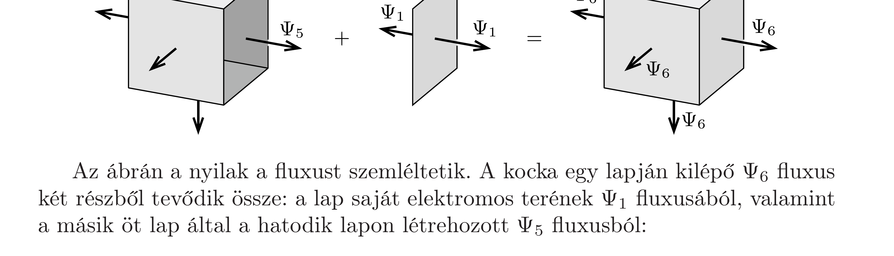

## Útmutatás

Induljunk ki az előző feladat megoldásából, majd határozzuk meg, hogy mekkora fluxust hoz létre a kocka öt lapja a hatodik oldallapon!

## Megoldás

A szimmetria miatt a kocka oldallapjaira ható elektrosztatikus eró merőleges a lapokra. Ezért az erő nagyságát - az előző feladat megoldásához hasonlóan - úgy számíthatjuk ki, hogy egy négyzetlap kis darabjaira ható erők felületre meróleges komponenseit összegezzük:
\[
F=\sum_{i} \sigma E_{i} \Delta A_{i} \cos \alpha_{i}=\frac{Q}{d^{2}} \sum_{i} E_{i} \Delta A_{i} \cos \alpha_{i}
\]
ahol $\Delta A_{i}$ az i-edik felületdarabka felszíne, $\sigma=Q / d^{2}$ a lapok felületi töltéssürúsége, $E_{i}$ a felületelem helyén mérhető elektromos térerósség nagysága, $\alpha_{i}$ pedig a térerősség és a felületdarabka normálisa által bezárt szög. A fenti kifejezésben az összeg éppen a kocka öt oldallapja által a hatodik lapon létrehozott $\Psi_{5}$ elektromos fluxus. Ennek meghatározásához tekintsük a következő ábrát:

Az ábrán a nyilak a fluxust szemléltetik. A kocka egy lapján kilépő $\Psi_{6}$ fluxus két részből tevődik össze: a lap saját elektromos terének $\Psi_{1}$ fluxusából, valamint a másik öt lap által a hatodik lapon létrehozott $\Psi_{5}$ fluxusból:
\[
\Psi_{6}=\Psi_{5}+\Psi_{1} .
\]
Egy lap saját elektromos teréből származó fluxus könnyen számolható a Gausstörvényból:
\[
\Psi_{1}=\frac{1}{2} \cdot \frac{Q}{\varepsilon_{0}},
\]
hiszen a lap mindkét oldalán ugyanannyi erővonal lép ki. A kocka bármely lapján kilépő $\Psi_{6}$ fluxus a szimmetria miatt a kockából kilépő teljes fluxus egyhatoda:
\[
\Psi_{6}=\frac{1}{6} \cdot \frac{6 Q}{\varepsilon_{0}} .
\]
Ezek alapján az öt lap által a hatodik lapon létrehozott elektromos fluxus:
\[
\Psi_{5}=\Psi_{6}-\Psi_{1}=\frac{Q}{\varepsilon_{0}}-\frac{Q}{2 \varepsilon_{0}}=\frac{Q}{2 \varepsilon_{0}} .
\]
Ezt behelyettesítve az eró (1) kifejezésébe:
\[
F=\frac{Q^{2}}{2 \varepsilon_{0} d^{2}} .
\]
Ekkora tehát a kocka lapjaira ható elektrosztatikus eró nagysága.
