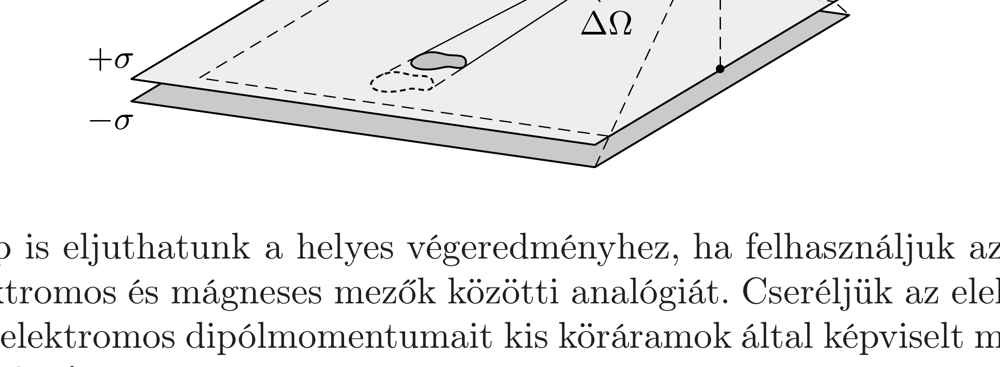
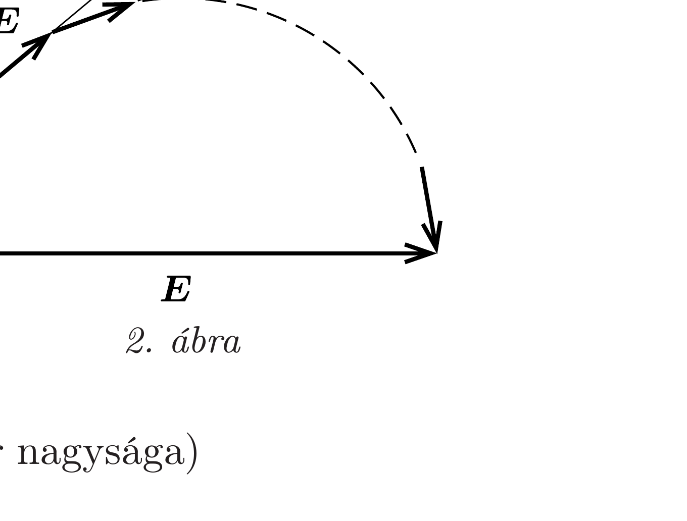
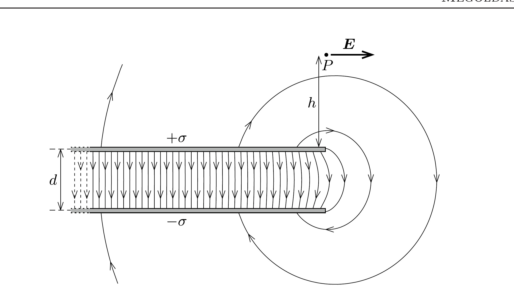
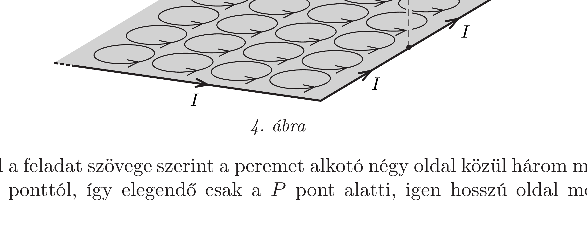

## Útmutatás

A felső és alsó szigetelőlemez azon darabkái, melyek a $P$ pontból nézve ugyanazon $\Delta \Omega$ térszög alatt látszanak (tehát egymást éppen elfedik), azonos nagyságú, de ellentétes irányú térerősséget hoznak létre a $P$ pontban, így hatásaik kölcsönösen kioltják egymást. Emiatt az alsó lemez által a $P$ pontban keltett térerősséget teljesen kioltja a felső lemez azon részének térerősségjáruléka, amelyik az alsó lemezzel megegyező térszögben látszik a $P$ pontból. Az eredő elektromos teret a $P$ pontban a felsó́ lemez „maradék” (az ábrán szaggatottan jelölt) szegélye hozza létre.

Másképp is eljuthatunk a helyes végeredményhez, ha felhasználjuk az időben állandó elektromos és mágneses mezők közötti analógiát. Cseréljük az elektromos kettősréteg elektromos dipólmomentumait kis köráramok által képviselt mágneses momentumokra!

## Megoldás

I. megoldás. A felsó (pozitív töltésú) lemez és az alsó (negatív töltésú) lemez azon darabkái, amelyek a $P$ pontból ugyanazon térszög alatt látszanak, ugyanakkora, de ellentétes irányú térerősséget hoznak létre a $P$ pontban, mert a darabkák töltése a $P$ ponttól mért távolságuk négyzetével egyenesen arányos, térerősségük viszont a Coulomb-törvény miatt a távolság négyzetével fordítottan arányos. Emiatt az alsó lemez által a $P$ pontban keltett elektromos teret teljesen kioltja a felső lemez azon részének térerősségjáruléka, amelyik az alsó lemezzel megegyezó térszögben látszik a $P$ pontból. Feladatunk a felsó szigetelőlap „maradék" szegélyétől származó térerősség meghatározása.

![Az 1. ábrán látható szegély nem mindenhol azonos szélességú: a háromszögek hasonlóságából adódik, hogy a felső szigetelőlemez $a$ hosszúságú, $P$ ponttól távolabbi éle mentén
\[
x_{b}=\frac{b d}{h},
\]
a $b$ hosszúságú élek mentén pedig](../../figures/333plus/figures/333+-p502-f1.png)
\[
x_{a}=\frac{a d}{2 h}
\]
a szélesség. Tekintsük most a szegélynek egy olyan elemét, amely az 1. ábrán látható $P^{\prime}$ pontból kicsiny $\Delta \varphi$ szög alatt látszik, és a $b$ hosszúságú oldal mentén helyezkedik el. Ennek a darabkának a távolsága a $P$ ponttól (az ábra jelöléseivel)
\[
r=\sqrt{\left(\frac{a}{2 \sin \varphi}\right)^{2}+h^{2}} \approx \frac{a}{2 \sin \varphi},
\]
ahol felhasználtuk, hogy $h \ll a$. A darabka hossza
\[
\Delta s=\frac{a}{2 \sin ^{2} \varphi} \Delta \varphi,
\]
töltése pedig
\[
\Delta Q=\sigma x_{a} \Delta s=\left(\frac{a}{2 \sin \varphi}\right)^{2} \frac{d}{h} \sigma \Delta \varphi .
\]
A szegély vizsgált eleme által a $P$ pontban létrehozott térerősség nagysága
\[
|\Delta \boldsymbol{E}|=\frac{1}{4 \pi \varepsilon_{0}} \frac{\Delta Q}{r^{2}}=\frac{1}{4 \pi \varepsilon_{0}} \frac{d}{h} \sigma \Delta \varphi,
\]
iránya pedig $h \ll a$ miatt jó közelítéssel vízszintes (bár ez utóbbi az ábránkon az erősen torzított méretarányok miatt nem látszik). Eredményünk független az $a$ és $b$ oldalélektől, valamint a $\varphi$ szögtől, és ugyanez mondható el a szegély többi darabkájáról is: az általuk létrehozott térerősségjárulék nagysága rögzített $d$ és $h$ mellett csak a $\Delta \varphi$ látószögüktől függ.

Osszuk fel tehát a teljes szegélyt olyan elemekre, amelyek a $P^{\prime}$ pontból azonos $\Delta \varphi \ll \pi$ szögben látszanak. Az ilyen darabkák által létrehozott térerősségvektorokat a 2. ábrán látható módon egymás végébe fúzve egy vízszintes síkú szabályos sokszög felét kapjuk. A felosztást finomítva ( $\Delta \varphi$-vel zérushoz tartva) a fél sokszög egy félkörhöz közelít, melynek „kerülete”
\[
\frac{1}{4 \pi \varepsilon_{0}} \frac{d}{h} \sigma \sum \Delta \varphi=\frac{1}{4 \pi \varepsilon_{0}} \frac{d}{h} \sigma \pi,
\]

így „átfogójának” hossza (azaz az eredő térerősségvektor nagysága)
\[
|\boldsymbol{E}|=\frac{\sigma}{2 \pi \varepsilon_{0}} \frac{d}{h} .
\]
Az eredő térerősség iránya jó közelítéssel vízszintes, és merőleges a lemezek $P$ pont alatt elhelyezkedő oldaléleire. A 3. ábra a lemezek széleinél kialakuló elektromos mező erővonalait mutatja oldalnézetben.

II. megoldás. A feladatra elegáns megoldást adhatunk, ha felhasználjuk a sztatikus elektromos és mágneses mezők hasonlóságát. A két töltött lemez egy olyan kettősréteget alkot, amelyen egyenletesen „elkent” elektromos dipólusok helyezkednek el $\sigma d$ felületi dipólmomentum-súrúségben. Egy elektromos dipólus elektromos terét és egy mágneses dipólus által keltett indukciót egy adott pontban ugyanolyan alakú formulák írják le, a különbség csak annyi, hogy a $\boldsymbol{p}$ elektromos dipólmomentumot és az $1 / \varepsilon_{0}$ arányossági tényezőt le kell cserélni rendre az $\boldsymbol{m}$ mágneses dipólnyomatékra és a $\mu_{0}$ tényezőre.

Cseréljük hát le gondolatban a kettősréteg elektromos dipóljait egyenletesen elhelyezkedő, elemi kis köráramok által képviselt mágneses dipólokra, és számítsuk ki az ezek által keltett eredó indukcióvektort a $P$ pontban! Egy $\Delta A$ területú, $I$ árammal átjárt kis körvezető mágneses momentuma $I \Delta A$, így a felületi mágneses dipólmomentum-súrúség éppen $I$. Az elemi köráramok belső, szomszédos áramelemei kioltják egymást, így csak a külső, szegélyen futó áramelemek hatását kell figyelembe vennünk (4. ábra). A sok kis köráram együttesét tehát helyettesíthetjük egy, a kettősréteg peremén elhelyezkedő, $I$ erősségú áramot szállító vezetékkel.

Mivel a feladat szövege szerint a peremet alkotó négy oldal közül három messze van a $P$ ponttól, így elegendő csak a $P$ pont alatti, igen hosszú oldal mentén
folyó áram hatását figyelembe vennünk. Ez az Ampère-féle gerjesztési törvény értelmében
\[
|\boldsymbol{B}|=\frac{\mu_{0}}{2 \pi} \frac{I}{h}
\]
nagyságú indukciót hoz létre a $P$ pontban, az indukcióvektor iránya pedig a 4. ábrán látható. Visszatérve az eredeti feladathoz, a $P$ pontbeli elektromos térerősség nagyságát úgy kapjuk, hogy az $I$ mágneses dipólmomentum-súrúséget lecseréljük $\sigma d$-re, $\mu_{0}$-t pedig $1 / \varepsilon_{0}$-ra:
\[
|\boldsymbol{E}|=\frac{1}{2 \pi \varepsilon_{0}} \frac{\sigma d}{h} .
\]
