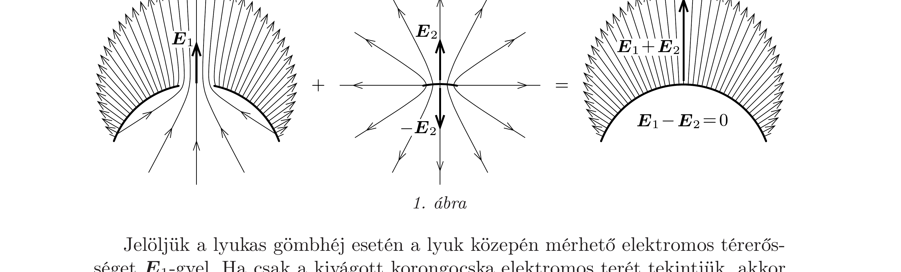
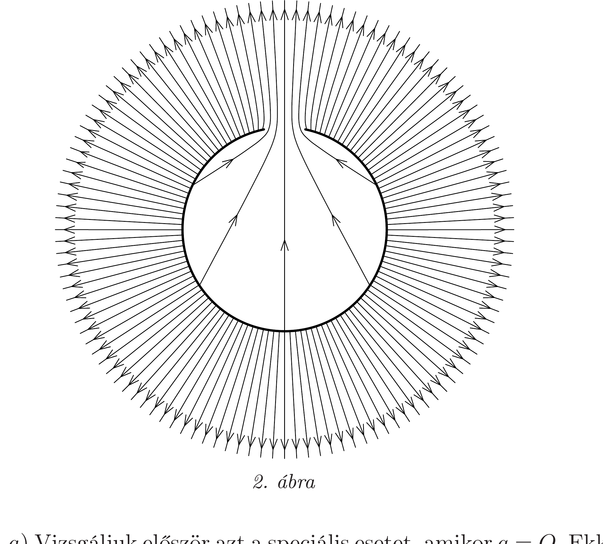

## Útmutatás

Alkalmazzuk a szuperpozíció módszerét, és vizsgáljuk meg, hogy milyen lenne a szigetelő gömb elektromos tere, ha a lyuknál kivágott (közelítőleg korong alakú) részt visszaragasztanánk a lyukba!

## Megoldás

A lyukas gömbhéj elektromos terét úgy képzelhetjük el, hogy egy egyenletesen töltött gömbhéj felületéből gondolatban kivágunk egy kicsiny (emiatt jó közelítéssel korong alakú) darabkát (lásd az 1. ábrát).

Jelöljük a lyukas gömbhéj esetén a lyuk közepén mérhető elektromos térerősséget $\boldsymbol{E}_{1}$-gyel. Ha csak a kivágott korongocska elektromos terét tekintjük, akkor annak (a középpontjához közel) mindkét oldalán ugyanakkora, $\left|\boldsymbol{E}_{2}\right|$ nagyságú a térerősség. Illesszük vissza képzeletben a gömbhéjból kivágott darabkát a lyukba! Így egy egyenletesen töltött szigetelő gömbhéjat kapunk, melynek belsejében az elektromos térerősség mindenhol nulla, ezért a szuperpozíció miatt
\[
\boldsymbol{E}_{1}-\boldsymbol{E}_{2}=0 .
\]
A gömbhéjon kívül (a gömb felületéhez közel) az elektromos tér olyan, mint egy $Q$ ponttöltés tere attól $R$ távolságban, ezért
\[
\left|\boldsymbol{E}_{1}+\boldsymbol{E}_{2}\right|=\frac{1}{4 \pi \varepsilon_{0}} \frac{Q}{R^{2}} .
\]
Az (1) és (2) egyenletekből azt kapjuk, hogy a térerősség a lyukas gömbhéj esetén a lyuk középpontjában
\[
\left|\boldsymbol{E}_{1}\right|=\frac{1}{8 \pi \varepsilon_{0}} \frac{Q}{R^{2}}
\]
nagyságú, iránya pedig (a szimmetria miatt) sugárirányú.

Hátravan még a lyukas gömbhéj elektromos terének ábrázolása. A fenti szuperpozíciós gondolatmenetből következik, hogy a lyukon áthaladó elektromos fluxus - azaz a lyukból kilépő erővonalak száma - éppen fele a gömbhéj lyuktól távoli részeinek (a lyukkal megegyező felszínú) darabkáiból kiinduló fluxusnak. De vajon honnan indulnak a lyukon kilépő erővonalak? A gömbhéj belső felületéről! A gömbhéjon belüli elektromos tér a lyuktól távol olyan, mint egy (a kivágott felületdarabkával megegyező nagyságú, azzal ellentétes töltésü) ponttöltés tere, a gömbön kívüli elektromos tér pedig a gömbtől távolodva egyre inkább izotroppá válik. A lyukas gömbhéj elektromos terének erővonalait (a szimmetriatengelyét tartalmazó metszetben) a 2. ábra mutatja.

