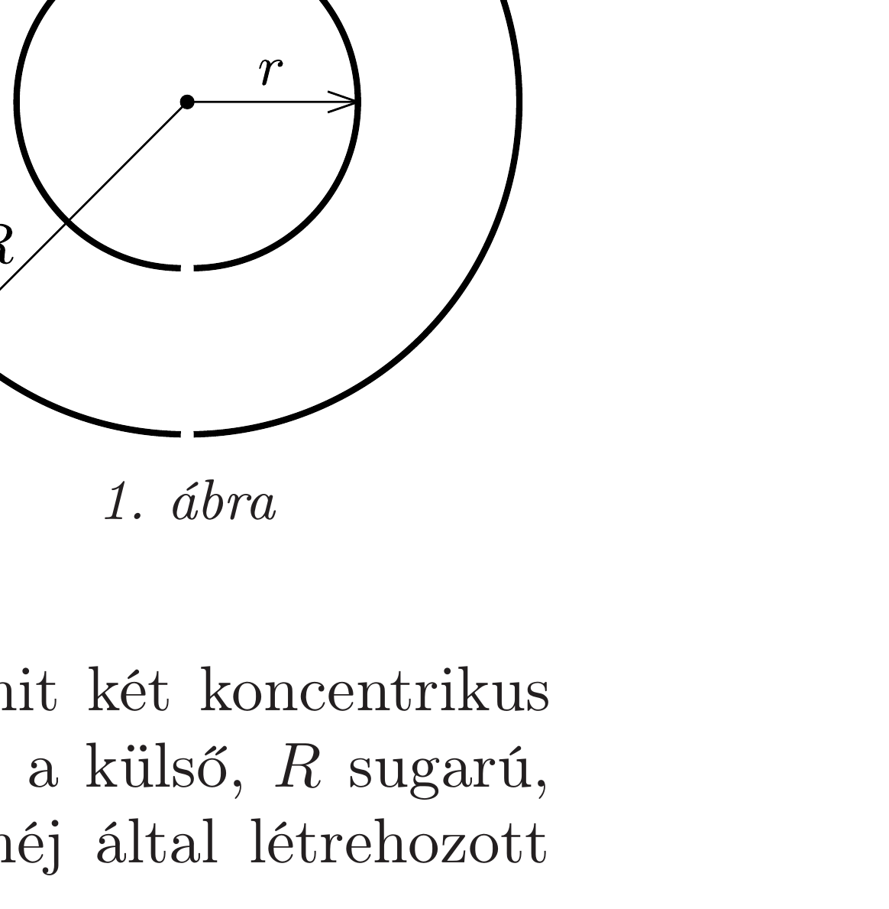
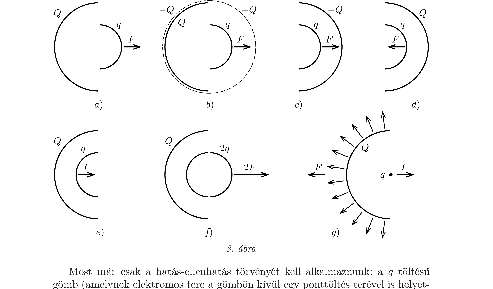
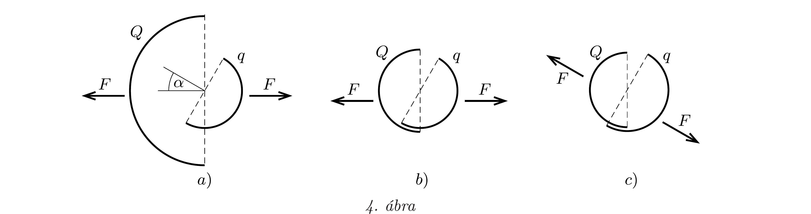

## Útmutatás

a) Próbáljuk meghatározni a két félgömb közötti erőt abban a speciális esetben, amikor a töltésük egyforma! Ekkor a félgömbökre ható elektrosztatikus eró úgy számolható, mintha felületükre valamekkora $p$ nyomású gáz fejtene ki erőt. Az általános eset (különböző nagyságú $q$ és $Q$ töltésekre vonatkozó) eredményét ezek után már megsejthetjük.
b) A szuperpozíció alkalmazásával többféleképpen is célt érhetünk.

## Megoldás

a) Vizsgáljuk először azt a speciális esetet, amikor $q=Q$. Ekkor az elrendezés elektromos mezője ugyanolyan, mint egyetlen, $2 Q$ töltéssel egyenletesen feltöltött szigetelő gömbhéj tere. A térerősség a gömbön kívül, a felület közelében úgy számolható, mintha azt egy $2 Q$ töltésú, a gömb középpontjába helyezett pontszerú test hozná létre:
\[
E=\frac{1}{4 \pi \varepsilon_{0}} \frac{2 Q}{R^{2}},
\]
a gömb belsejében pedig nulla. A szigetelő gömbhéj felületén a töltéssürúség:
\[
\sigma=\frac{2 Q}{4 R^{2} \pi}=\frac{Q}{2 R^{2} \pi}=\varepsilon_{0} E .
\]
Az $E$ térerősségú elektromos mezó a gömbhéj kicsiny $\Delta A$ felületü, $\Delta Q=\sigma \Delta A$ töltésú darabkáira $\Delta F=\frac{1}{2} E \Delta Q$ erốt fejt ki. Az $\frac{1}{2}$-es szorzótényező onnan származik, hogy a térerősség nagysága csak a felületdarabkák külső oldalán $E$, a belső oldalon zérus, átlagos értéke tehát $E / 2$-nek vehető.

Megjegyzés. Az $\frac{1}{2}$-es faktort az elózó feladatban, a lyukas gömbnél alkalmazott gondolatmenettel is megkaphatjuk. A gömbhéj egy kicsiny darabkájának közelében az elektromos teret egyrészt a vizsgált felületdarabka, másrészt pedig a gömbhéj többi része hozza létre. A felületdarabka a Gauss-törvényből következően mindkét oldalán $E / 2$ nagyságú, de ellentétes irányú térerősséget hoz létre, a gömb többi részének járuléka tehát $E / 2$, így lesz ugyanis a gömb belső felületénél a térerősség 0, kívül pedig $E$. Az $E / 2$ térerősségú térbe helyezett $\Delta Q$ töltésre valóban $\Delta F=\frac{1}{2} E \Delta Q$ nagyságú erő hat.

A gömbhéjon lévő töltésekre tehát felületegységenként
\[
p=\frac{\Delta F}{\Delta A}=\frac{1}{2} \sigma E=\frac{1}{2} \varepsilon_{0} E^{2}
\]
eró hat, éppen akkora, mintha a gömböt belülről $p$ túlnyomású gáz feszítené szét. Az egyes félgömbhéjakra ható eredő eró ugyanakkora, mint a félgömbhéjat gondolatban lezáró körlapra ható erő lenne $p$ túlnyomás esetén (hiszen egy $p$ nyomású gázzal töltött, lezárt félgömbre a gáz által kifejtett eredő erő zérus, ellenkező esetben örökmozgót készíthetnénk). A $Q$ töltésú félgömb által a másik $Q$ töltésú testre ható erố tehát
\[
F_{Q \rightarrow Q}=p \cdot R^{2} \pi=\frac{1}{2} \sigma E \cdot R^{2} \pi=\frac{1}{8 \pi \varepsilon_{0}} \frac{Q^{2}}{R^{2}} .
\]

Térjünk vissza most az eredeti kérdéshez, amikor az egyik félgömbhéjon nem $Q$, hanem $q$ töltés van! Az elektrosztatikus erő arányos a test töltésével, ezért
\[
F^{(a)}=F_{Q \rightarrow q}=F_{q \rightarrow Q}=\frac{q}{Q} F_{Q \rightarrow Q}=\frac{1}{8 \pi \varepsilon_{0}} \frac{Q q}{R^{2}} .
\]
b) I. megoldás. Egészítsük ki a különböző sugarú félgömbhéjakból álló elrendezést a „tükörképével” (1. ábra)! Írjuk fel a bal oldali két félgömbhéj által a jobb oldali két félgömbhéjra kifejtett eredő erőt (jelöljük ezt $F_{0}$-lal)! Ez négy erőből tehető össze:
\[
F_{0}=F_{Q \rightarrow Q}+F_{q \rightarrow q}+F_{Q \rightarrow q}+F_{q \rightarrow Q} .
\]
Az összeg két utolsó tagja egyenlő egymással, és mindkettő éppen az az $F^{(b)}$ erő, amit keresünk. Ha tehát ki tudjuk számítani $F_{0}$-t, akkor $F_{Q \rightarrow Q}$ és $F_{q \rightarrow q}$ ismeretében (amelyeket az $a$ ) kérdésre tudunk vissza-

vezetni) a keresett $F^{(b)}$ eró meghatározható.
$F_{0}$ kiszámításához tekintsük azt az elektromos teret, amit két koncentrikus gömbhéj hoz létre: a belső, $r$ sugarú, $2 q$ töltésú gömbhéj és a külső, $R$ sugarú, $2 Q$ töltésú gömbhéj. Gyakorlatilag ez lesz a négy félgömbhéj által létrehozott elektromos tér is.

A kis gömbhéj belsejében az elektromos térerősség nulla. E gömb felületén a töltéssúrúség (2. ábra):
\[
\sigma_{q}=\frac{q}{2 r^{2} \pi}
\]
a térerősség pedig a gömb felületénél, de kívül:
\[
E_{1}=\frac{1}{4 \pi \varepsilon_{0}} \frac{2 q}{r^{2}} .
\]
Ennek a kis gömbnek a tere a nagy gömb felületénél, annak belsejében:
\[
E_{2}=\frac{1}{4 \pi \varepsilon_{0}} \frac{2 q}{R^{2}} .
\]
A nagy gömb felületén a töltéssúrúség:
\[
\sigma_{Q}=\frac{Q}{2 R^{2} \pi} .
\]
A nagy gömbön kívüli térrészben a térerősségért mindkét gömb töltése felelős. Itt az elektromos térerősség nagysága (a felülethez közel)
\[
E_{3}=\frac{1}{4 \pi \varepsilon_{0}} \frac{2 q+2 Q}{R^{2}} .
\]

A fenti kifejezések segítségével - az $a$ ) kérdésnél alkalmazott gondolatmenetet követve - $F_{0}$-t a következő módon számíthatjuk ki:
\[
F_{0}=\frac{1}{2} \sigma_{q} E_{1} r^{2} \pi+\frac{1}{2} \sigma_{Q}\left(E_{2}+E_{3}\right) R^{2} \pi .
\]
Behelyettesítve $\sigma_{q}, \sigma_{Q}, E_{1}, E_{2}$ és $E_{3}$ fenti kifejezéseit a két-két félgömbhéj között ható erőre ezt kapjuk:
\[
F_{0}=\frac{q^{2}}{8 \pi \varepsilon_{0} r^{2}}+\frac{Q(2 q+Q)}{8 \pi \varepsilon_{0} R^{2}} .
\]
Az $a$ ) kérdésre adott választ felhasználva azt is tudjuk, hogy
\[
F_{Q \rightarrow Q}=\frac{1}{8 \pi \varepsilon_{0}} \frac{Q^{2}}{R^{2}} \quad \text { és } \quad F_{q \rightarrow q}=\frac{1}{8 \pi \varepsilon_{0}} \frac{q^{2}}{r^{2}} .
\]
Ezekből végül a keresett erő:
\[
F^{(b)}=F_{Q \rightarrow q}=F_{q \rightarrow Q}=\frac{1}{8 \pi \varepsilon_{0}} \frac{Q q}{R^{2}} .
\]
Az eredmény meglepő, hiszen $F^{(b)}$ független $r$-től. Eszerint mind az $a$ ), mind pedig a $b$ ) esetben ugyanakkora erő hat a két töltött félgömb között.
II. megoldás. Vegyük körül - gondolatban - a 3. ábra a) részén látható elrendezést (amelyen az egyszerúség kedvéért csak a kisebb félgömbhéjra ható erőt tüntettük fel) egy $R$-nél „hajszálnyival” nagyobb sugarú, $-2 Q$ töltésú gömbhéjjal a $b$ ) ábrán látható módon. Így a félgömbhéjak között ható erốt nem változtatjuk meg, hiszen az egyenletesen töltött gömbhéj térerőssége belül nulla. Ez az elrendezés egyenértékú a $c$ ) ábrán láthatóval, amiből $-Q$ előjelét megváltoztatva a $d$ ) ábrán feltüntetetthez jutunk. Tükrözzük most a testeket a félgömbhéjak képzeletbeli határsíkjára! Az így kapott $e$ ) elrendezésben a $Q$ töltésú (egyenletesen töltött) félgömbhéj ugyanakkora erőt fejt ki egy „benne lévő“ másik, $q$ töltésú félgömbhéjra, mint amekkorát egy „belőle kilógó" $q$ töltésú félgömbhéjra. Az $a$ ) és $e$ ) ábrák szuperpozíciójával kapott $f$ ) ábra szerint egy $2 q$ töltésú gömbre a nagy félgömbhéj $2 F$ erőt fejtene ki, a $q$ össztöltésú gömbre pedig ennek felét, $F$-et.

Most már csak a hatás-ellenhatás törvényét kell alkalmaznunk: a $q$ töltésú gömb (amelynek elektromos tere a gömbön kívül egy ponttöltés terével is helyettesíthető, tehát nem függ $r$-től) a $Q$ töltésú félgömbhéjra éppen a keresett $F^{(b)}$ nagyságú erőt fejti ki $(g)$ ábra). A végeredmény a Coulomb-törvény és a gáznyomásos hasonlat alkalmazásával adódik:
\[
F^{(b)}=\frac{1}{4 \pi \varepsilon_{0}} \frac{q}{R^{2}} \cdot \frac{Q}{2 \pi R^{2}} \cdot R^{2} \pi=\frac{1}{8 \pi \varepsilon_{0}} \frac{Q q}{R^{2}} .
\]

Megjegyzés. A fentiekhez hasonló „tükrözéses módszerrel” megmutatható, hogy a félgömbhéjak között ható erő nagysága akkor is a fent kiszámított érték, ha a két félgömb
szimmetriatengelye tetszőleges $\alpha$ szöget zár be egymással. Az erő nagysága a töltések szorzatán kívül csak a nagyobb félgömbhéj sugarától függ, iránya pedig a nagyobb félgömb szimmetriatengelyével párhuzamos, jóllehet a hatásvonala általában nem megy át a félgömbhéjak közös középpontján (4. ábra $a$ ) része). Ez az eredmény azért is meglepő, mert ha $r$ és $R$ majdnem egyforma nagyságúak, egyikük csupán egy parányival nagyobb a másiknál, akkor az erő iránya ugrásszerúen változik, attól függően, hogy melyik sugár is a nagyobb $(b)$ és $c$ ) ábrák).

