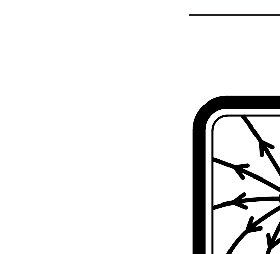
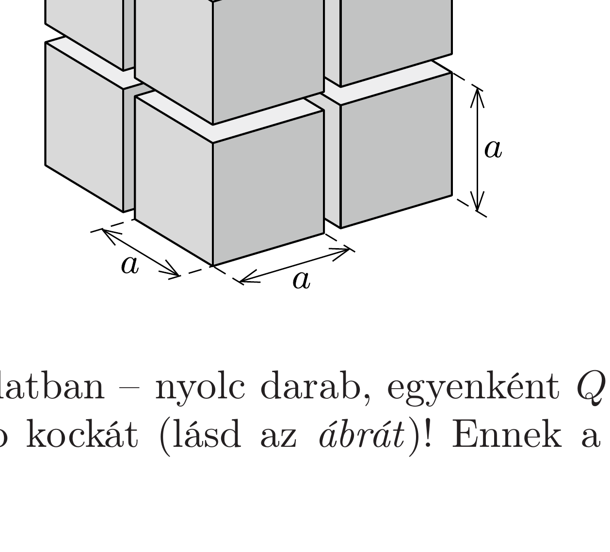
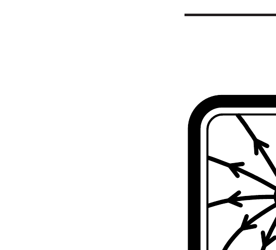

## Útmutatás

Vágjuk fel gondolatban a kockát nyolc egybevágó kiskockára, majd alkalmazzuk a szuperpozíció elvét és a dimenzióanalízis módszerét!

\section*{Elektrosztatika II. \\ (vezetók)}

## Megoldás

Egy homogén töltéssűrúségú kocka középpontjában az $U_{\text {közép }}$ potenciál csak a Coulomb-állandótól $(k)$, a kocka töltésétől $(Q)$ és az élének hosszától (a) függhet. Mivel a szóban forgó mennyiségek dimenziója
\[
\left[U_{\text {közép }}\right]=\frac{\mathrm{Nm}}{\mathrm{C}}, \quad[k]=\frac{\mathrm{Nm}^{2}}{\mathrm{C}^{2}}, \quad[Q]=\mathrm{C}, \quad[a]=\mathrm{m}, \quad, \quad[A]
\]
ezért a potenciál $k$-val és $Q$-val egyenesen, $a$-val pedig fordítottan arányos:
\[
U_{\text {közép }}(a, Q)=c k \frac{Q}{a},
\]
ahol $c$ egy dimenziótlan állandó (amely a kocka geometriájára jellemző́).

Építsünk fel - gondolatban - nyolc darab, egyenként $Q$ töltésú kockából egy $2 a$ élhosszúságú nagyobb kockát (lásd az ábrát)! Ennek a nagyobb kockának a
középpontjában a potenciál
\[
U_{\text {közép }}(2 a, 8 Q)=c k \frac{8 Q}{2 a}=4 c k \frac{Q}{a} .
\]
A nagy kocka középpontja a kis kockák mindegyikének az egyik csúcsa. Vegyünk el (és távolítsuk el nagyon messzire) a nyolc kis kockából hetet! Ekkor a potenciál a nagy kocka középpontjának helyén a nyolcadára csökken, a maradék egy kocka csúcsán tehát a potenciál
\[
U_{\text {csúcs }}=\frac{1}{8} \cdot 4 c k \frac{Q}{a}=\frac{1}{2} c k \frac{Q}{a}
\]
lesz. Az (1) és (2) kifejezéseket összehasonlítva látszik, hogy egy homogén térfogati töltéseloszlású kocka középpontjában a potenciál éppen kétszer akkora, mint a csúcsán.

\section*{Elektrosztatika II. \\ (vezetők)}
