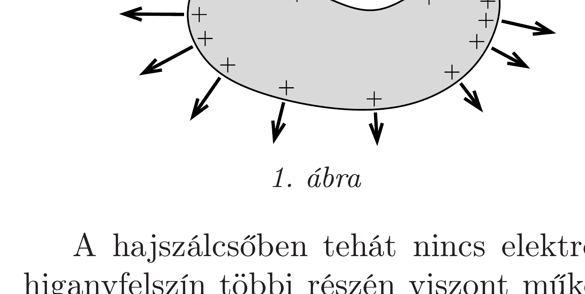
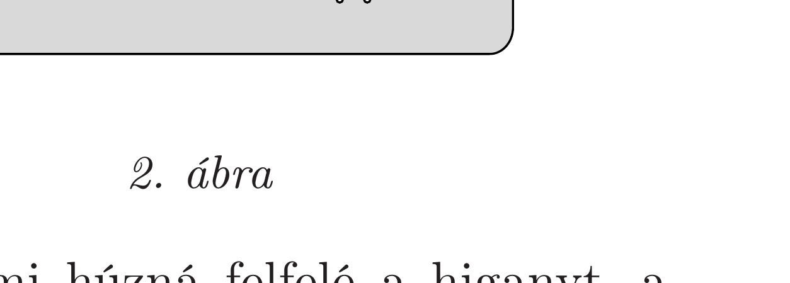

## Útmutatás

Egy töltött fémtesten a töltések a felszínen helyezkednek el, és a rájuk ható elektromos tér a felületre merőleges húzóerőt fejt ki. Milyen hatással van ez az eró az állandó térfogatú higany alakjára?

## Megoldás

Egy töltött fémtest egységnyi felületú (kicsiny) darabkáját a felület közelében mérhető elektromos térerősség négyzetével arányos eró húzza „kifelé” (1. ábra). Ez a húzóeró a felületi töltéseloszlástól, az pedig a felület mértani alakjától függ. Esetünkben a töltött fémtest a higany (hiszen a feszültség rákapcsolásakor töltések vándorolnak rá), melynek alakját a 2. ábra mutatja. A hajszálcső belsejében, annak a külső higanyszint alatti részében gyakorlatilag nincs elektromos tér, mert az a fémtest belsejében van (Faraday-kalitka). Úgy is érvelhetünk, hogy ha lenne a bemélyedés belsejében számottevő elektromos tér, akkor az üreg alja és teteje között potenciálkülönbség lépne fel, ez viszont - a higany fémes volta miatt - nem történhet meg.

A hajszálcsőben tehát nincs elektromos tér, ami húzná felfelé a higanyt, a higanyfelszín többi részén viszont múködik ilyen (függőlegesen felfelé ható) erő. Mivel a folyadék össztérfogata adott, a kapillárisban lesüllyed a higanyszint.

Megjegyzés. Az elektrosztatika törvényeihez alakilag hasonló egyenletek írják le a hốvezetés jelenségét is. Az analógiában az elektromos potenciálnak a hőmérséklet, az elektromos térerősségnek pedig a hőáramsürúséggel arányos vektor felel meg.

A feladatban szereplő elektrosztatikus problémának az a hốtani kérdés felel meg, hogy milyen hőmérsékleteloszlás alakul ki egy (a 2. ábrán látható alakú) jó hővezetőképességü test környezetében, ha a test kicsit melegebb a mérsékelten hóvezető környezeténél. A test nyilván hốt ad le, de a bemélyedés belsejében nem alakul ki számottevő hőáram, hiszen az üreg fala mindenhol gyakorlatilag ugyanakkora hőmérsékletú.
