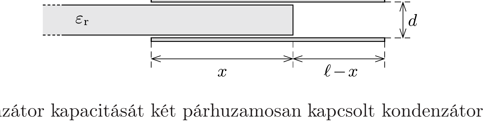

## Útmutatás

Az elektromos mező térfogategységre vonatkoztatott energiája (energiasürúsége) az elektromos térerősség négyzetével és a dielektromos állandóval arányos: $w_{\mathrm{el}}=\varepsilon E^{2} / 2$. A kondenzátor lemezei közé csúsztatott szigetelő (a polarizációja révén) lecsökkenti az elektromos térerősséget, melynek következtében a rendszer energiája is csökken. Az energiaváltozásból (a munkatétel alkalmazásával) kiszámíthatjuk a dielektrikumra ható erốt.

## Megoldás

$a$ ) Legyen a síkkondenzátor lemezeinek távolsága $d$, a lemezek töltése $Q$, felületük $A$, továbbá a vizsgált helyzetben a szigetelőlap $x$ hosszúságú darabja már legyen az $\ell$ hosszúságú lemezek között $(0<x<\ell)$, ahogy ezt az ábra mutatja.

A kondenzátor kapacitását két párhuzamosan kapcsolt kondenzátor (az egyik dielektrikummal kitöltött, a másik üres) kapacitásának összegeként számíthatjuk ki:
\[
C=\varepsilon_{0} \varepsilon_{\mathrm{r}} \frac{A}{d} \frac{x}{\ell}+\varepsilon_{0} \frac{A}{d} \frac{\ell-x}{\ell} .
\]
Láthatjuk, hogy a síkkondenzátor kapacitása a kezdeti $\varepsilon_{0} A / d$-ről $x$-szel arányosan növekszik a kezdeti érték $\varepsilon_{\mathrm{r}}$-szeresére. Mivel az $a$ ) esetben a töltés állandó, a kondenzátor energiáját így adhatjuk meg:
\[
W_{\mathrm{kond}}=\frac{Q^{2}}{2 C}=\frac{Q^{2} \ell d}{2 \varepsilon_{0} A\left[\left(\varepsilon_{\mathrm{r}}-1\right) x+\ell\right]} .
\]
Ezek szerint $x$ növekedtével a kondenzátor energiája csökken! Ebből következik, hogy a szigetelőlap betolásakor végzett munkánk negatív, vagyis a lemezek maguk közé húzzák a lapot, a szigetelőlapra befelé mutató erő hat.

Az eró nagyságát az elemi munkavégzés $(F \Delta x)$ és a $\Delta W_{\text {kond }}$ energiaváltozás egyenlőségéből differenciálszámítással határozhatjuk meg:
\[
F=\frac{\Delta W_{\mathrm{kond}}}{\Delta x} \rightarrow \frac{\mathrm{~d} W_{\mathrm{kond}}}{\mathrm{~d} x}=-\frac{\left(\varepsilon_{\mathrm{r}}-1\right) \ell d Q^{2}}{2 \varepsilon_{0} A\left[\left(\varepsilon_{\mathrm{r}}-1\right) x+\ell\right]^{2}} .
\]

Megjegyzés. Felmerülhet a kérdés, milyen módon fejt ki az elektromos mező a kondenzátorlemezekkel párhuzamos erốt a szigetelőlapra? Ha a lemezek között homogén,
a lemezekre merőleges lenne az elektromos tér, a lemezeken kívül pedig nulla a térerősség (ez a szokásos kondenzátor-kép), akkor a szigetelőlapra nem hatna erő. Az erőhatás ténylegesen az elektromos eróvonalaknak a lemezek szélén tapasztalható kidudorodásával (a mező inhomogenitásával) magyarázható.
b) A szigetelőlapra ható erő nem függhet attól, milyen kapcsolatban van a kondenzátor a környezetével, ezért előző eredményünk akkor is érvényes kell hogy legyen, ha a kondenzátor feszültségét tartjuk állandó értéken. Ekkor azonban a kondenzátor töltése a $Q=C U$ összefüggés szerint változik, amint a lapot a lemezek közé juttatjuk. Írjuk be az erő kifejezésébe a kondenzátor $x$-től függő töltését:
\[
F=-\frac{\varepsilon_{0} A\left(\varepsilon_{\mathrm{r}}-1\right) U^{2}}{2 \ell d},
\]
vagyis ebben az esetben állandó erő hat a szigetelőlapra.
Érdekes megállapításra jutunk, ha kifejezzük a kondenzátor energiáját állandó feszültség mellett:
\[
W_{\mathrm{kond}}=\frac{1}{2} C U^{2}=\frac{\varepsilon_{0} A\left[\left(\varepsilon_{\mathrm{r}}-1\right) x+\ell\right] U^{2}}{2 \ell d},
\]
ami azt mutatja, hogy ilyenkor a kondenzátor energiája lineárisan növekszik $x$-szel. Így a szigetelőlap $\Delta x$ elmozdulására jutó $\Delta W_{\text {kond }}$ energiaváltozást elemi úton is kiszámíthatjuk:
\[
\frac{\Delta W_{\mathrm{kond}}}{\Delta x}=\frac{\varepsilon_{0} A\left(\varepsilon_{\mathrm{r}}-1\right) U^{2}}{2 \ell d} .
\]
Az előjeltől eltekintve pontosan ugyanolyan alakra jutottunk, mint a szigetelőlapra ható eró számításakor. Eredményünket tehát úgy összegezhetjük, hogy a lap becsúsztatásakor az elektromos mező valamekkora munkát végez a lapon (behúzza a lapot), miközben ugyanennyivel növekszik a kondenzátor energiája. Ez úgy lehetséges, hogy a folyamatban a telep energiája kétszer ennyivel csökken, hiszen a kondenzátor kapacitása (és ezzel együtt a töltése) növekszik, vagyis a telep töltést ad le. A telep munkavégzése az előző feladat megoldásában látott módon határozható meg, a részletes számítást az Olvasóra bízzuk.
