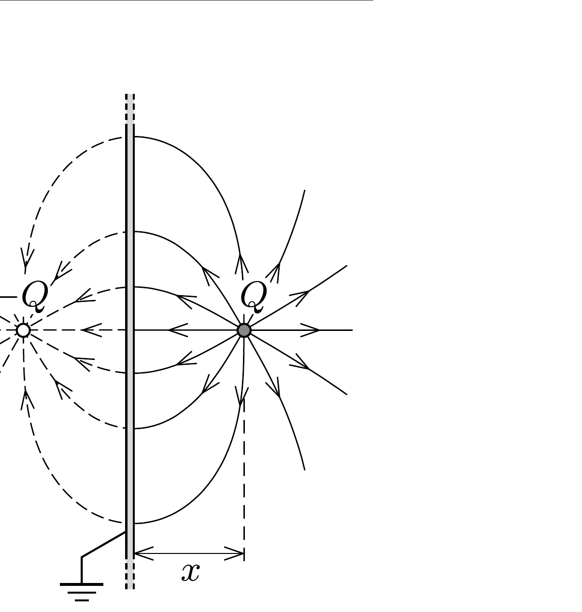

## Útmutatás

A töltésre ható erốt a tükörtöltés módszerével határozhatjuk meg. Eszerint egy földelt (vagy ami ezzel egyenértékú: egy nagy kiterjedésú) síklap
olyan elektromos teret hoz létre a ponttöltés felőli féltérben, amilyet egy, a fémlap átellenes oldalán elhelyezkedő, $-Q$ nagyságú ponttöltés hozna létre. A becsapódási idő kiszámításánál gondoljunk a bolygómozgás törvényeire!

## Megoldás

Mielött rátérnénk a feladat megoldására, tekintsünk két azonos nagyságú, de ellentétes elójelú ponttöltést ( $Q$ és $-Q$ ), melyek egymástól $2 x$ távolságra helyezkednek el. A töltések által keltett elektromos mező szerkezete jól ismert, és szimmetrikus a töltéseket összekötő szakasz (merőleges) felezősíkjára. Ebben a szimmetriasíkban az elektromos potenciál értéke nulla, ezért ha ide egy földelt fémlapot helyezünk, akkor a fémlap belsejében bekövetkezó töltésszétváláson kívül nem történik semmi: az elektromos mezó ugyanolyan marad, mint korábban.

A földelt fémlap két oldalán ellentétes előjelú felületi töltések halmozódnak fel, ezek biztosítják, hogy a fém anyagának belsejében a térerősség zérus legyen. A két oldalon kialakuló töltéseloszlás független egymástól: például a $Q$ töltés oldalán akkor sem változik meg a fémlap és a $Q$ töltés által létrehozott elektromos mező, ha a túloldali $-Q$ töltést eltávolítjuk. (Ezt úgy is beláthatjuk, hogy a fémlapot enyhén a $Q$ töltés felé görbítjük, és „nagyon messze” bezárjuk. Az így keletkezett Faraday-kalitka belsejében kialakuló elektromos mezőre a külső tér nincs

hatással.)

Egy földelt fémsík és egy tőle $d$ távolságra elhelyezkedő $Q$ ponttöltés elektromos tere tehát a ponttöltést tartalmazó féltérben olyan, mintha azt a $Q$ töltés egy képzeletbeli, a lemez túloldalán található „tükörtöltéssel” együtt hozta volna létre (lásd az ábrát). A $Q$ ponttöltéssel átellenes féltérben az elektromos térerősség azonosan nulla. A $Q$ töltésből kiinduló összes erővonal a földelt fémsíkba fut be, ezért a rajta felhalmozódó össztöltés $-Q$.

Megjegyzés. A tükörtöltések módszerével speciális alakú (sík, gömb stb.) vezetők és ponttöltések elektromos mezójét lehet meghatározni. A módszer az elektrosztatika alapegyenleteinek azon a tulajdonságán alapul, hogy ha egy zárt felület minden pontjában ismert a potenciál értéke, valamint a felület belsejében elhelyezkedő töltések eloszlása is adott, akkor ezek együtt egyértelmúen meghatározzák a felület belsejében kialakuló elektromos teret. Az előző gondolatmenetben a felület zártságát a földelt fémsík „végtelenben" történő bezárásával oldottuk meg.

A feladatban szereplő fémsík nem földelt, csak „nagy kiterjedésú" (össztöltése nulla). Ennek elektromos tere úgy állítható elő a nulla potenciálú ( $-Q$ össztöltésú) fémsík teréből, hogy egyenletes töltéseloszlásban $Q$ töltést viszünk fel rá (szuperpozíció elve). Ez azonban nagy fémsík esetén nagyon kicsiny felületi töltéssúrúséget jelent, amelynek hatása elhanyagolható. (Úgy is érvelhetünk, hogy a nagy fémlap szélei a $Q$ ponttöltéstől nagyon messze, tehát csaknem a nulla potenciálú pontig érnek, ezért a lap lényegében földeltnek tekinthető.)

A (nem túl gyorsan mozgó) $Q$ töltésú testre ható vonzóerő tehát a tükörtöltéstől származó Coulomb-erőként számítható:
\[
F(x)=k \frac{Q^{2}}{4 x^{2}},
\]
ahol $x$ a sík és a pontszerú test pillanatnyi távolsága. Ez az eró éppen akkora, amekkora gravitációs vonzóerőt egy $M=k Q^{2} /(4 \gamma m)$ tömegú, rögzített helyzetú test fejtene ki a tőle $x$ távolságra lévő $m$ tömegú másik testre. Az analógia alapján alkalmazhatjuk Kepler III. törvényét, ami a bolygók $T$ keringési ideje és az ellipszispályájuk $a$ félnagytengelye között teremt kapcsolatot:
\[
\frac{T^{2}}{a^{3}}=\frac{4 \pi^{2}}{\gamma M} .
\]

Ha a fémsíktól $d$ távolságban engedjük el a töltött testet, pályáját tekinthetjük egy nagyon lapos (elfajult) ellipszisnek is, amelynek félnagytengelye $a=d / 2$. A $T_{\mathrm{b}}$ becsapódási idő az elfajult pályához tartozó keringési idő fele:
\[
T_{\mathrm{b}}=\frac{T}{2}=\frac{\pi}{Q} \sqrt{\frac{m d^{3}}{2 k}} .
\]
