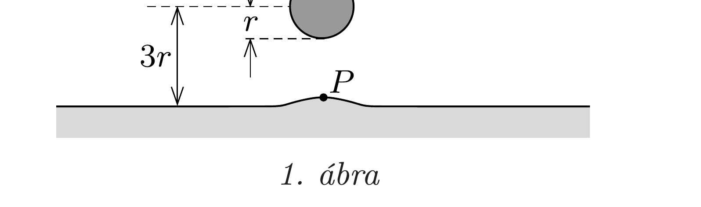
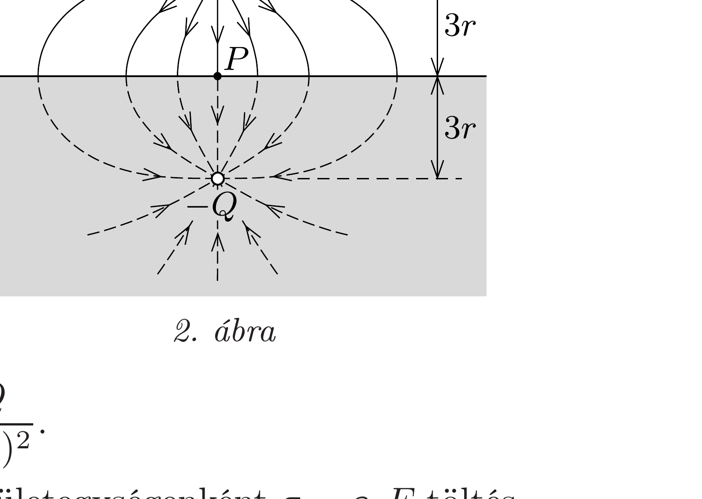

## Útmutatás

Az víz kipúposodása olyan kismértékú, hogy a vízfelszín síknak tekinthető, és alkalmazhatjuk a vezető síkokra vonatkozó tükörtöltés módszerét.

## Megoldás

A sós víz elektromosan jól vezető folyadék (elektrolit). Mind a pozitív, mind a negatív töltéshordozók (ionok) könnyen elmozdulnak benne. A közeledő, feltöltött golyó hatására az általa vonzott, vele ellentétes töltésú ionok igyekeznek a golyó felé elmozdulni, míg a golyóval azonos töltésú ionok a taszító eró hatására ellenkező irányban mozdulnak el. A folyadék felületén végül olyan egyensúlyi töltéseloszlás alakul ki, melynek hatására a folyadék belsejében megszúnik az elektromos tér, a golyó és a folyadék közötti térben pedig az erővonalak merólegesen futnak be a sós víz feszínére.

A töltött golyó a vele ellentétes töltésú folyadékfelszínt kissé megemeli. Az egyensúlyi folyadékfelület alakja várhatóan kevéssé tér el a síktól (erre utal a feladat szövege is), tehát a levegőben kialakuló eredő elektromos mezó meghatározásához alkalmazhatjuk az előzó feladatban részletesen ismeretett tükörtöltés módszerét. Elegendő figyelmünket egyetlen pontra, a felemelkedő folyadékfelület legfelső $P$ pontjára koncentrálni; ennek emelkedése az, amit ki kell számítanunk.

Az 1. ábrán $P$-vel jelölt pontban a $Q$ töltéstől származó térerősség
\[
E_{1}=\frac{1}{4 \pi \varepsilon_{0}} \frac{Q}{(3 r)^{2}} .
\]
A folyadék felületén kialakuló töltéseloszlás hatását a felszín alatt $3 r$ mélységben elképzelt $-Q$ nagyságú tükörtöltés hatásával helyettesítjük (2. ábra). A tükörtöltéstől származó térerősség a $P$ pontban ugyanakkora és ugyanolyan irányú, mint $E_{1}$, ezért itt az

eredó térerősség:
\[
E=2 E_{1}=\frac{1}{2 \pi \varepsilon_{0}} \frac{Q}{(3 r)^{2}} .
\]
A folyadék felszínén (a Gauss-törvény szerint) felületegységenként $\sigma=\varepsilon_{0} E$ töltés (felületi töltéssúrúség) alakul ki. A felületegységre ható elektrosztatikus erő
\[
\frac{F}{A}=\frac{1}{2} \sigma E=\frac{1}{2} \varepsilon_{0} E^{2} .
\]
(Az $\frac{1}{2}$-es szorzótényezó megjelenése azt a tényt fejezi ki, hogy az elektromos térerósség csak a folyadék felett $E$ nagyságú, a folyadékban nulla, átlagos értéke pedig $\frac{1}{2} E$.) Ez a felületegységre jutó, függőlegesen felfelé mutató eró egyensúly esetén éppen a $P$ pontbeli $h$ emelkedésből származó hidrosztatikai nyomással egyezik meg:
\[
\frac{F}{A}=\varrho g h .
\]
(A felületi feszültség szerepét a feladat szövegének megfelelően elhanyagoltuk.) Ebből kiszámítható a sós víz felszínének $h$ emelkedése:
\[
h=\frac{2 Q^{2}}{(36 \pi)^{2} \varepsilon_{0} \varrho g r^{4}} \approx 0,29 \mathrm{~mm} .
\]

Ez az érték valóban „pici” a golyó sugarához, illetve a víztől mért távolságához képest, jogos volt a síkra vonatkozó tükörtöltés-közelítés. Be lehet látni, hogy a víz emelkedéséből adódó görbületi nyomás a hidrosztatikai nyomásnál sokkal kisebb, a felületi feszültség szerepét tehát jogosan hanyagoltuk el.
