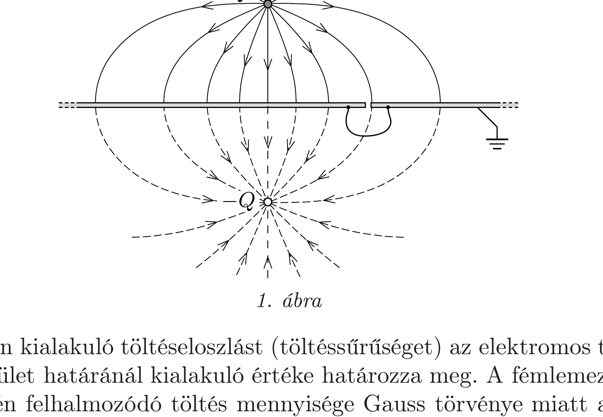
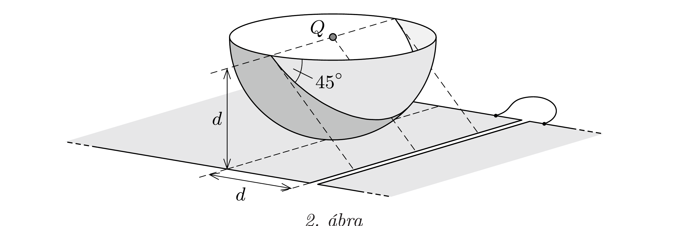
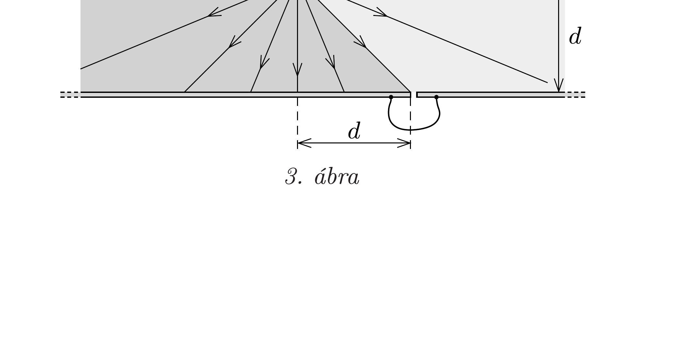
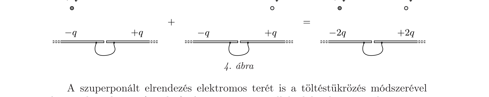
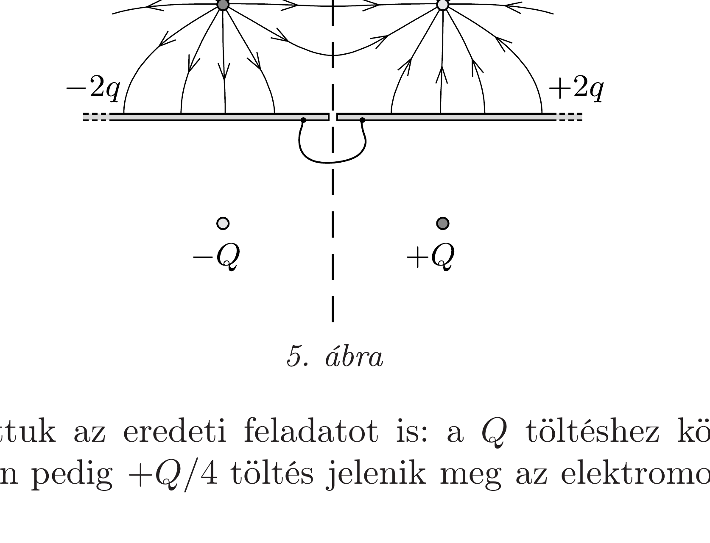

## Útmutatás

Oldjuk meg a feladatot először úgy, mintha a fémlemezek földeltek lennének, majd vigyünk fel annyi töltést a két fémlemezre, amennyit az elektromos töltés megmaradásának törvénye megkíván.

## Megoldás

I. megoldás. Tekintsük először azt az esetet, amikor a vezetékkel összekötött két fémlemez földelt, tehát a töltések szabadon távozhatnak a lemezekről, vagy éppen oda áramolhatnak. (A feladatban ez nem teljesül, mégis tanulságos először ezzel a problémával foglalkozni.) A két fémlemez az elektromos kontaktus miatt úgy viselkedik, mintha egyetlen nagy kiterjedésú (végtelen nagynak tekinthető) földelt lemez lenne. A $Q$ ponttöltés hatására a lemez felett olyan elektromos tér alakul ki, mintha a túloldalon, $Q$ tükörképének helyén egy $-Q$ nagyságú „tükörtöltés” helyezkedne el (1. ábra).

A lemezen kialakuló töltéseloszlást (töltéssúrúséget) az elektromos térerősségnek a fémfelület határánál kialakuló értéke határozza meg. A fémlemez valamekkora területén felhalmozódó töltés mennyisége Gauss törvénye miatt arányos az adott területre befutó erővonalak számával. A teljes (földelt) fémlemezre összesen $-Q$ töltés kerül, hiszen mindegyik erővonal valahol eléri a „végtelen nagy”
lemezpárt. Az elektromos erőteret a valódi töltés és a tükörtöltés terének szuperpozíciójaként állíthatjuk elő. Ugyanez igaz az erővonalszámokra is: a lemez valamely darabján átmenő erővonalszám a valódi töltésből, illetve a tükörtöltésből származó erővonalszámok összege. Mivel azonban ezek egymással egyenlőek, ezért a lemez kiszemelt darabjába befutó teljes elektromos fluxus a valódi ( $Q$ nagyságú) ponttöltés által létrehozott fluxus kétszerese.

Vizsgáljuk meg, hogy ha a lemezen felhalmozódó töltések nem lennének jelen, akkor a $Q$ nagyságú ponttöltésből (gömbszimmetrikusan) kiinduló $Q / \varepsilon_{0}$ számú eróvonal közül hány haladna át a töltés „alatti” fémlemezen, és mennyi a másik lemezen! Ha a $Q$ töltést gondolatban egy gömbhéjjal vesszük körül a 2. ábrán látható módon, akkor az erővonalak fele, $Q /\left(2 \varepsilon_{0}\right)$ halad át az alsó félgömbhéjon. A töltéstől távolabbi fémlemezt azok az erốvonalak érik el, amelyek az ábrán világosabban jelölt nyolcadgömbhéjon („dinnyehéjon“) lépnek ki; ezek $Q /\left(8 \varepsilon_{0}\right)$ fluxust hoznak létre. A másik fémlemezre háromszor ennyi erővonal fut be, a rajta átmenó fluxus tehát $3 Q /\left(8 \varepsilon_{0}\right)$. Mivel ezeknek a fluxusoknak a kétszeresét kell vennünk (a tükörtöltés miatt), ezért a jobb oldali lemezen $-Q / 4$ töltés, a bal oldalin pedig $-3 Q / 4$ töltés halmozódna fel, ha a lemezek földeltek lennének.

Valójában azonban a fémlemezek nem földeltek, emiatt az össztöltésük a megosztás után is nulla marad. Ha az eddig számolt töltés-értékekhez mindkét oldalon +Q/2-t hozzáadunk (mindkét lemezre ekkora töltést viszünk), akkor megkapjuk az eredeti feladat megoldását: a bal oldali lemez töltése $-Q / 4$, a jobb oldali lemezé pedig +Q/4 lesz.

Megjegyzés. Ha a $Q$ töltést elfelezzük, és az egyik fél töltést a lemezeket elválasztó keskeny réssel párhuzamos irányban valamennyire elmozdítjuk, a fémlemezeken a töltések átrendeződnek, de az egyes lemezeken lévớ összes töltés mennyisége nem változik meg. Ezt az eljárást sokszor megismételve a $Q$ töltést akár teljesen szét is „kenhetjük” egy hosszú, egyenes szigetelő pálca mentén, és ezzel a feladatot kétdimenzióssá alakíthatjuk. Ekkor a térbeli ábra helyett elegendó síkbelit készítenünk (3. ábra). Ez is jól mutatja, hogy ha a $Q$ töltés egymaga lenne csak jelen, a belőle kiinduló erővonalakból háromszor több jutna a bal oldali lemezre, mint a jobb oldalira. Ugyanez igaz a tükörtöltésekre is, tehát a két fémlemez eredő töltésaránya is 3 : 1 lenne, ha a lemezeket leföldelnénk.
II. megoldás. Jelöljük a bal oldali fémlemezre jutó töltés mennyiségét $-q$-val, ekkor a jobb oldali lemez töltése a megosztás hatására nyilván $+q$ lesz. Helyezzünk el most $-Q$ töltést a 4. ábrán látható helyre, ez a jobb oldali lemezen hoz létre $+q$ töltést és a bal oldali lemezre juttat $-q$ töltést. A két elrendezés szuperponálható, az eredményt ugyancsak a 4. ábra mutatja.

A szuperponált elrendezés elektromos terét is a töltéstükrözés módszerével határozhatjuk meg (5. ábra). A szaggatott vonallal jelölt sík - a ténylegesen ott lévó fémlemezekhez hasonlóan - ugyancsak ekvipotenciális, tehát a helyére akár egy valóságos fémlemezt is tehetnénk. A szimmetria miatt ezen lemez felsó felén is $-2 q$ töltés jelenne meg, és mivel a $Q$ töltésből kiinduló eróvonalak mindegyike valamelyik félsíkra érkezik, $-2 q-2 q=-Q$, azaz $q=Q / 4$.

Ezzel megoldottuk az eredeti feladatot is: a $Q$ töltéshez közelebbi lemezen $-Q / 4$, a távolabbin pedig $+Q / 4$ töltés jelenik meg az elektromos megosztás hatására.
