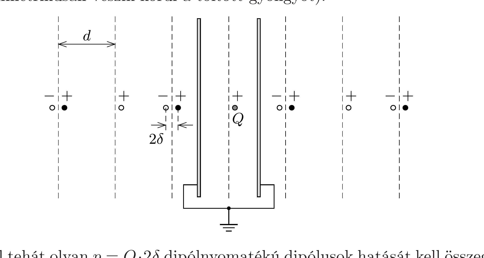

## Útmutatás

A kondenzátor lemezeinek hatása leírható a kondenzátor lemezein kívül (mindkét oldalon) megjelenő, végtelen sok számú tükörtöltéssel. A tükörtöltések által kifejtett erő nagysága véges, mert a gyöngytől távol elhelyezkedő tükörtöltések járuléka elhanyagolható.

## Megoldás

Mindkét kondenzátorlemez azonos, nulla potenciálú, ezért alkalmazhatjuk a töltéstükrözés módszerét. A végtelen sok $+Q$ és $-Q$ tükörtöltés közül az első néhányat az ábrán lyukas karikák jelzik. Ezek közül a pozitív előjelúek hatásai a szimmetria miatt kioltják egymást. A gyöngyre ható erő nem változik meg, ha a fekete pöttyökkel jelzett helyekre is elhelyezünk $+Q$ töltéseket (hiszen ezek szimmetrikusan veszik körül a töltött gyöngyöt).

Végül tehát olyan $p=Q \cdot 2 \delta$ dipólnyomatékú dipólusok hatását kell összegezni, melyek a töltött gyöngytől (jó közelítéssel) $d, 3 d, 5 d, 7 d, \ldots$ távolságra vannak. Egyetlen, $r$ távolságra lévő dipólus által a gyöngyre kifejtett erő nagysága (lásd pl. a 241. feladatot)
\[
F_{\text {dipól }}(r)=\frac{1}{2 \pi \varepsilon_{0}} \frac{p Q}{r^{3}},
\]
így az összes dipólus hatása:
\[
F=\frac{2}{\pi \varepsilon_{0}} \frac{Q^{2} \delta}{d^{3}}\left(1+\frac{1}{3^{3}}+\frac{1}{5^{3}}+\ldots\right)=\frac{2}{\pi \varepsilon_{0}} \frac{Q^{2} \delta}{d^{3}} \sum_{n=0}^{\infty} \frac{1}{(2 n+1)^{3}},
\]
ez az eró pedig a közelebbi lemez felé irányul. A kapott kifejezésben szereplő összeg első néhány tagját kiszámolva kiderül, hogy a sor gyorsan konvergál, így a gyöngyre ható erőre a következőt kapjuk eredményül:
\[
F \approx 2,1 \frac{Q^{2} \delta}{\pi \varepsilon_{0} d^{3}}
\]

Megjegyzés. A fenti szumma kifejezhető a Riemann-féle zéta-függvénnyel, amelyet a
\[
\zeta(s)=\sum_{n=1}^{\infty} \frac{1}{n^{s}}
\]
összeggel definiálhatunk azon $s$ értékekre, amelyekre a sor konvergens (ez valós számok körében az $s>1$ feltételt jelenti). Belátható, hogy az erőre kapott eredmény felírható az
\[
F=\frac{7 \zeta(3)}{4} \frac{Q^{2} \delta}{\pi \varepsilon_{0} d^{3}}=2,1036 \frac{Q^{2} \delta}{\pi \varepsilon_{0} d^{3}}
\]
alakban. Érdekes, hogy már az elsố néhány tag összegének kiszámításával milyen pontos értéket kaptunk az erőre.
