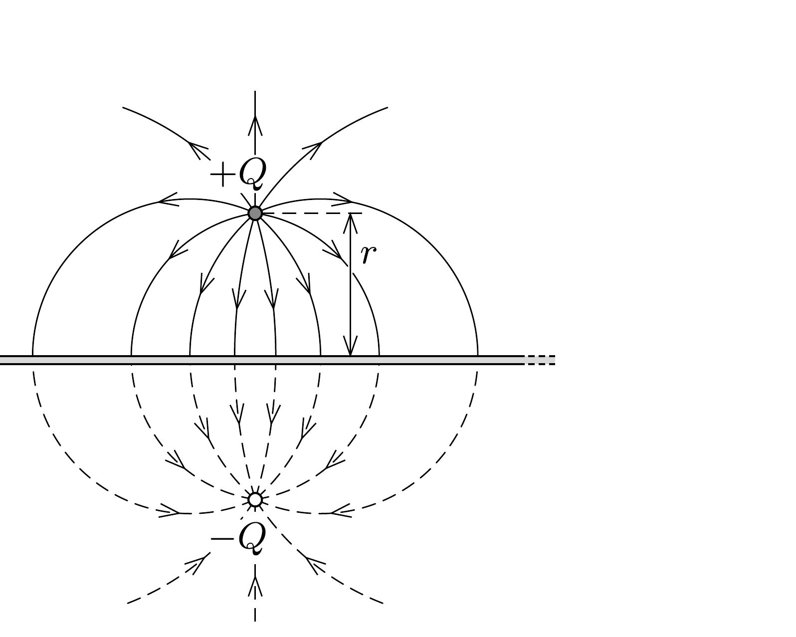
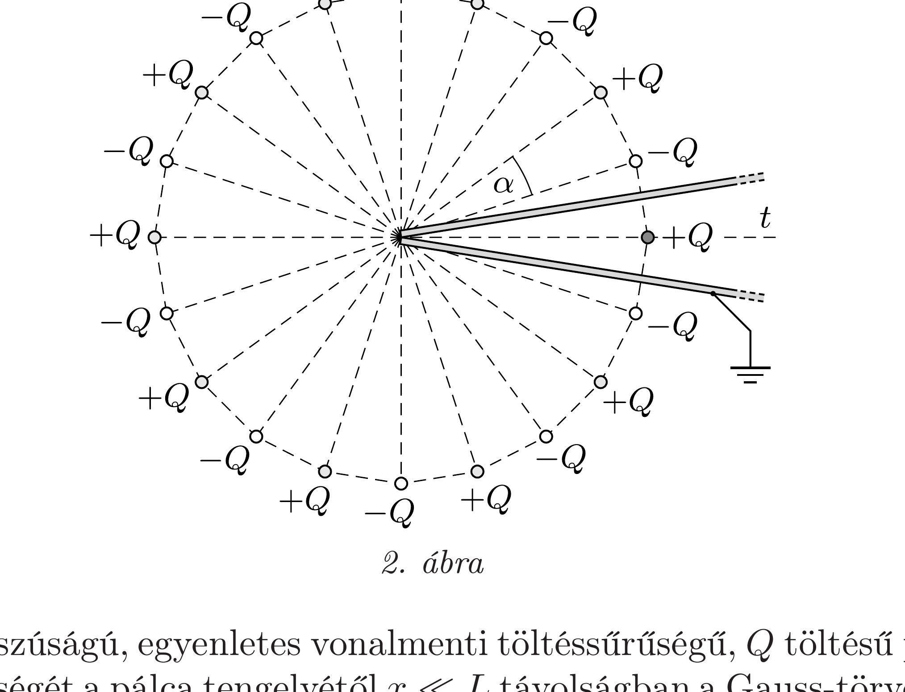
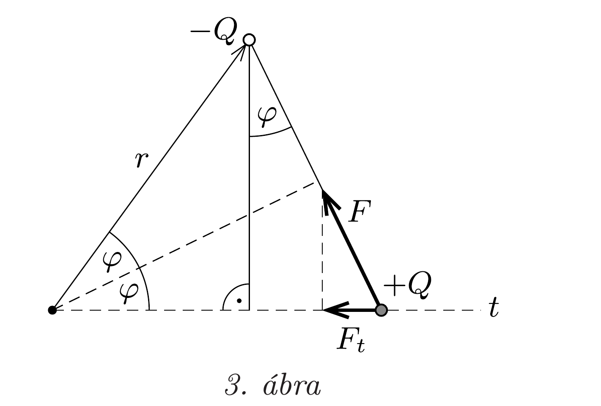

## Útmutatás

A feladatot a töltéstükrözés segítségével oldhatjuk meg. A tükörtöltéseket (melyek ebben az esetben vonalszerúek) úgy kell elhelyeznünk, hogy a földelt fémlapok helyén összesen nulla potenciált hozzanak létre.

## Megoldás

A földelt fémlapok és a töltött pálca által a fémsíkok között keltett elektromos mezó éppen olyan, mintha azt a töltött pálca és - megfelelő elhelyezkedésú, elójelú és számú - képzeletbeli (vonalszerú) tükörtöltések hoznák létre. Az $a$ ) esetben lényegében egyetlen fémlapról van szó, ekkor a lemezek állandó (azonosan nulla) potenciáljának biztosításához egyetlen „tükörpálca” elegendő (1. ábra).

A b) esetben a fémlemezek potenciálját

úgy tudjuk zérussá tenni, ha a töltött pálcát
tükrözzük mindkét fémlapra, majd a „tükörpálcákat" is tükrözzük a fémlapokra, és az eljárást addig folytatjuk, amíg új tükörpálcát kapunk. A töltés minden tükrözésnél $(-1)$-szeresére változik. A módszer csak akkor alkalmazható, ha a valódi töltések által elfoglalt térrészbe nem kerül tükrözött töltés. Ez akkor teljesül, ha $2 n \cdot \alpha=360^{\circ}$, ahol $n$ pozitív egész (2. ábra).

Egy $L$ hosszúságú, egyenletes vonalmenti töltéssűrúségú, $Q$ töltésú pálca elektromos térerősségét a pálca tengelyétől $x \ll L$ távolságban a Gauss-törvény alapján számíthatjuk ki. A pálcával egybeeső tengelyú, $x$ sugarú és $L$ hosszúságú henger palástján kilépó elektromos fluxus $E \cdot 2 \pi x L$, ami éppen $Q / \varepsilon_{0}$-lal egyenlő, ezért a térerősség nagysága
\[
E=\frac{Q}{2 \pi \varepsilon_{0} L x} .
\]

Az $a$ ) esetben a tükörpálca elektromos térerőssége a valódi pálca pontjaiban az $x=2 r$ helyettesítéssel kapható meg, így a pálcára ható eró nagysága
\[
F^{(a)}=\frac{Q^{2}}{4 \pi \varepsilon_{0} L r},
\]
iránya pedig a tükörkép, tehát a fémlap felé mutat. (A valóságban természetesen ezt az erőt a fémlap megosztott töltései fejtik ki a pálcára.)

A b) esetben (a pálcával párhuzamos irányból nézve) a valódi pálca és a tükörpálcák szabályos 20-szöget alkotnak. Az eredeti pálcára ható eró a többi (19 darab) tükörpálca által kifejtett erő eredője, amely - a szimmetria miatt - merőleges a pálcára és a fémlapok metszésvonala felé mutat. Elegendő tehát a tükörtöltések által kifejtett erőnek a metszésvonal felé mutató ( $t$ irányú) komponensét kiszámítani, majd ezeket az erókomponenseket összegezni.

Tekintsük a 3. ábrán látható tükörpálcát, amely a fémlapok érintkezési vonaláról szemlélve az eredeti pálcához képest $2 \varphi$ szögben látszik. Ennek és az eredeti pálcának a távolsága $x=2 r \sin \varphi$, így a közöttük ható erő nagysága
\[
F(\varphi)=\frac{Q^{2}}{2 \pi \varepsilon_{0} L x}=\frac{Q^{2}}{4 \pi \varepsilon_{0} L r \sin \varphi},
\]
iránya pedig a tükörtöltés előjelétől függően vonzó vagy taszító. Ennek az erőnek a fémlemezek $t$ szögfelezőjével párhuzamos összetevője
\[
F_{t}=F(\varphi) \sin \varphi= \pm \frac{Q^{2}}{4 \pi \varepsilon_{0} L r},
\]
nagysága tehát nem függ a $\varphi$ szögtől, csupán az iránya változik a tükörtöltés előjelétől függően (a pálcával ellentétes tükörtöltés esetén a fémlapok metszésvonala felé, egyforma töltések esetén pedig az ellenkező irányba mutat).

Mivel a 19 tükörpálcából 10-nek a töltése $-Q$, 9 -nek pedig $+Q$, az eredő erő ugyanakkora, mintha csak egyetlen tükörpálca lenne jelen. Az eredeti pálcára ható eró tehát (irányát és nagyságát tekintve) az $a$ ) esetben kiszámítottal egyezik meg.

Megjegyzés. Látható, hogy az eredmény tetszőleges $\alpha=180^{\circ} / n$ hajlásszögre igaz ( $n$ pozitív egész). Felsőbb matematikai eszközökkel belátható, hogy a pálcára ható elektromos erő akkor is független a fémlapok által bezárt szögtől, amikor $n$ nem egész, tehát amikor a töltéstükrözés módszere nem alkalmazható.
