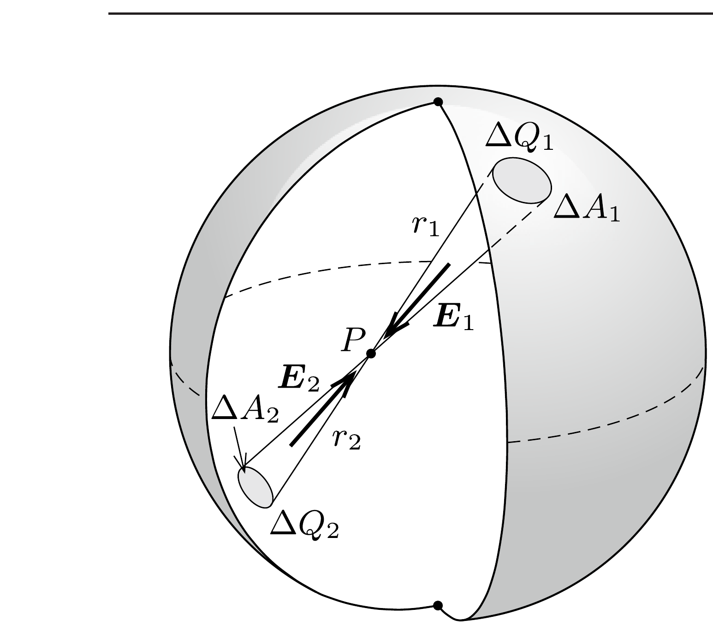
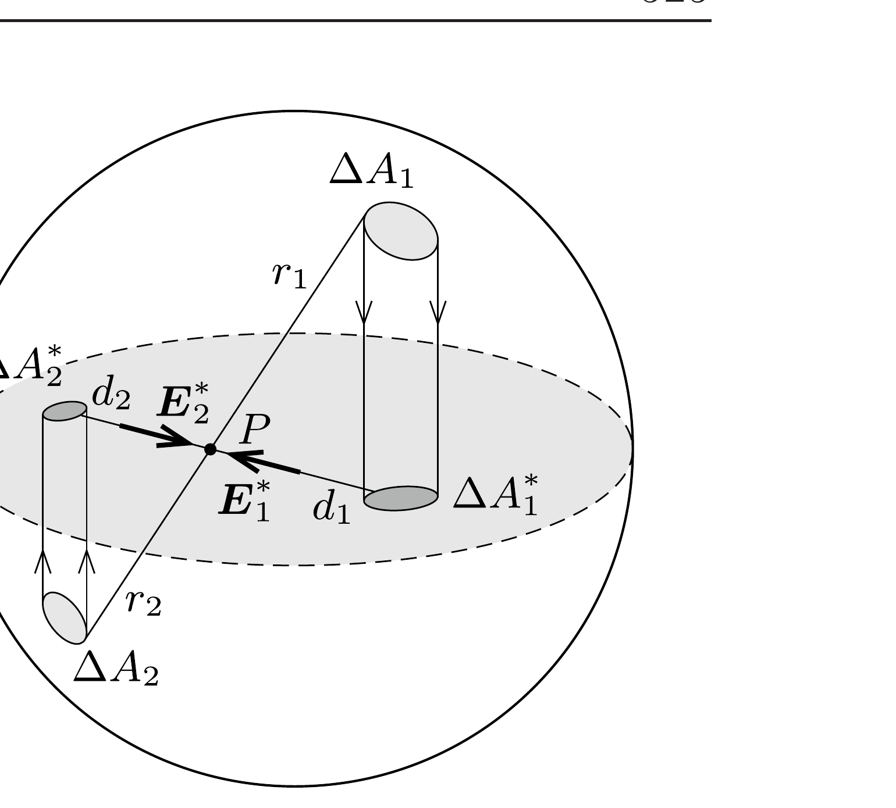

## Útmutatás

Ha egy vékony fémkorongot elektromosan feltöltünk, töltéseloszlása nem lesz egyenletes: a felületi töltéssúrúség a korong közepétől a szélek felé egyre növekszik.

Egy töltött fémgömbön a töltések - mint azt jól tudjuk - egyenletesen helyezkednek el, és a gömb belsejében az elektromos térerősség nulla (hiszen az „egymással szemközti”, azonos térszögben látszó kis felületdarabkák elektromos térerőssége páronként kiejti egymást).

Lássuk be, hogy ha egy töltött fémgömböt - gondolatban - koronggá „lapítunk össze" úgy, hogy közben a töltéseket nem engedjük elmozdulni, a korong felülete ekvipotenciális lesz, így éppen a feladatunkban szereplő probléma megoldását kapjuk.

## Megoldás

Tekintsünk először egy $R$ sugarú, $Q$ össztöltésú fémgömböt, amelynek felületén (a szimmetria miatt) egyenletesen oszlanak el a töltések, vagyis a felületi töltéssúrúség
\[
\sigma_{0}=\frac{Q}{4 \pi R^{2}}=\text { állandó. }
\]
A gömb belsejében - mint az jól ismert - nulla az eredő elektromos térerősség. Ezt úgy láthatjuk be, hogy kiszámítjuk a gömb egy belső $P$ pontjából valamelyik irányban látható (igen kicsiny) $\Delta A_{1}$ méretú felületdarabkán lévó
\[
\Delta Q_{1}=\sigma_{0} \Delta A_{1}
\]
nagyságú töltés, illetve a vele ellentétes irányban látszó
\[
\Delta Q_{2}=\sigma_{0} \Delta A_{2}
\]
nagyságú töltés eredő elektromos terét a $P$ pontban (1. ábra). Az eredő térerősség nagysága Coulomb törvénye szerint:
\[
\left|\boldsymbol{E}_{1}+\boldsymbol{E}_{2}\right|=k \frac{\Delta Q_{1}}{r_{1}^{2}}-k \frac{\Delta Q_{2}}{r_{2}^{2}}=k \sigma_{0}\left(\frac{\Delta A_{1}}{r_{1}^{2}}-\frac{\Delta A_{2}}{r_{2}^{2}}\right)=0 .
\]
Az utolsó lépésben felhasználtuk, hogy (geometriai megfontolásból adódóan)
\[
\frac{\Delta A_{1}}{\Delta A_{2}}=\frac{r_{1}^{2}}{r_{2}^{2}} .
\]

Megjegyzés. A fenti egyenlőség belátásához azt kell végiggondolnunk, hogy a $P$ pontból adott (kicsiny) térszögben látszó, $A$ pont körüli felületdarabka területe - a térszög definíciója szerint - a $P A$ szakasz hosszának négyzetével arányos, ha a felület merốleges a $\overrightarrow{P A}$ irányra. Igaz ugyan, hogy a gömbfelület érintősíkja általában nem merőleges $\overrightarrow{P A}$ ra, hanem valamekkora szöget zár be vele, de ez a szög az átellenes felületdarabkánál is ugyanakkora, tehát az innen származó torzítási szorzófaktor a fenti arányból kiesik.

Az egymással szemközti kicsiny felületdarabkákon lévő töltések erőhatásai páronként kiejtik egymást; a gömbfelületen lévő összes töltéstől származó eredő elektromos térerősség tehát nulla.

Térjünk most rá az elektromosan töltött korong esetére! Megmutatjuk, hogy ennek töltéseloszlása könnyen megkapható az egyenletesen töltött fémgömb töltéseloszlásából. „Ragasszuk” rá (gondolatban) a töltéseket a gömbfelületre, majd vetítsük le merőlegesen a gömbfelület pontjait egy olyan síkra, amely a gömb középpontjára is, és a korábban vizsgált $P$ pontra is illeszkedik (2. ábra).

Mivel a töltések nem tudnak elmozdulni, az eredetileg $\Delta A_{1}$ nagyságú felületen található $\Delta Q_{1}$ töltés a síkra vetítve változatlan mennyiségben, de valamennyivel kisebb $\Delta A_{1}^{*}$ területen fog elhelyezkedni, tehát megnó a töltéssúrúsége; emellett a $P$ ponttól mért távolsága is megváltozik, az eredeti $r_{1}$ helyett egy kisebb érték, $d_{1}$ lesz. Ugyanez történik a gömbfelület átellenes pontjaiban található, $\Delta Q_{2}$ nagyságú töltéssel is.

Vajon mekkora eredő elektromos térerősséget hoz létre ez a két (levetített, de még a koronghoz ragasztott) töltésdarabka a sík $P$ pontjában? Ismét a Coulombtörvényből számolhatjuk az eredőt:
\[
\left|\boldsymbol{E}_{1}^{*}+\boldsymbol{E}_{2}^{*}\right|=k \frac{\Delta Q_{1}}{d_{1}^{2}}-k \frac{\Delta Q_{2}}{d_{2}^{2}}=k \sigma_{0}\left(\frac{\Delta A_{1}}{d_{1}^{2}}-\frac{\Delta A_{2}}{d_{2}^{2}}\right)=0 .
\]
Az utolsó lépésnél (geometriai megfontolások alapján) felhasználtuk, hogy
\[
\frac{\Delta A_{1}}{\Delta A_{2}}=\frac{r_{1}^{2}}{r_{2}^{2}}, \quad \text { továbbá } \quad \frac{r_{1}}{r_{2}}=\frac{d_{1}}{d_{2}} .
\]
Ugyanez igaz a többi töltéspár által létrehozott térerősségre is, tehát a teljes töltéseloszlás elektromos mezőjére is: a korong síkjában az elektromos térerősség nulla.

Azt az érdekes eredményt kaptuk, hogy a $P$ pontban rögzített töltéseket a többi töltés elektromos tere semerre sem akarja elmozdítani. No de akkor a töltések rögzítését (leragasztását) akár meg is szüntethetjük, azok - erőhatás hiányában - úgysem mozdulnak el. Ezzel megoldottuk az elektromosan töltött körlap problémáját: azon a töltések éppen úgy oszlanak el, mintha egy egyenletesen töltött gömbfelületről kerültek volna oda merőleges vetítéssel.

A fémkorong felületi töltéssúrúsége is könnyen leolvasható egy olyan „oldalnézeti" rajzról, amelyen a kérdéses felületdarabkák éppen egy-egy vonalnak látszanak (3. ábra). Azok a töltések, amelyek eredetileg $\Delta A$ nagyságú területen helyezkedtek el, és a vetítés után az $R$ sugarú korong középpontjától $r$ távolságra
kerülnek, az új helyükön
\[
\Delta A^{*}=\Delta A \sin \alpha=\frac{\sqrt{R^{2}-r^{2}}}{R} \Delta A
\]
nagyságú területre jutnak. A fémkorong töltéssürúsége tehát a középpontjától $r$ távolságban
\[
\sigma(r)=\frac{\Delta Q}{\Delta A^{*}}=\sigma_{0} \frac{\Delta A}{\Delta A^{*}}=\frac{Q}{4 \pi R^{2}} \frac{R}{\sqrt{R^{2}-r^{2}}}
\]
értékú (4. ábra). A töltéssúrúség az elózetes várakozásunknak megfelelően a korong közepétől a széle felé haladva egyre nő, a peremen „végtelen naggyá" válik. Ezt a végtelent azonban nem szabad komolyan venni, mert amikor $r$ már csak annyival kisebb $R$-nél, mint a korong (eddig nullának tekintett, de a valóságban természetesen véges) vastagsága, akkor a fenti számolás érvényét veszti.

Megjegyzés. Érdekes kérdés: mi történne az egyenletesen töltött gömb töltéselrendezésével, ha azt a gömb egyik átmérőjére, vagyis egy vonalra vetítenénk? Az erók páronkénti kiejtése látszólag itt is múködik, amiből arra következtethetnénk, hogy egy nagyon vékony fémszálon (pl. egy varrótún) a töltések egyenletes vonalmenti töltéssưrúséggel helyezkednek el (hiszen az $r$ sugarú gömbövek $2 \pi r h$ felszíne a $h$ magasságukkal arányos). Ez pedig biztosan nem lehet igaz, hiszen pl. a tú hosszának egyik harmadolópontjában a 2/3 hosszúságú részen lévó töltések nagyobb erốt fejtenek ki, mint az 1/3 hosszon lévők. Vajon hol a hiba? - ennek kiderítését az Olvasóra bízzuk.
