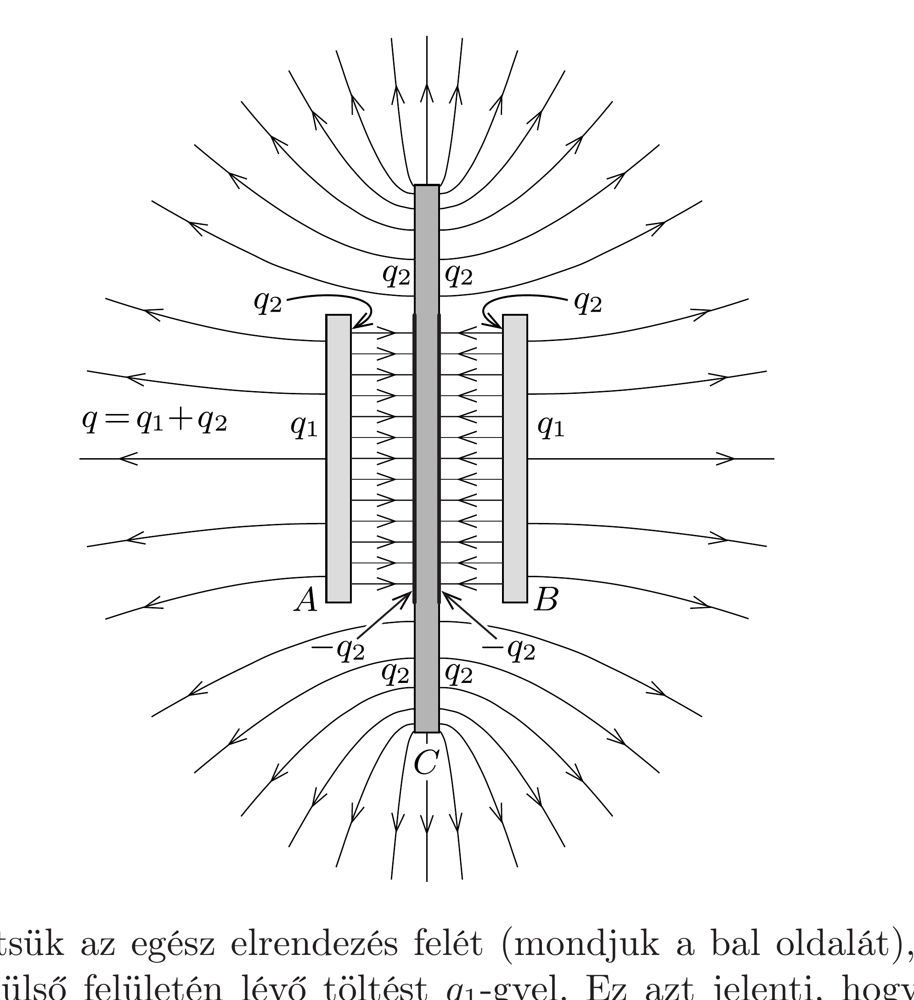

## Útmutatás

a) Eredetileg a két korong közötti térrészben elhanyagolhatóan kicsi az elektromos térerősség. Ha a középső korong átmérője alig haladja meg az 5 cmt, akkor jelenléte az erőtérmentes környezetben gyakorlatilag nem befolyásolja az eredeti töltéseloszlást. Ha viszont $D$ sokkal nagyobb, mint 5 cm, akkor a $C$ korong $A$ és $B$ közé eső része (az elektromos megosztás révén) $q$-val ellentétes töltésúvé válik, és ilyenkor a szélső korongokra befelé mutató eredő eró fog hatni. A két határeset között biztosan van olyan $D^{*}$ korongátmérő, amelynél a szélső korongokra ható erő éppen zérus.
b) A megoldás kulcsgondolata az, hogy (mivel mindhárom korong nagyon közel van egymáshoz) a három korongot egyetlen lemeznek tekinthetjük, melyen (legalábbis a külső felületen) éppen olyan töltéseloszlás jön létre, mint amit az előzó feladat megoldásában határoztunk meg.

## Megoldás

a) A harmadik korong behelyezése előtt az elektromos megosztás miatt az azonos töltések lehetőség szerint távol helyezkednek el egymástól, vagyis
a korongok külső felületén. Így a két korong között jó közelítéssel az elektromos térerősség mindenhol nulla. Ha a középső (töltetlen) korong csak egy kissé nagyobb a két szélsőnél, akkor a behelyezése után egy lényegében erőtérmentes környezetbe kerül, így változás alig történik, tehát ilyenkor az $A$ és $B$ korongra ható elektromos eró taszító jellegú marad.

Ha a $C$ jelú korong igen nagy (akár végtelennek is tekinthető), akkor a felületén jelentős töltésszétválást okoz a megosztás, a nagy korong közepének környezetében (mindkét oldalán) közelítőleg $-q$ töltés jelenik meg, ami határozott vonzó elektromos erót eredményez. A helyzet ahhoz hasonló, mint amikor egy végtelen kiterjedésú, töltetlen vezető síklap közelébe teszünk mondjuk egy ponttöltést, amire a megosztás miatt vonzó elektrosztatikus eró hat.

A fenti két határeset között biztosan létezik a középső fémlemeznek olyan $D^{*}$ átmérője, amikor a két szélső korongra ható eredő elektromos erő zérus.
b) Jelöljük az $A$ és $B$ korongok sugarát $R$-rel, a közöttük lévó távolságot $d$ vel $(d \ll R)$, a középső $C$ korong sugarát pedig $R^{*}=\lambda R$-rel, ahol $\lambda>1$ egy dimenziótlan szám. Az egyszerúség kedvéért tegyük fel, hogy a $q$ töltés pozitív $(q>0)$.

Az egyik szélső korongra (például a bal oldali $A$ lemezre) ható elektromos erőt a rajta kialakuló töltéseloszlásból, azaz a felületi töltéssűrúségből tudjuk kiszámítani. Ha egy adott pontban a felületi töltéssúrúség $\sigma$, akkor ennek a pontnak a közvetlen közelében a felületen kívül az elektromos térerősség nagysága $\sigma / \varepsilon_{0}$, míg a fém belsejében nulla. Így a felületen (a felületi töltések helyén) az átlagos térerősség $\sigma / 2 \varepsilon_{0}$, vagyis az egységnyi felületre ható, kifelé mutató erő (ami egy „belső nyomásnak” is tekinthető) értéke $p=\sigma^{2} /\left(2 \varepsilon_{0}\right)$. A teljes eredő erốt ezeknek az elemi erőkomponenseknek a korong egész felületére történó integrálásával határozhatjuk meg.

A megoldás kulcsa annak felismerése, hogy a három korongból álló rendszert (kívülről) egyetlen $R^{*}$ sugarú fémkorongnak tekinthetjük, melynek össztöltése $2 q$. Ez jó közelítéssel azért tehető meg, mert a vékony korongok közötti távolságok sokkal kisebbek a korongok sugaránál, így a lemezek között kialakuló véges erősségü elektromos tér nem eredményez számottevő potenciálkülönbséget; ebben a közelítésben tehát a három korong ekvipotenciális. Természetesen a fellépő elektromos megosztás töltésszétválást okoz mindhárom korongon, így például az eredetileg töltetlen $C$ jelú korong központi része negatív töltésú lesz, miközben ugyanekkora pozitív töltés kerül a központi rész körüli gyürüre. A két szélső (kisebb méretú) korong esetében bizonyos mennyiségú pozitív töltés a belső oldalukra kerül, és az itt eloszló töltés (a síkkondenzátoroknál megszokott módon) „farkasszemet néz” a $C$ jelú korong központi részének negatív töltéseivel. Ennek megfelelően a két szélső korong külső felületén $q$-nál kevesebb töltés marad. Távolról nézve tehát a rendszer egyetlen $R^{*}$ sugarú, pozitív töltésú fémkorongnak látszik, míg a rendszeren belüli két „síkkondenzátor” gyakorlatilag láthatatlan marad.

Az előző feladat megoldásában megmutattuk, hogyan számítható ki egy $R$ sugarú, $Q$ össztöltésú vékony fémkorong felületén kialakuló töltéseloszlás. Alkalmazzuk most ezt a megoldást az $R^{*}$ sugarú, $2 q$ össztöltésú (távolról egyetlennek
látszó) fémkorongra! Ennek egyik oldalán a felületi töltéssürúség így írható fel:
\[
\sigma(r)=\frac{q}{2 \pi R^{*}} \frac{1}{\sqrt{R^{* 2}-r^{2}}},
\]
ahol $r$ a korong középpontjától mért távolság.

Most tekintsük az egész elrendezés felét (mondjuk a bal oldalát), és jelöljük az $A$ korong külső felületén lévő töltést $q_{1}$-gyel. Ez azt jelenti, hogy a középső $C$ korong külső gyürújén felhalmozódó töltés $q_{2}=q-q_{1}$. A $C$ korong központi része ( $R$ sugarú körlapja) a töltéssemlegesség miatt $-q_{2}$ töltésú, így az $A$ korong belsó felületén lévó töltésmennyiség $+q_{2}$. Az $A$ korong teljes belső felülete és a $C$ korong központi része egy síkkondenzátort alkot, melynek tere a lemezek között jó közelítéssel homogén, és így az egymással szemben lévő belső felületeken homogén felületi töltéseloszlás jön létre, melynek $\sigma^{*}$ felületi töltéssürúsége:
\[
\sigma^{*}= \pm \frac{q_{2}}{\pi R^{2}} .
\]
A $q_{1}$ töltés nagyságát az ismert töltéssűrúségből integrálással határozhatjuk meg:
\[
q_{1}=\int_{0}^{R} \sigma(r) 2 \pi r \mathrm{~d} r=\frac{q}{R^{*}} \int_{0}^{R} \frac{r \mathrm{~d} r}{\sqrt{R^{* 2}-r^{2}}}=q\left(1-\sqrt{1-\frac{1}{\lambda^{2}}}\right),
\]
ahol a tömör $\lambda=R^{*} / R$ jelölést használtuk. A $q_{2}$ töltés értéke is felírható $q_{1}$ ismeretében:
\[
q_{2}=q-q_{1}=q \sqrt{1-\frac{1}{\lambda^{2}}} .
\]

A töltések elhelyezkedését és a kialakuló erővonalképet vázlatosan a (torzított méretarányú) ábra szemlélteti.

Az $A$ korongra ható $F$ eredő erőt a $\sigma$ és $\sigma^{*}$ felületi töltéssürúségekből határozhatjuk meg (az eró irányát „kifelé" választva pozitívnak):
\[
F=\frac{1}{2 \varepsilon_{0}} \int_{0}^{R}\left(\sigma^{2}-\sigma^{* 2}\right) 2 \pi r \mathrm{~d} r=\frac{q^{2}}{4 \pi \varepsilon_{0} R^{2}}\left[\frac{1}{2 \lambda^{2}} \ln \left(\frac{\lambda^{2}}{\lambda^{2}-1}\right)-2\left(1-\frac{1}{\lambda^{2}}\right)\right],
\]
ahol felhasználtuk, hogy
\[
\sigma^{*}=\frac{q_{2}}{\pi R^{2}}=\frac{q}{\pi R^{2}} \sqrt{1-\frac{1}{\lambda^{2}}} .
\]
Az $F$ eró akkor zérus, ha a szögletes zárójelben álló kifejezés nulla értéket vesz fel. Grafikus vagy numerikus módszerrel meghatározhatjuk, hogy ez akkor következik be, ha $\lambda \approx 1,16$. Az $A$ (vagy $B$ ) korongra ható eredő elektromos erő tehát akkor zérus, ha a középső $C$ korong átmérője nagyjából 16\%-kal nagyobb, mint a szélső korongok 5 cm-es átmérője, azaz körülbelül 5,8 cm.

Megjegyzések. 1. Ha a $C$ jelü korong mérete nagyon nagy (vagyis $\lambda$ végtelenhez tart), akkor az $A$ és $B$ korongokra ható eredő erő így alakul:
\[
F=-\frac{q^{2}}{2 \pi \varepsilon_{0} R^{2}}, \quad \text { ha } \quad \lambda \rightarrow \infty .
\]
Ez az eredmény éppen a töltött síkkondenzátor lemezei közötti vonzóerő jól ismert formulájával egyezik meg.
2. Ha $\lambda$ értéke 1-hez tart, akkor az erőformulában lévő második (vonzó) tag eltúnik, ami annak felel meg, hogy a korongok belsó oldalán nem jelennek meg töltések a megosztás következtében (ahogy ezt az előzőekben is feltételeztük). Azonban az első (taszító) tag divergenssé válik, és így az eró végtelenhez tart. Ez azt mutatja, hogy a széleffektusokat nem hanyagolhatjuk el ebben az esetben. Ha az eró nagyságára jó közelítést szeretnénk kapni, akkor $(R-d)$-nél le kell vágnunk az integrációs tartományt, ahol $d$ a lemezek közötti távolság:
\[
F \approx \frac{q^{2}}{8 \pi \varepsilon_{0} R^{2}} \ln \frac{R}{2 d}, \quad \text { ha } \quad \lambda \rightarrow 1 .
\]
