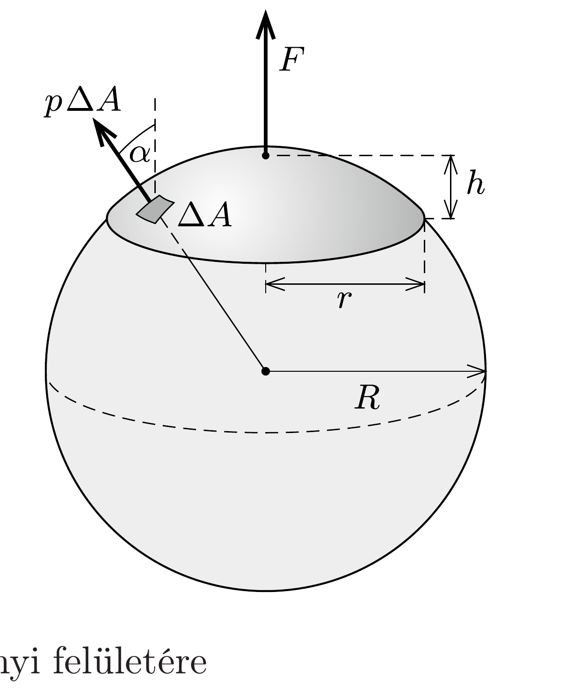

## Útmutatás

Az elektromos mezó a felület egyes darabkáira a felülettel arányos nagyságú és a felületre merőleges irányú erốt fejt ki. Ez az erő hasonló a folyadékok vagy gázok nyomásából származó erőhatásokhoz.

## Megoldás

A vékony gömbsüveg nem változtatja meg a gömb kapacitását, az továbbra is $C=R / k \operatorname{marad}$, ahol $k=1 /\left(4 \pi \varepsilon_{0}\right)$ a Coulomb-állandó. Ha a gömböt (a „végtelenhez" képest) $U$ feszültségre töltjük fel, a rajta lévő össztöltés $Q=$ $C U=U R / k$ lesz.

A gömbsüveg a fémgömb egyenletes töltéseloszlását sem változtatja meg, csupán annyi változást okoz, hogy a gömbsüveg által lefedett felületről az ott lévő töltések az alufólia külső felületére vándorolnak. Az elektromos mező gömbszimmetrikus Coulomb-mező marad, és az elektromos térerősség a fólia közvetlen közelében $E=k Q / R^{2}=U / R$ nagyságú, sugárirányban kifelé mutató vektor lesz.

Az alufólián lévő töltések és a gömb többi részén található töltések taszítják egymást, emiatt az alufóliára (a szimmetriából adódóan) függőleges, felfelé irányuló elektrosztatikus erő hat. A süveg akkor emelkedik fel a gömbről, amikor ez a taszítóerő éppen megegyezik az alufólia $m g$ súlyával.

Az alufóliára ható erőt úgy számíthatjuk ki, hogy képzeletben felosztjuk a gömbsüveget kicsiny, egyenként $\Delta A$ nagyságú felületdarabkákra, meghatározzuk, hogy mennyi töltés van az egyes felületdarabkákon, és hogy az elektrosztatikus mező mekkora és milyen irányú erốt fejt ki ezekre a kis töltésekre. Az erőhatások vektori összege megadja az alufóliára ható eredő elektromos erốt (lásd az ábrát).

A gömbsüveg egységnyi felületére
\[
\sigma=\frac{Q}{4 \pi R^{2}}=\varepsilon_{0} \frac{U}{R}
\]
töltés jut, $\Delta A$ nagyságú felületen tehát $\Delta Q=\sigma \Delta A$ töltés található. Erre a töltésre a gömbön kívül $E$, a fémen belül nulla, átlagosan tehát $\frac{1}{2} E$ értékú elektromos térerősség
\[
p \Delta A=\frac{1}{2} E \Delta Q=\frac{\varepsilon_{0}}{2} \frac{U^{2}}{R^{2}}
\]
nagyságú, a felületdarabkákra merőleges irányú erőt fejt ki.
A gömbsüvegre ható (felületegységenként $p$ nagyságú) erők éppen olyanok, mintha a gömbsüveget alulról $p$ nyomású gáz nyomná. Ha a gömbsüveget gondolatban lezárnánk egy $r$ sugarú körlappal, és az analógiát felhasználva ezen a körlapon is figyelembe vennénk a gáztól származó $p \cdot r^{2} \pi$ nagyságú nyomóerőt, akkor az eredő erő nulla lenne (ellenkező esetben a gáz gyorsítani kezdené a zárt felületet). Ezek szerint a gömbsüvegre ható eredő eró nagysága
\[
F=p \cdot r^{2} \pi=\frac{\varepsilon_{0}}{2} \frac{U^{2}}{R^{2}} \cdot r^{2} \pi .
\]

Megjegyzés. Ezt az eredményt úgy is megkaphatjuk, hogy meggondoljuk, a felületdarabkákra ható eróknek elegendő a függőleges összetevőit összegezni, hiszen az eredő
eró - szimmetriamegfontolások szerint - biztosan függőleges:
\[
F=\sum p \Delta A \cos \alpha=p \sum \Delta A \cos \alpha,
\]
ahol $\alpha$ a felületdarabka érintősíkjának a vízszintessel bezárt szöge. Mivel $\Delta A \cos \alpha$ a felületdarabka vízszintes vetületének területe, ezek összege a gömbsüveg vetületének, vagyis egy $r$ sugarú körlapnak $r^{2} \pi$ területével egyezik meg.

A gömbsüveg felszíne
\[
A=2 \pi R h,
\]
ahol $h=R-\sqrt{R^{2}-r^{2}}$ a gömbsüveg magassága. Az alufólia tömege
\[
m=A d \cdot \varrho=2 \pi R\left(R-\sqrt{R^{2}-r^{2}}\right) d \cdot \varrho
\]
módon számolható. A süveg felrepülésének feltétele:
\[
F>m g, \quad \text { azaz } \quad \varepsilon_{0} \frac{U^{2}}{2 R^{2}} \cdot r^{2} \pi>2 \pi R\left(R-\sqrt{R^{2}-r^{2}}\right) d \cdot \varrho g,
\]
ahonnan a kritikus feszültség:
\[
U_{\mathrm{krit}}=\sqrt{\frac{4 R^{3} d \varrho g\left(R-\sqrt{R^{2}-r^{2}}\right)}{\varepsilon_{0} r^{2}}} .
\]
Ennél nagyobb feszültségre feltöltött fémgömbről felemelkedik a megadott méretú és súrúségú, gömbhéj alakú alufólia.
