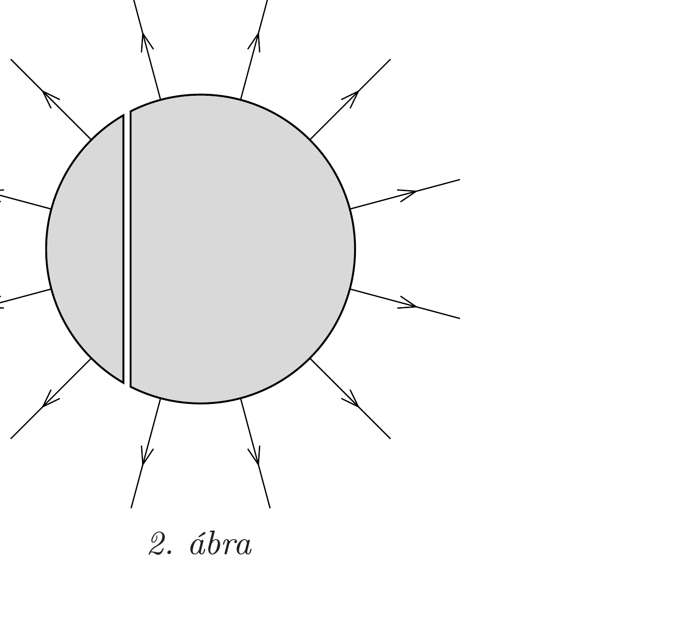

## Útmutatás

A töltéseloszlás egyensúlyi helyzetében az elektrosztatikus tér energiája minimális. Kialakulhat-e számottevő feszültség az ólomgömb két része között?

## Megoldás

A bal oldali gömbszeletre vitt $Q$ töltés a jobb oldali gömbszeleten töltésmegosztást hoz létre. Ha $q$-val jelöljük a $Q$ töltésnek azt a részét, amely a feltöltött gömbszelet sík felületü részén helyezkedik el, akkor a jobb oldali gömbszelet sík felületére $-q$ töltés vándorol, hiszen a két egymás melletti síkfelület síkkondenzátort képez (1. ábra).

Vajon mekkora lesz $q$, és hogyan oszlanak el a töltések a gömb külső felületén? A választ pl. az energiaminimum elvéből kaphatjuk meg. Eszerint egyensúlyi helyzetben a töltések úgy helyezkednek el a vezetők felületén, hogy a rendszer teljes elektrosztatikus energiája a lehető legkisebb legyen. Jelen esetben a síkkondenzátor energiája (a szigetelőréteg hajszálvékony volta miatt) elhanyagolhatóan kicsi, a rendszer energiája tehát lényegében a gömbön kívüli elektrosztatikus mező energiájával egyezik meg. Ez az energia nyilván ugyanolyan töltéseloszlásnál lesz minimális, mint amilyen a $Q$ töltéssel feltöltött eredeti (szétvágatlan) gömb esetében, vagyis az ismert egyenletes töltéseloszlásnál.

Más módon is érvelhetünk. Külön-külön mindkét gömbszelet potenciálja állandó, mivel bármilyen alakú is legyen a fém, mindig ekvipotenciális, és belsejében
a térerősség mindig zérus. Mennyi most az ólomgömb két szelete közti potenciálkülönbség?
\[
\Delta U=E d,
\]
ahol $E$ a két síkfelület közötti térben az elektromos térerősség, $d$ pedig a síkfelületek távolsága. A feladat szövege szerint az elválasztó réteg „hajszálvékony", vagyis $d$ majdnem zérus, $E$ pedig $q$-val arányos, tehát nem lehet „nagyon nagy". Ezek szerint a $\Delta U$ potenciálkülönbség is majdnem zérus, azaz elhanyagolhatóan kicsi. Ebben a (jogos) közelítésben a teljes gömbfelület potenciálja ugyanakkora. Egy gömbön az $U=$ állandó feltétel csak egyetlen töltéseloszlás mellett valósulhat meg adott $Q$ esetén. Ez az eloszlás a jól ismert gömbszimmetrikus töltéseloszlás, amikor a felületi töltéssűrúség
\[
\sigma=\frac{Q}{4 R^{2} \pi}=\text { állandó. }
\]

Az egyenletes felületi töltéseloszláshoz tartozó elektromos térerősség a gömbön belül (a „síkkondenzátor” belsejét leszámítva) zérus, a gömbön kívül pedig a jól ismert Coulomb-féle erótér, nagysága a középponttól $r$ távolságban
\[
E(r)=\frac{1}{4 \pi \varepsilon_{0}} \frac{Q}{r^{2}} \quad(r>R) .
\]
A gömbön kívül kialakuló eróvonalkép jó kö-

zelítéssel a 2. ábrán látható módon alakul.
