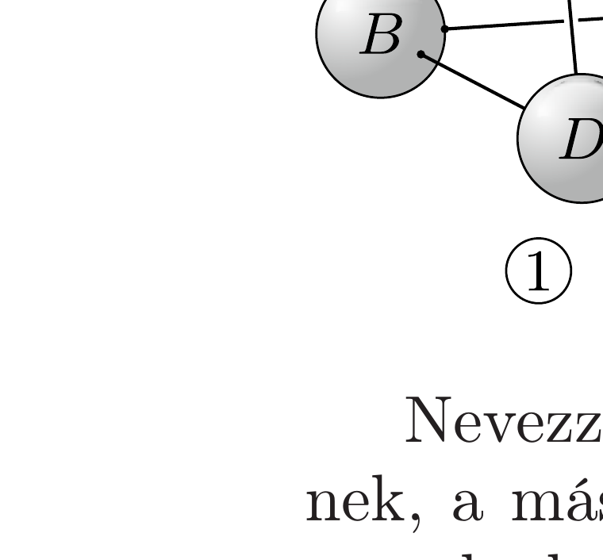
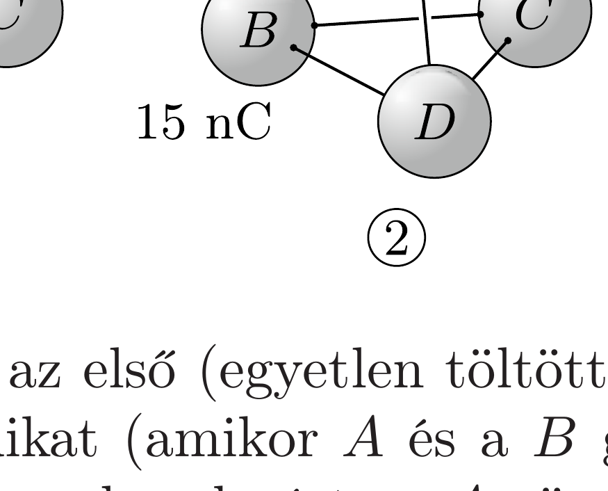
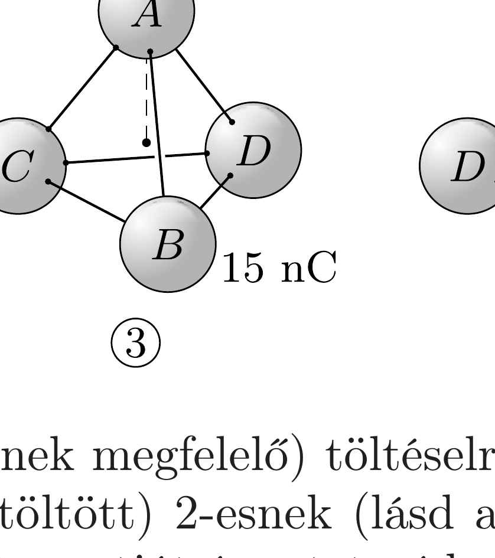
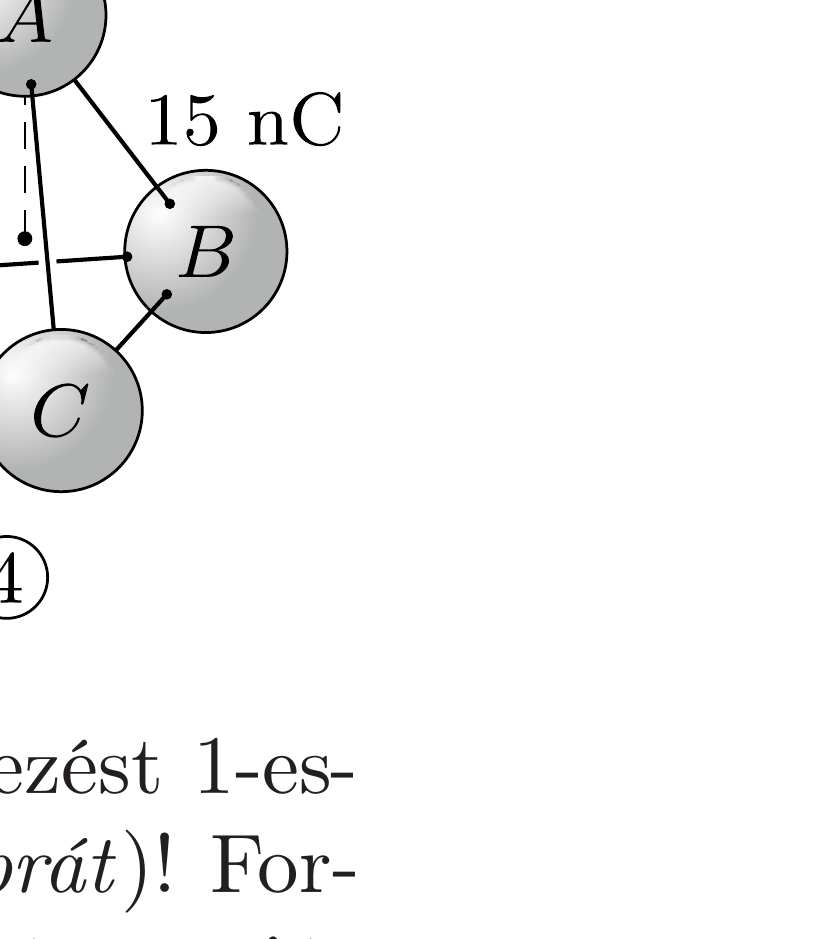

## Útmutatás

Ha a gömbök távolsága sokkal nagyobb lenne, mint a sugaruk, akkor az elektromos terüket a pontszerú töltés közelítésében számíthatnánk. Jelen esetben (ahogy a feladat ábráján is látszik) ez nem teljesül, a gömbök mérete és a távolságuk összemérhető, emiatt egymást erốsen polarizálják. A töltéseloszlások és az elektromos mező csak nagyon bonyolult módon számítható ki, de szerencsére erre nincs szükség! Használjuk a szuperpozíció elvét!

## Megoldás

A szuperpozíció elve szerint, ha valamilyen elrendezésben a töltések egyensúlyban vannak a fémgömbökön, akkor valamennyi töltést arányosan (mondjuk $\lambda$-szorosára) megnövelve ismét egyensúlyi elrendezést kapunk, amelyben a térerősségek és a potenciálkülönbségek mindenhol az eredeti értékek $\lambda$-szorosai. Továbbá az is igaz, hogy két egyensúlyi töltéselrendezést összeadva ismét egyensúlyi töltéselrendezést kapunk, és ebben a térerősségek, illetve a potenciálok bármely helyen az ottani eredeti értékek vektori, illetve skalár összegei.

Nevezzük az első (egyetlen töltött gömbnek megfelelő) töltéselrendezést 1-esnek, a másodikat (amikor $A$ és a $B$ gömb töltött) 2-esnek (lásd az ábrát)! Forgassuk el a 2-es elrendezést az $A$ gömb középpontját és a tetraéder középpontját összekötó egyenes körül 120°-kal (legyen ez a 3-as elrendezés), illetve -120°-kal (4-es elrendezés)!

Képezzük ezek után az 1-es állapot $\lambda_{1}$-szeresének, illetve a 2-es és 3-as állapotok $\lambda_{2}$-szeresének a szuperpozícióját, és válasszuk a szuperpozíció együtthatóit
úgy, hogy három egyforma töltésú gömbünk legyen, továbbá az $A$ gömb potenciálja éppen ugyanakkora $(U)$ maradjon, mint az 1-es állapotban volt. Ez a két feltétel akkor teljesül, ha fennáll, hogy
\[
20 \lambda_{1}+15 \lambda_{2}+15 \lambda_{2}=15 \lambda_{2},
\]
illetve
\[
\lambda_{1} U+\lambda_{2} U+\lambda_{2} U=U .
\]
A fenti egyenletrendszer megoldása: $\lambda_{1}=-\frac{3}{5}, \lambda_{2}=\frac{4}{5}$, és ennek megfelelően a szuperpozícióban a három töltött gömb mindegyike 12 nC töltéssel rendelkezik.

Hasonló módon, az 1-es elrendezés és a 2-es, a 3-as és a 4-es állapot megfelelő szuperpozíciójával elérhető, hogy mind a négy gömb töltése ugyanakkora legyen, az $A$ gömb potenciálja pedig $U$. A gömbök töltése ilyenkor 10 nC-nak adódik. A részletes számítást az Olvasóra bízzuk.
